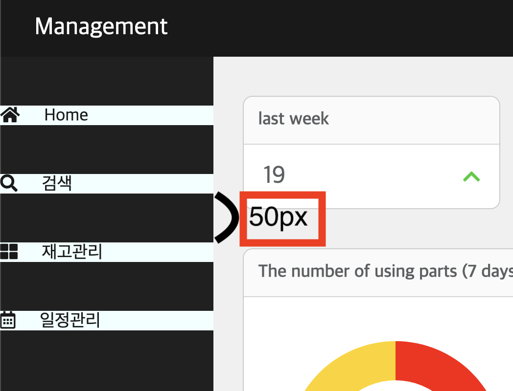
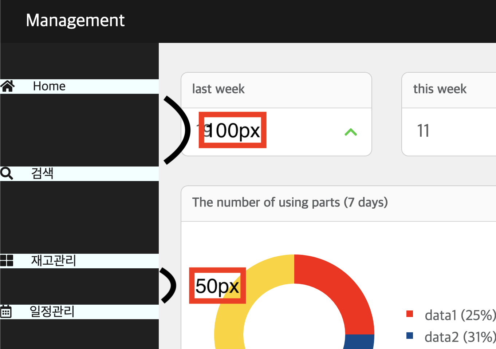
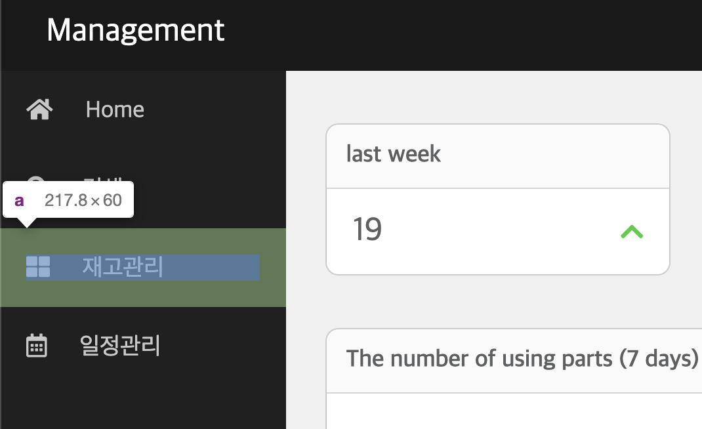

~~최근 예전에 만들었던 사이트를 node js로, 보다 나은 기능과 디자인으로 다시 만들어보고 싶어서 개인적인 프로젝트를 진행중인데 사이드바 메뉴를 만들던 중에 li로 쌓은 요소들의 margin이 겹쳐지는 것을 목격했다. 내가 도대체 뭘 잘못한거지 하면서 한참 고민했었는데 원래 그런것 같다.~~


# 마진 겹침

마진겹침현상은 위아래로 쌓여진 요소가 있고, margin속성을 부여했을때 위아래의 margin이 서로 겹쳐지는 현상이다. 

내가 진행하던 프로젝트에 `li`요소에 `margin:50px 0`을 적용하면 다음과 같이 된다. 

  

분명 상하 50px을 적용했으니 총합은 **100px**이 되어야 하는데 50px이 위아래 요소끼리 합쳐졌다. 왜 그런지 찾아보니 MDN, W3C에 상쇄된다고 정의가 되어있었다.

<br>

> 여러 블록의 위쪽 및 아래쪽 바깥 여백(마진)은 경우에 따라 제일 큰 여백의 크기를 가진 단일 여백으로 결합(상쇄)되곤 합니다. 이런 동작을 여백 상쇄라고 부릅니다. 단, 플로팅 요소와 절대 위치를 지정한 요소의 여백은 절대 상쇄되지 않습니다.  
\- MDN

> <a>https://developer.mozilla.org/ko/docs/Web/CSS/CSS_Box_Model/Mastering_margin_collapsing

<br>

이런 마진겹침(여백상쇄)는 세가지 상황에서 일어날 수 있다고 한다.  
### <u>요소의 `display`가 `block`일때!</u>
### <u>좌우 여백은 상쇄되지 않음!</u>
1. 인접 형제 요소간 바깥 여백 상쇄
2. 부모요소와 자식요소의 첫번째 혹은 마지막 요소의 여백이 겹칠 때(같은 방향)
3. 빈 요소의 상하 여백이 겹칠 때


나는 여백이 동일할 때만 마진이 겹쳐지는거라고 생각했는데 더 큰 마진을 가진 값으로 여백이 생긴다고 한다. 확인해보니 다음과 같았다.

```javascript
// css
nav .menu .main-menu li a {
    display: block;
    width: 100%;
    height: 100%;
    box-sizing: border-box;
    margin: 50px 0;
    background-color: azure;
    color: #191919;
}
// 이 부분 추가!(두번째 요소의 상하 margin값을 100px)
nav .menu .main-menu li:nth-child(2) a {
    margin: 100px 0;
}
```

css 파일에 `li`요소(`a`)의 두 번째 상하`margin`을 100px로 만들어주면

  

**100px + 50px = 150px**이 되어야하지만 **100px**이 된 것을 확인할 수 있었다.

<br>

또한 음수값의 여백도 반영이 된다고 한다. MDN에서 확인해보면 다음과 같이 기술되어 있다.

> \- 음수 값을 가진 바깥 여백을 포함할 경우, 상쇄된 여백의 크기는 제일 큰 양수 여백과 제일 작은(음의 방향으로, 절댓값이 제일 큰) 여백의 합이 됩니다.  
\- 모든 바깥 여백이 음수 값을 가질 경우, 상쇄된 여백의 크기는 제일 작은(음의 방향으로, 절댓값이 제일 큰) 여백의 크기가 됩니다. 인접 요소와 중첩 요소 모두에 적용됩니다.

결국 나는 이 문제를 해결하기 위해 `li`요소에 `padding`을 사용해서 여백을 주어 균일하게 여백을 주었다.



<br>

다른 <u>해결책</u>을 찾아보니 `float`를 이용하거나, 마진겹침은 `block`요소에서만 일어나기 때문에 `display`를 `inline`으로 지정하는 것이다.

~~이런 점을 숙지하고 잘 이용한다면 균일한 여백을 가지고 있는 레이아웃을 만들 수 있을 것 같다~~


