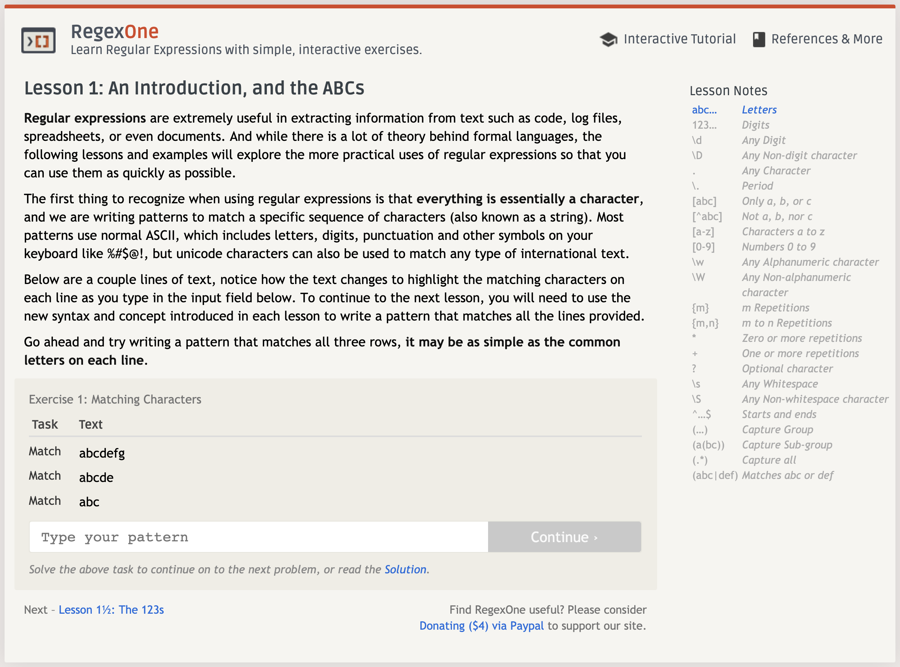

~~항상 정규표현식을 쓸 일이 있을때마다 재대로 몰라서 엄청 헤메고 다른사람의 것을 복붙해서 사용해왔기 때문에 정리해보려고 한다.~~  
~~유튜브 드림코딩 엘리님이 잘 설명해준 강의가 있어서 그것을 토대로 정리해봤다.~~


# 정규표현식 (Regex)

정규표현식은 문자열을 다룰 수 있는 아주 강력한 기능이라고 생각한다. js나 python을 사용할 때, index, find, indexof 등 이런걸 주로 써서 코드가 더러워지고 길어지는 경향이 있었는데 이 정규표현식을 이용하면 아주 간단하게 해결할 수 있다. 

MDN에 나와있는 설명을 보니 다음과 같다.
> 정규표현식은 문자열에 나타나는 특정 문자 조합과 대응시키기 위해 사용되는 패턴입니다. 자바스크립트에서, 정규표현식 또한 객체입니다. 이 패턴들은 `RegExp`의 `exec`메소드와 `test`메소드, 그리고 `String`의 `match`메소드 , `replace`메소드 , `search`메소드 , `split`메소드와 함께 쓰입니다.


정규표현식을 만드는  방법에는 두가지가 있다. 

```javascript
// 정규식 리터럴
const re = /ab+c/;

// RegExp 객체의 생성자 함수
const re = new RegExp("ab+c");
```

<br>

그리고 자바스크립트에서는 다음과 같이 적용이 가능하다.
```javascript
// 숫자만 추출하는 정규표현식
const text = "won1jong2bin3";
const re = /\d/g;

console.log(text.match(re));    // [ '1', '2', '3' ]
```

<br>

정규표현식의 구조를 보면 다음과 같이 구성할 수 있다.  

`/` `pattern` `/` `flag`

`/`로 추출하고자 하는 것을 표현한 패턴을 감싸고 그 뒤에 `flag`을 붙인다.

<br>

패턴을 표현하는 방식은 다음과 같다. 아래의 키들을 조합하여 패턴을 만든다.  

| Chracter | 기능 |
| :---: | :--- |
| `||` | 또는(or) |
| `()` | 그룹지정 |
| `[]` | 문자셋, 괄호안의 어떤 문자든 |
| `[^]` | 부정 문자셋, 괄호안의 문자는 제외 |
| `(?:)` | 결과에서 제외 |

<br>

| Chracter | 기능 |
| :---: | :--- |
| `?` | 없거나 있거나 (zero or one) |
| `*` |	없거나 있거나 많거나 (zero or more) |
| `+` |	하나 또는 많이 (one or more) |
| `{n}` | n번 반복 |
| `{min,}` | 최소(들어가는 개수) |
| `{min,max}` | 최소, 최대(들어가는 개수) |

<br>

| Chracter | 기능 |
| :---: | :--- |
| `\b` | 문장의 마지막에 |
| `\B` | 문장의 마지막을 제외하고 |
| `^` |	문장의 시작 |
| `$` |	문장의 끝 |

<br>

| Chracter | 기능 |
| :---: | :--- |
| `\` |	특수 문자가 아닌 문자 \
| `.` |	어떤 글자 (줄바꿈 문자 제외) |
| `\d` | digit 숫자 |
| `\D` | digit 숫자 제외 |
| `\w` | word 문자 |
| `\W` | word 문자 제외 |
| `\s` | space 공백 |
| `\S` | space 공백 제외 |

<br>

원하는 문자를 적고 그 뒤에 조건을 덧붙여 몇개가 들어가는지 제외하는지 아닌지 를 명시한다.

```javascript
const text = "won1jong2bin3";
const re = /\d{1}/g;    // 숫자가 하나 들어간다는 뜻 (\d 다음에 {1} 갯수를 지정)

console.log(text.match(re));    // [ '1', '2', '3' ]
```


<br>

## Expression Flag
- **flag**는 검색에 영향을 준다.  
- 하나만 사용하는게 아닌 여러개 사용이 가능하다.

| flag | 기능 |
|:---:| :--- |
| `g` | 전역검색(일치하는 것 모두) |
| `i` | 대소문자 구분 x |
| `m` | 다중행 검색 |
| `s` | `.` 도 개행문자에 포함 |
| `u` | 유니코드 전체 지원 |
| `y` | `sticky`검색을 수행(수행 위치 지정) |

<br>

```javascript
const text = "won1jong2bin3";
const re = /\d/gim;     // 전체를 추출하고(g) 대소문자 구분없이(i) 여러 행에서(m) 추출

console.log(text.match(re));    // [ '1', '2', '3' ]
```

<br>
<br>


~~막상 공부하고 보니 뭔가 별거 없었다 하지만 내가 직접 사용하고 패턴을 만드려고 해봤더니 많이 헷갈렸다. 추천해주신 사이트 중에 정규표현식 퀴즈를 풀 수 있는 사이트가 있었다.~~

> <a> https://regexone.com/ 


조건에 맞는 정규표현식을 입력하면 pass다.


<br>

\# 숫자추출
| Task | Text |
|:---|:---|
| Match | abc123xyz |
| Match | define "123" | 
| Match | var g = 123; |

✅  result: \d{3}  

<br>

| Task | Text |
|:---|:---|
| Match | hog |
| Match | dog |
| Skip | bog |

✅  result: [^b]..

<br>

~~문제를 풀다보니 정규표현식을 이용해서 추출할 때 패턴이 다르더라도 동일한 결과를 얻을 수 있다는게 느껴졌다. 위 문제에서 "bog"를 제외하고 "hog", "dog"에서 추출해야 하는데  
`[^b]..`,  `[hd]og` 이렇게 몇가지 방법이 생각이 났다.  
나중에 보다 복잡한 문자열을 다룰 때 이해하기 쉽고 효율적은 정규표현식을 구사하는 것도 중요할 것 같다.~~

정규표현식 연습할 수 있는 사이트!
> <a>regexr.com