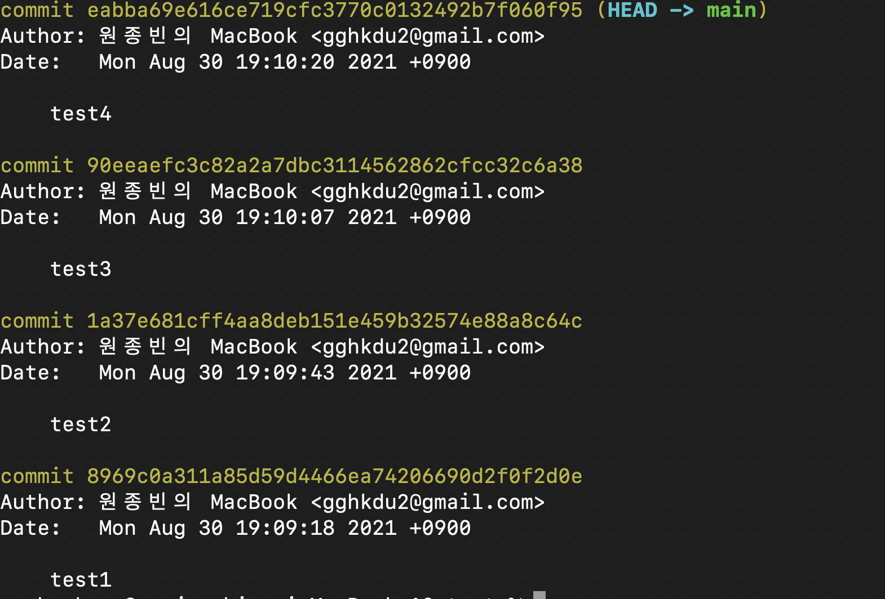
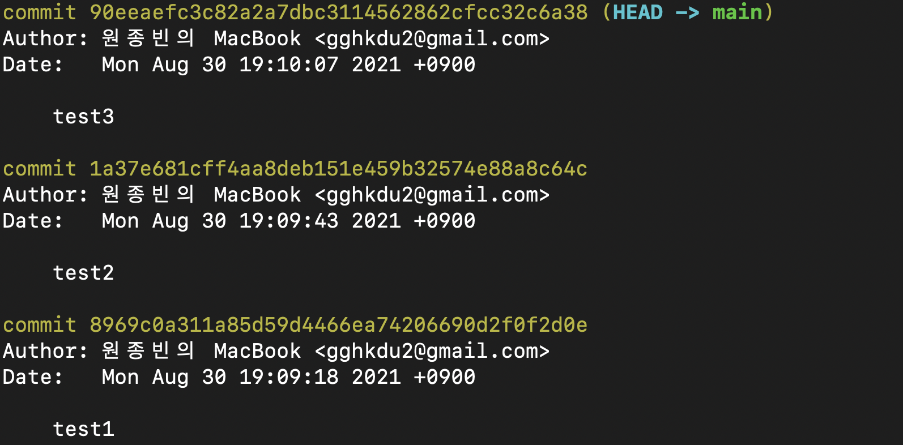

git을 사용하기 시작한지 한 두달정도 된 것 같은데 아직도 git 명령어가 너무 헷갈린다. 항상 쓰는 명령어만 사용하다보니 매일 `git add .` `git commit -m ""` `git push origin main`만 남발하고 있는것 같다.  

오늘 파일을 업로드하다가 꼬여서 아무것도 하지 않은 commit이 여러개 생기게 되었는데 이걸 어떻게 없애는지 잘 모르겠어서 고민하다가 git에 대해 공부해야겠다고 생각했다. 

 

# git
git은 분산 버전 관리 시스템(Version Control System)이다. 중앙서버가 하나 존재하고, 개인 로컬에 중앙서버의 전체 사본을 가지고 작업할 수 있다.  

git을 사용하면 내가 업로드한 시점에 따라 다시 되돌릴 수도 있고, 다른 사람과 협업하는데 매우 용이하다고 한다. 그리고 업로드한 부분을 그 이전의 코드와 비교할 수 있다. ➞ **버전 관리 용이**

 

## 기본용어
| 용어 | 의미 |
|:---:|:---|
| Repository | 중앙(원격)저장소 |
| Working Tree | 저장소를 어느 한 시점을 바라보는 작업자의 현재 시점 |
| Staging Area | 저장소에 커밋하기 전에 커밋을 준비하는 위치 |
| Commit | 저장소에 저장하는 작업 |
| Head | 현재 작업중인 Branch |
| Branch | 가지 또는 분기점 |
| Merge | 다른 Branch의 내용을 현재 Branch로 가져와 합치는 작업 |

 
 

# git 명령어

## `git init`
`git init`을 입력해서 현재 폴더dp에서 git 작업을 할 수 있도록 git 저장소를 초기화한다.

 

## `git status`
현재 저장소의 상태를 볼 수 있다. `git add`해서 추가한 파일(`staged files`)들을 확인할 수 있고, 새로 변경된 사항이 있는 파일(`Untracked files`)을 볼 수 있다.

> `staged`는 <u>현재 추적하고 있는 상태(stage area에 저장된 상태)</u>로 변경이 되면 알려준다  
`Untracked`는 <u>추적하고 있지 않은 상태</u>로 신경쓰지 않는 상태이다.  
만약 `staged files`에 변경이 생기면 vscode에서 봤을때 주황색으로 `M`이 파일의 오른쪽에 생기게 되는데 이건 변경됬다는 뜻이고 <u>`Modified`상태</u>라고 한다.

 

## `git add`
로컬의 파일을 staged 상태로 바꾼다.(지켜보게한다)

 

## `git commit`
수정작업이 끝났음을 명시한다. (`-m`옵션으로 메세지를 남길 수 있다.)

 

## `git clone`
원격저장소의 저장소를 local로 복사한다.

 

## `git pull`
원격저장소의 내용을 local로 복사한다. `git clone`과 같은 기능이다. 차이가 있다면 remote 설정을 자동으로 하는지의 차이가 있다.

> `git clone` ➞ remote 자동  
`git pull` ➞ remote를 사용자가 지정해 준다

 

## `git push`
commit된 내용을 원격저장소에 반영한다.

 

## `git log`
커밋 내역을 확인할 수 있다. (`git l`을 사용하면 좀더 간략하게 확인 가능)

 

## `git branch`
새로운 branch를 생성한다.  
> git을 처음 시작할때 main branch를 권장한다는 내용을 본적이 있어서 나는 main branch를 사용한다.(`git branch -M main`)

> 분기할 때는 `git branch test main`을 사용한다.(main branch에서 test branch를 분기)

 

## `git checkout`
branch를 다른 branch로 옮긴다. (찾아보니 `git co`로 간단하게 사용할 수 도 있다)

 

## `git merge`
다른 branch의 내용을 병합한다.

> `git co main` (main branch로 이동) ➞ `git merge test` (test branch를 main으로 병합)

 

## `git reset`
~~내가 제일 궁금했던 부분이다~~  
branch의 HEAD가 가르키는 부분을 변경한다. 옵션으로는 hard, mixed, soft가 있다

| 옵션 | 기능 |
|:---:|:---|
| hard | 돌아간 커밋 이후의 변경 이력을 모두 삭제 |
| soft | 변경 이력 삭제, 변경 내용 유지, 인덱스 유지(`git add`) |
| mixed | 변경 이력 삭제, 변경 내용 유지, 인덱스 초기화(`git add`) |

 

> `git reset --[옵션] [commit]`

 

테스트 해보기 위해 임시로 만들었다.  

 

현재 HEAD는 제일 상단의 commit을 가르키고 있다. 

`git reset 90eeaefc3c82a2a7dbc3114562862cfcc32c6a38`을 했을때 (test3) 

 

 

정상적으로 <u>세번째(test3)로 HEAD가 옮겨간 것</u>을 볼 수 있다 commit을 취소하는 역할로 사용하면 될 것 같다!
