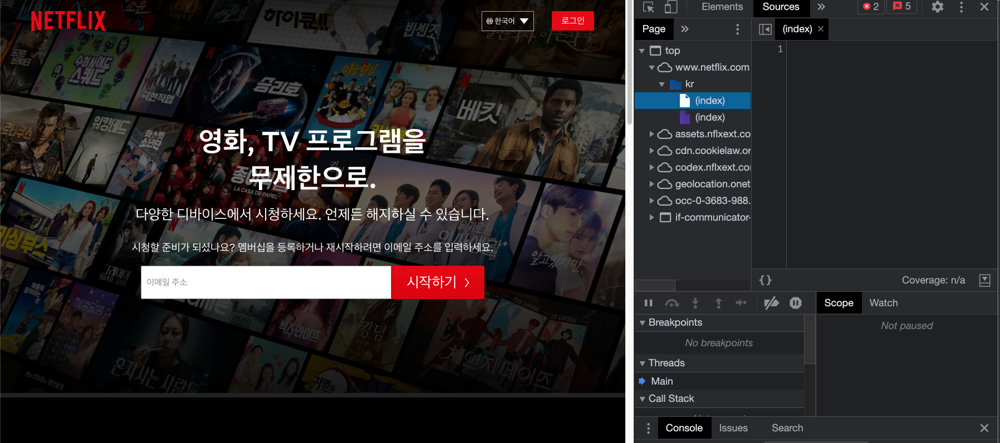

~~예전부터 react를 배워보고 싶었는데 원래 수강하던 강의가 끝나서 이번 기회에 리액트를 공부해보려고 한다~~

# 리액트 (React)
facebook에서 제공하는 웹 프레임워크로 자바스크립트 라이브러리의 하나이다.  

react를 이용하면 사용자와 상호작용할 수 있는 동적인 UI를 쉽게 만들 수 있기 때문에 많이 이용한다(생산성의 증가)

<br>

## 리액트 특징

| 특징 | 설명 |
| :--- | :--- |
| Data Flow | 단방향 데이터 흐름 |
| Component 기반 구조 | 독립적인 단위의 소프트웨어 모듈(component), View를 여러 컴포넌트로 쪼개서 만듬 |
| Virtual DOM | 이벤트가 발생시 Virtual DOM을 만들고 실제 DOM과 전후를 비교해 변경이 필요한 부분에 반영 |
| Props ans State | 부모컴포넌트에서 자식컴포넌트로 전달해주는 데이터(Props) - 읽기전용 , 컴포넌트 내부에서 선언하고 값을 변경할 수 없음(State) - 동적인 데이터를 다룰때 |
| JSX | Javascript를 확장한 문법 |

<br>


리액트를 시작하기 위해 **nodejs, npm, npx을 사용한다.** 

## \# node js
원래 javascript는 웹브라우저에서만 구동이 가능했으나, 크롬의 자바스크립트 엔진(V8)을 사용하여 웹브라우저가 아닌 여러 OS환경에서 javascript를 실행할 수 있는 환경을 제공한다

<br> 

## \# npm
Node Package Manager의 약자로 nodejs에서 사용할 수 있는 모듈을 패키지화해 설치 관리할 수 있는 역할을 한다.

<br>

## \# npx
Node Package eXecute의 약자로 nodejs 패키지 관리 모듈인 npm의 5.2.0버전부터 추가된 기능이다. 패키지를 설치하지 않고 npm 패키지를 1회성으로 실행해볼 수 있다.


<br>
<br>

# 리액트 시작하기

다음과 같은 명령어를 터미널에 입력해 실행한다
```
npx create-react-app [app name]
```

실행하고 보면 내가 지정한 앱 이름으로 폴더가 생성된 것을 확인할 수 있다.  

리액트는 아무 설정을 하지 않아도 내가 하는 작업이 바로바로 반영이 된다.

<br>

**<u>React는 자바스크립트로 내가 사용하는 요소들을 생성하고 그것들을 html로 밀어넣는다</u>**  

public 폴더의 index.html을 살펴보면 다음과 같은 부분이 있다.

```html
<body>
    <noscript>You need to enable JavaScript to run this app.</noscript>

    <!-- id가 root인 요소 -->
    <div id="root"></div>       

  </body>
```

그리고, src폴더의 index.js파일을 보면 다음과 같은 부분이 있다.

```javascript
ReactDOM.render(
  <React.StrictMode>
    <App />
  </React.StrictMode>,
  document.getElementById('root')   // index.html의 id가 root인 요소
);
```

이건 어떤 부분을 root의 아이디를 가진 요소를 찾아서 랜더링해준다는 의미이다.  
(만약 아이디가 root인 요소를 찾지 못하면 에러가 발생한다)

> 이 방식이 react가 빠른 이유라고 한다.  
html을 처음부터 넣지 않고, html에서 html코드를 추가하거나 삭제

브라우저가 동작할때 처음에 빈 html을 로드하고, component에 작성해둔 내용들이 react 내부 구조에 의해 빈 html에 추가된다. (때문에 웹브라우저에서 소스코드를 보면 html이 보이지 않는다고 한다)

<br>

실제로 그런가 싶어서 react로 만들어진 넷플릭스에 들어가서 소스코드를 살펴봤다.



index가 진짜 그냥 빈 페이지인 것을 확인했다. 

이렇게 되는 이유가 Virtual Dom을 가상으로 생성하고, 실제 DOM과 비교해서 변화가 발생한 부분만 react가 업데이트 하기 때문이다. 


