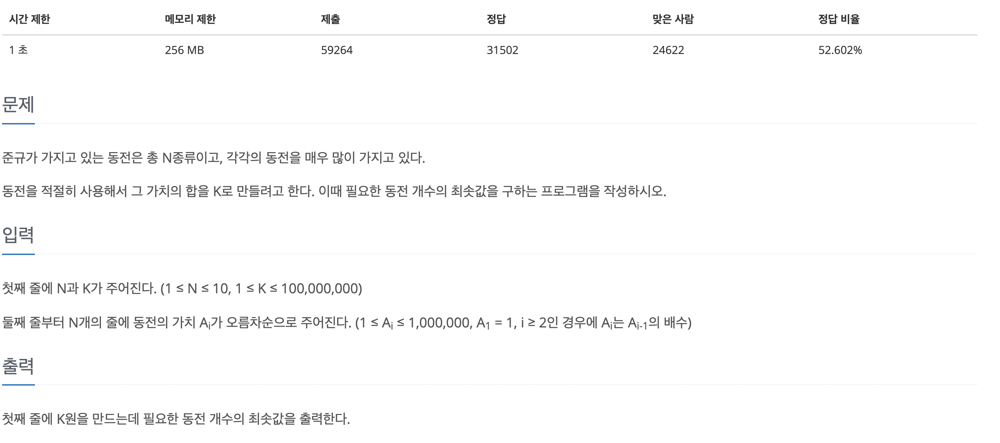
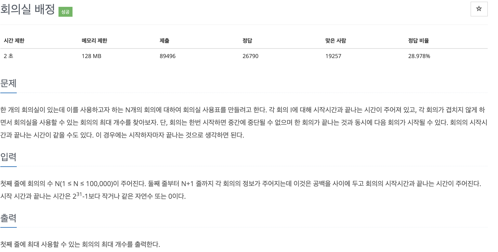

~~최근 백준 단계별 문제풀기에서 그리디 알고리즘을 풀기 시작했다. 그리디 알고리즘을 유투브에서 몇번 들어보긴 했지만 정확이 어떤 알고리즘인지 헷갈려서 정의를 내리고 다시 풀어보려고 한다.~~

<br>

# 그리디 알고리즘
그리디 알고리즘은 영어로 greedy algorithm이다. 해석해보자면 탐욕적인 알고리즘이라는 뜻이다.

왜 탐욕적인지를 찾아보니 **현재 상황에서 <u>가장 좋은 경우</u>를 선택**하기 때문이다.  

~~현재 상황에서 가장 좋은 해를 선택한다면 조삼모사같은건가? 싶은 생각이 들었다..~~

현재 상황에서 가장 좋은 해를 결정하고 다음 단계로 넘어가기 때문에 일부 상황에서는 나쁜 해가 될 수 있다. 

> 생각해보면 내가 a지점에서 b지점을 가는데 수많은 경로중에 가장 좋은 상황인 도로를 선택한다고 가정하면 원래 빠른 도로였던 곳이 사고가 나서 정체되었다가, 수습되서 다시 가장 빠른 도로가 된다면 그리디 알고리즘은 이 좋은 도로를 놓치게 되지 않을까라는 예를 생각했다

하지만 이런 그리디 알고리즘이 좋은 결과를 도출하는 상황들이 있기 때문에 많이 쓰이고, 근사치를 빠르게 구하기 위해서 사용되기도 한다.

<br>

내가 백준에서 제일 처음 경험한 문제는 동전문제였다.



몇 일 전에 푼 문제인데 이때는 그리디 알고리즘을 사용한지도 몰랐다

그냥 보고 `if`문으로 제일 큰것부터 망에 거른다는 느낌으로 풀면 되지 않을까 했는데 그 방법이 **그리디 알고리즘**이었다.

내 코드는 이렇다.

```javascript
const fs = require("fs");
const filePath = process.platform === 'linux' ? "/dev/stdin" : "./1_11047.txt";

// 입력요소를 줄바꿈으로 나눔
let input = fs.readFileSync(filePath).toString().trim().split("\n");

// 첫번째로 몇개의 동전 종류, 금액이 입력되서 n, k로 따로 구분
const n = parseInt(input[0].split(" ")[0]);
let k = parseInt(input[0].split(" ")[1]);

// 첫번째 줄을 지움(n, k)
input.shift();

// 각 동전을 숫자형으로 타입변환
input = input.map(item => +item)

// 결과를 저장할 변수 result(동전개수)
let result = 0;

// 오름차순으로 동전단위가 입력되기 때문에 for문을 거꾸로 돌렸다
for (let i = n-1; i >= 0; i--) {
  // while을 왜 썻는지 모르겠다... if문으로 바꿔도 될 것 같다
  while(input[i] <= k) {
  // if(input[i] <= k) {}
    result += parseInt(k / input[i]);   // 동전개수에 몫만큼 더해주고
    k %= input[i];    // 나머지를 금액으로 할당해준다
  }
}

console.log(result);
```

이렇게 최소의 동전 개수를 구할때는 동전의 <u>단위가 정해져있기때문에</u> 큰수부터 걸러주면? 가능한 큰 단위부터 빠지게 되므로 현재 상황에 최적, 결과적으로도 최적의 해가 도출된다. 

> 단위가 정해져있는 경우, 큰수부터, 작은수부터 이런 조건을 많이 사용하게 되므로 정렬이 많이 사용된다.

> 그리디 알고리즘에 대해서 정리하면서 한문제를 더 풀어봤다. 처음에는 정렬을 많이 사용한다는 사실을 잘 몰랐었다. 그래서 변수를 여러개 두고 if문을 덕지덕지 붙여서 푸는 방법으로 코드를 짰었다. 그리더 차라리 그리디 알고리즘에 대해서 알아보고 풀어보자라는 생각에 정렬을 많이 사용한다는 사실을 깨달았다...!

<br>

다음으로 푼 문제는 회의실 배정 문제이다.



처음 접근방식은 변수를 여러개 두고 만약에 다음 시작시간이 전의 강의들보가 크고, 그중에 강의 시작 시간이 제일 빠른 것을 선택해서 넘어가도록 코드를 작성했었다. 코드가 굉장히 더럽고, 계속 틀렸다고 나왔왔었다....

다음 코드가 정렬을 깨닫고 수정한 코드이다
```javascript
const fs = require("fs");
const filePath = process.platform === 'linux'? "/dev/stdin" : "./2_1931.txt";

let input = fs.readFileSync(filePath).toString().trim().split("\n");

// 강의의 개수를 따로 구분
const n = input[0];
input.shift();
let i;

// 우선 각 값들을 문자에서 숫자로
for (i = 0; i < n; i++) {
    input[i] = input[i].split(" ").map(item => +item)
}

// 시작시간이 더 큰수가 기준이 되면 안되기 때문에 시작시간을 기준으로 정렬, 끝나는 시간을 기준으로 정렬 (총 두번 정렬)
input.sort((a, b) => a[0] - b[0]);
input.sort((a, b) => a[1] - b[1]);

// 결과로 출력할 변수 result (가장 앞에 있는 값은 무조건 선택되기 때문에 초기값 1로 둠)
let result = 1;
let temp = input[0][1];   // 임시로 시작시간과 비교할 대상(선택된 강의의 끝나는 시간)

// 다음 강의의 시작시간과 비교하기 위해 (강의수 -1)까지
for (i = 0; i < n-1; i++) {
    if (input[i+1][0] >= temp) {
        result += 1;    // 출력할 결과에 +1 
        temp = input[i+1][1]    // 다음 강의의 시작시간과 비교할 선택된 강의의 끝나는 시간 할당
    }
}

console.log(result);
```

정렬을 하고 풀어보니 정말 수월하게 풀렸다...

<br>

## 그리디 알고리즘이 적용될 수 있는 경우
1. 이전의 선택이 이후의 선택에 영향을 주지 않아야 한다.
2. 각 부분 문제에 대한 최적해가 문제의 최적해를 얻을 수 있다.


~~2번 항목의 상황이라면 당연히 그리디 알고리즘이 무조건 좋은게 아닌가..?~~
~~다시 한번 느끼는 점이지만 무엇이든 조금이라도 알아보고 풀어보는게 최고인것 같다~~

