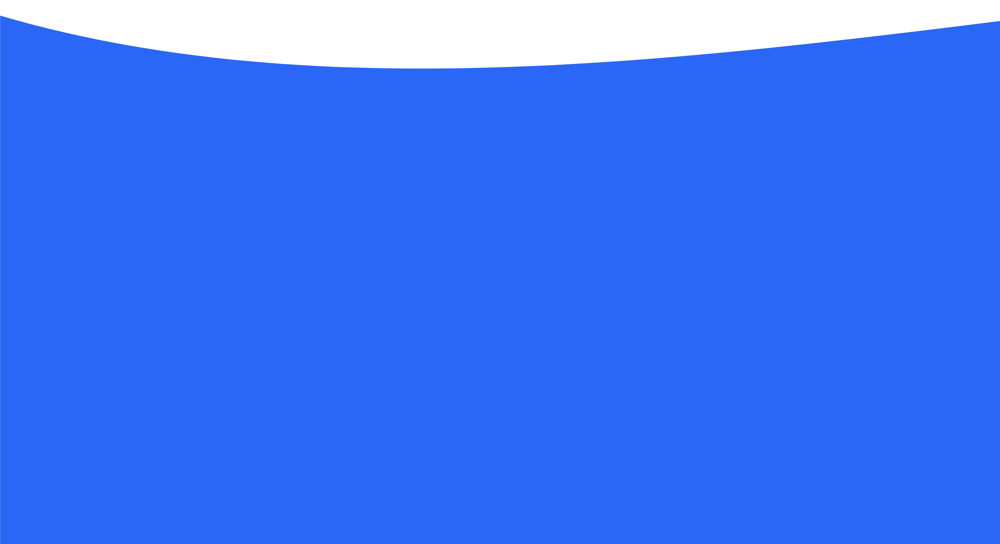
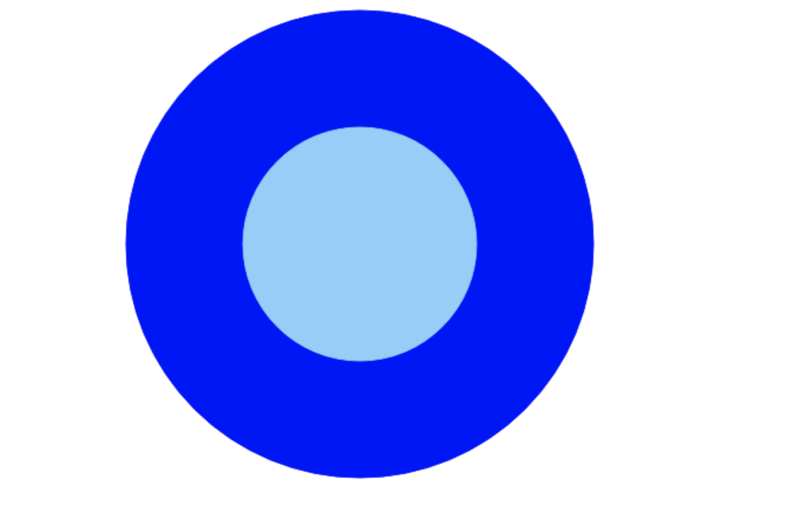
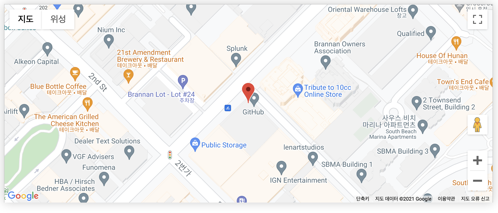

# 임베디드(embed)
외부의 소스를 불러와서 웹페이지 내에서 삽입하는 요소

<br>

# img
문서에 이미지를 삽입한다.  
내용이 존재하지 않고 속성으로 어떤 이미지를 어떻게 할지를 정의한다
`img`태그는 빈 요소로 닫는 태그가 없다(내용도 x)

## `src`
- 이미지의 경로를 지정
- 어떤 이미지를 보여줄지가 결정되기 때문에 필수적으로 존재해야하는 속성

## `alt`
- alternative text라는 뜻을 가지고 있다
- 이미지가 정상적으로 출력되지 않는 경우 `alt`의 텍스트를 출력한다
- 접근성을 높여준다(이미지를 글씨로 푠현할 수 있으므로)
- 이미지가 정상적으로 출력되면 사용자에게 보여지지 않는다
- 만약 이미지에 마우스를 올렸을때 간단한 텍스트를 보여주고 싶으면 `title=""`을 이용한다

## `width`, `height`
- 가로 세로 길이를 지정한다
- 기본 단위가 `px`이다
- height를 지정하지 않으면 비율대로 설정이 된다
- `width="100" height="100"` 단위(px)를 입력하지 않음

<br>

## 이미지 유형
웹브라우저에 따라 지원하는 확장자가 다르다

|종류|MIME|확장자|설명|
|:---:|:---:|:---|:---|
|JPEG|`image/jpeg`|`.jpg`, `.jpeg`, `.jfif`, `.pjpeg`, `.pjp`|정지 이미지의 손실압축에 적합하다(저장될수록 손실되기 때문에 여러번 재저장하면 픽셀이 뭉개진다)|
|PNG|`image/png`|`.png`|원본이미지를 보다 정확하게 보여주거나 투명도 지원(무손실 압축, 파일크기가 비교적 크다)|
|GIF|`image/gif`|`.gif`|여러장으로 이루어져 애니메이션 표현이 가능(256개의 색을 표현가능)|
|WEBP|`image/webp`|`.webp`|구글이 만든 이미지 포멧으로 우수한 성능을 가지지만 사용할 수 있는 브라우저가 적다(파일크기가 작다)|
|SVG|`image/svg+xml`|`.svg`|벡터이미지, 확대해도 깨지지 않음, XML언어로 구성되어 있다(이미지 임의 수정이 가능)|

예전에 물결이 차오르는 버튼을 블로그를 참고하면서 만든적이 있는데 그때 svg이미지가 다음과 같은 코드로 구성되어 있었다

```
data:image/svg+xml,%3Csvg xmlns='http://www.w3.org/2000/svg' width='100%25' height='100%25' viewBox='0 90 240 300' preserveAspectRatio='none'%3E%3Crect x='0' y='0' width='500' height='800' style='stroke: none; fill: %230066ff;' /%3E%3Cpath d='M0,100 C150,200 350,0 500,100 L500,00 L0,0 Z' style='stroke: none; fill:%23fff'%3E%3C/path%3E%3C/svg%3E
```


위 코드가 다음과 같은 이미지를 나타낸다. 이 당시 색상을 현재의 파란색으로 변경한건데 style부분의 fill을 바꿔서 사용했다

<br>

## `srcset`
`src`속성에 하나를 지정했다면 `srcset`는 여러개의 이미지를 반응형으로 보여줄 수 있다(viewport에 따라)

- 지원이 되지 않는 경우가 있으니 대표이미지를 `src`로 정의해둬야 한다
- 너비서술자: `w`
- 픽셀 밀도 서술자: `x`
- `srcset`에 있는 이미지가 필요할때만 이미지를 받아온다

```html

```
이렇게 사용할 수 있다.

## `sizes`
`srcset`을 사용했을때 이미지가 가변적으로 늘어날 수 있으나, `sizes`를 사용하면 최소 최대를 지정해 크기를 고정시킬 수 있다.

```html

```
600px이상일때는 600px로 고정시키고, 450px~600px일 경우에는 450px로 고정하고, 그 이외 300px로 고정한다는 의미

<br>
<br>

# video
비디오 요소를 삽일할 수 있다.

`video`태그의 내용에는 텍스트가 위치할 수 있는데 이는 비디오가 정상적으로 출력되지 않을때 출력되는 역할을 한다(`img`태그의 `alt`와 비슷하다고 보면 된다), 비디오가 정상적으로 출력된 경우 내용인 텍스트는 사용자에게 보여지지 않는다

`video` 태그 내에 `source`태그를 여러개 사용해서 문제가 있을시 다음 `source`태그의 요소를 보여준다. 

## 속성
|속성|설명|특이사항|
|:---:|:---|:---|
|`src`|비디오의 경로를 명시|`video`태그는 자식요소를 가질 수 있는 `<source>`로 표현할 수 있기 때문에 필수 속성이 아님|
|`controls`|비디오를 컨트롤할 수 있는 컨트롤러를 제공(음량, 시점, 시작 및 정지)|`boolean`값이 위치하고 기본값은 `false` |
|`autoplay`|재생가능한 시점에 자동으로 재생|`boolean`값이 위치하고 기본값은 `false`, 소리가 있는 경우 자동재생이 되지 않음(브라우저에서 막는다- UX)|
|`muted`|음소거를 해줌|`boolean`값이 위치하고 기본값은 `false`, `autopaly`와 같이 사용해서 `autoplay`가 작동하게 해준다|
|`loop`|반복해서 재생이 되도록 한다|`boolean`값이 위치하고 기본값은 `false`|
|`width`, `height`|가로,세로 값을 지정할 수 있다|-|
|`poster`|재생이 되지 않았을때 보여주는 화면(썸네일)|`poster`를 명시하지 않으면 첫번째 프레임을 사용|

```html
<video controls muted loop height="180" width="250" poster="이미지경로">
    <source src="비디오경로">
    비디오가 정상적으로 출력되지 않았을때 출력하는 대체텍스트
</video>
```

<br>

# audio
소리 컨텐프를 삽입할 수 있다. 

`audio`태그 내에 `source`태그를 사용해서 가장 위의 `source`태그를 검사해서 문제가 없으면 출력 있으면 다음번의 `source`태그를 출력한다.

## 속성
|속성|설명|특이사항|
|:---:|:---|:---|
|`src`|오디오 파일의 경로|`source`태그 사용가능|
|`autoplay`|자동재생|권장하지 않는다(되지 않는 브라우저가 많음)|
|`controls`|비디오를 컨트롤할 수 있는 컨트롤러를 제공(음량, 시점, 시작 및 정지)|`boolean`값이 위치하고 기본값은 `false`|
|`muted`|음소거를 해줌|`boolean`값이 위치하고 기본값은 `false`|
|`loop`|반복해서 재생이 되도록 한다|`boolean`값이 위치하고 기본값은 `false`|


```html
<audio  controls >
    <source src="비디오파일 경로" type="MIME에 따라">
    <source src="비디오파일 경로2" type="MIME에 따라">
    <source src="비디오파일 경로3" type="MIME에 따라">
</audio>
```

<br>

# canvas
그래픽 캔버스 요소로 API를 이용해 그래픽이나 애니메이션을 그릴 수 있게 한다 (js 필요)

html으로 마크업을 하고 js를 이용해서 style을 입힌다

<br>

canvas의 예제 코드를 봐도 감이 안잡혀서 간단하게 예제로 없던 동그라미를 만들기 위해 혼자서 해봤다

우선 깨달은 점은 html에서 들어갈 수 있는 크기를 지정해줘야 js로 할때 지정 크기를 넘어가도 잘리지 않는다

예제코드로 있던 `fillRect(10, 10, 150, 100);`은 x축으로 10이동, y축으로 10이동, 가로 150, 세로 100의 크기를 가진다라는 뜻이고,

`fillStyle = 'green';`은 색상을 브라우저에 내장된green으로 해준다는 것이다.

동그라미를 만들려면 css의 `border-radius`같은 속성이 있어야 할텐데 무엇일지 찾아봤다 `arc`라는 속성이 있었다

```javascript
arc(x, y, radius, startAngle, endAngle, anticlockwise)
// x,y = 축
// radius = 반지름
// startAngle = 시작각도
// endAngle = 진행각도
// anticlockwise = 방향
```
이걸 활용해서 다음과 같이 해봤다

```html
<script>
    const canvas = document.getElementById('canvas');
    const ctx = canvas.getContext('2d');
    const ctx2 = canvas.getContext('2d');

    // 준비단계 beginPath하지 않으면 이전의 그림과 섞인다
    ctx.beginPath();
    ctx.arc(300, 300, 200, 0, Math.PI*2, false)
    //그릴 선의 색상은 blue로 설정
    ctx.strokeStyle = "blue";
    // 그려라!
    ctx.stroke();
    // 채울 색의 색상은 blue로 설정
    ctx.fillStyle = "blue";
    // 채워라!
    ctx.fill(); 

    // 새로 시작하고 같은 좌표로 하늘색으로 원을 더 그려봤다!
    ctx2.beginPath();
    ctx2.arc(300, 300, 100, 0, Math.PI*2, false)
    ctx2.strokeStyle = "lightskyblue";
    ctx2.fillStyle = "lightskyblue";
    ctx2.fill(); 
    ctx2.stroke();
</script>
```



결과적으로 겹쳐진 원이 정상적으로 생겼다!


<br>

# iframe
인라인 프레임 요소

- 다른 html요소를 보여줄 수 있다
- 지도에 많이 이용한다(구글 맵)

예전에 클론 코딩을 진행하면서 사용했던 잊혀진 기억이 있는데 찾아보니 다음과 같다.

```html 
<iframe width="1218" height="685" src="https://www.youtube.com/embed/afvT1c1ii0c" title="YouTube video player" frameborder="0" allow="accelerometer; autoplay; clipboard-write; encrypted-media; gyroscope; picture-in-picture" allowfullscreen></iframe>
```

해당 코드는 youtube에 있는 동영상을 가지고 온 코드이다. 해당 코드는 유투브에 가서 오른쪽 마우스를 클릭한 후에 소스코드 복사를 하면 얻을 수 있었다.

`width`, `height`를 사용해서 크기를 지정하고, `src`는 해당 비디오의 주소이고 그외 정책을 허용하거나 프레임의 테두리 등등을 확인할 수 있다

<br>

# 추가적으로

iframe을 이용해서 지도를 삽입하는 경우가 많다고 했는데 잊고 있었지만 나는 다른 방법으로 지도를 삽입해본적이 있었다. 구글 API를 이용했다! 세부적인 내용이 기억이 안나서 수정해 보면서 기능을 찾아봤다

구글맵에서 API를 발급받고, html에서 `<div id="map"></div>`를 넣어주고 다음과 같은 형식으로 `script`로 사용한다

```html
<script>
    function initMap() {
        const myLatLng = {
            lat: 37.782293,
            lng: -122.391240
            // 경도 위도
        }
        const map = new google.maps.Map(
            document.getElementById('map'),
            {
                // 지정한 위치가 가운데로 오도록
                center: myLatLng,
                // 스크롤하면 확대축소
                scrollwheel: false,
                // 확대정도
                zoom: 18
            }
        );
        // 마커를 찍는 부분
        const marker = new google.maps.Marker({
            position: myLatLng,
            map: map,
            title: "GitHub"
            // 마커에 가져다 대면 나오는 텍스트
        })
    }
</script>
<script src="http://maps.googleapis.com/maps/api/js?key=APIKEY&callback=initMap" async defer></script>
```

이렇게 해주면 다음과 같은 지도가 내 웹페이지에 생기게 된다.

