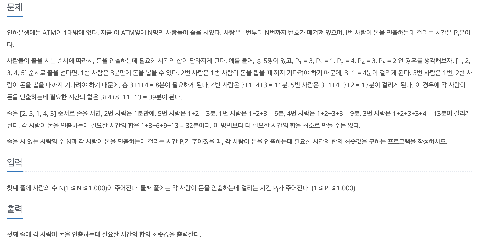

백준 단계별로 풀기 문제를 한문제씩 풀려고 노력하고 있다. 예전에 배열에 sort함수를 사용하면서 그냥 직관적으로 이렇게 하는거구나하고 넘어간적이 있는데 다시 사용하려다보니 이해를 안해서 기억도 안나고, 왜 그런지 너무 의문스러웠다.

나는 이 문제를 풀었다.



문제가 이해가 안가서 이게 뭔소리지..? 하고 있다가 그냥 이전사람들의 인출시간을 자신의 인출시간과 포함하여 가장 최소의 대기시간을 출력하면 되는 문제였다. 문제를 이해하자마자 그냥 이거 쭉 정렬시켜놓고 더하면 되는거같다 싶어서 바로 해봤다.

```javascript
const fs = require("fs");
const { abort } = require("process");
const filePath = process.platform === 'linux'? "/dev/stdin" : "./3_11399.txt";

let input = fs.readFileSync(filePath).toString().trim().split("\n");

const n = parseInt(input[0]);
input.shift();

input = input[0].split(" ").map(item => +item);

input = input.sort();


let temp = 0;
let result = 0;
for (let i = 0; i < n; i++){
    temp += input[i];
    result += temp;
};

console.log(result);
```

맞을줄 알았지만 틀렸다 왜 틀렸는지 이해가 안가서 데이터를 임시로 넣어서 정렬하고 console로 띄워보다 데이터가 10이상을 넣어보는 순간 깨달았다.


```javascript
// 기존 예시 데이터
5
3 1 4 3 2

// 이유를 알게된 데이터
5
100 10 13 2 4
```

```javascript
// 기존 데이터의 정렬
[ 1, 2, 3, 3, 4 ]

// 이유를 알게된 데이터의 정렬
[ 10, 100, 13, 2, 4 ]
```

<u>왜 정렬이 안되지?</u> 생각하다가 문득 생각이 났다! (**아 이거 숫자라고 숫자로 정렬하는게 아니지?!**)

MDN에서 `sort()`를 찾아보니 이렇게 되어있다.

> `sort()` 메서드는 배열의 요소를 적절한 위치에 정렬한 후 그 배열을 반환합니다. 정렬은 stable sort가 아닐 수 있습니다. 기본 정렬 순서는 문자열의 유니코드 코드 포인트를 따릅니다.

<br>

내가 한 `input.sort()`는 숫자를 기준으로 정렬한게 아니고 매개변수가 생략되서 유니코드값으로 정렬이 된것이다.

정확히 sort함수를 찾아보니 다음과 같았다.

```javascript
arr.sort([compareFunction])
```

여기서 **compareFunction**는 두개의 매개변수를 받는다 

보통 `a`와 `b`로 주고, 규칙은 다음과 같다

<br>

## 반환하는 값이 0보다 작으면 변환이 일어난다

### 1. 반환값이 0보다 큰 경우 그대로 a, b
### 2. 반환값이 0인 경우 그대로 a, b
### 3. 반환값이 0보다 작은 경우 b, a 로 변환

먼저 다음 예시를 보면 

```javascript
const arr = [ 100, 10, 13, 2, 4 ]
arr.sort((a,b) => b-a);

// a와 b에 반대로 들어간다
// 1번째 -> a=10, b=100 -> 변환op
// 2번째 -> a=13, b=10 -> 변환x
```

이런식으로 비교하면서 **<u>원본데이터를 수정한다</u>**

~~따라서 나는 `input = input.sort()`이렇게 할 필요가 없고, `input.sort()` 이렇게만 해줬어도 됬다~~

`a`와 `b`에 매개변수가 입력될때 반대로 입력되는 것을 확인할 수 있었다.
따라서 오름차순으로 정렬하려면 b가 a보다 큰경우에 변환이 일어나야한다. (`return a-b`) 반대로 내림차순으로 정렬하려면 a가 b보다 큰 경우 변환이 일어나야한다 (`return b-a`)

그래서 나는 정렬부분을 수정하고 제출했다

```javascript
const fs = require("fs");
const { abort } = require("process");
const filePath = process.platform === 'linux'? "/dev/stdin" : "./3_11399.txt";

let input = fs.readFileSync(filePath).toString().trim().split("\n");

const n = parseInt(input[0]);
input.shift();

input = input[0].split(" ").map(item => +item);

input.sort((a,b) => {return a-b})

let temp = 0;
let result = 0;
for (let i = 0; i < n; i++){
    temp += input[i];
    result += temp
};

console.log(result)
```

성공!

<br>
<hr>
<br>

요약하면 `sort`함수로 정렬할때

## 내림차순 정렬: `arr.sort((a, b) => {return b-a})`
## 오름차순 정렬: `arr.sort((a, b) => {return a-b})`

