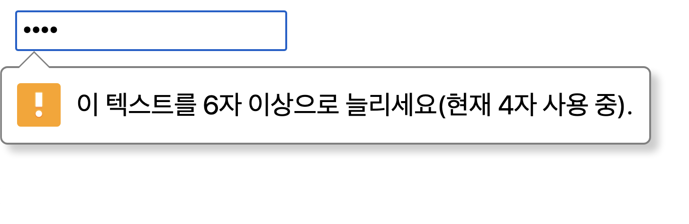

간단한 문제들을 풀어보았다

~~혹시 몰라서 문제를 올리지 않고 코드만 첨부하였습니다~~

# 1. h1~h6


```html
<h1>다람쥐 헌 쳇바퀴에 타고파</h1>
<h2>다람쥐 헌 쳇바퀴에 타고파</h2>
<h3>다람쥐 헌 쳇바퀴에 타고파</h3>
<h4>다람쥐 헌 쳇바퀴에 타고파</h4>
<h5>다람쥐 헌 쳇바퀴에 타고파</h5>
<h6>다람쥐 헌 쳇바퀴에 타고파</h6>
```


<br>

# 2. ol, ul


```html
<ul>
    <li>사과</li>
    <li>오렌지</li>
    <li>포도</li>
    <li>체리</li>
</ul>
<ol>
    <li>가지</li>
    <li>감자</li>
    <li>당근</li>
    <li>대파</li>
</ol>
```

- `ul`은 unordered list로 순서가 없는 리스트
- `ol`은 ordered lista로 순서가 있는 리스트

<br>

# 3. input




```html
<form>
    <input type="password" placeholder="비밀번호를 입력해주세요" minlength="6" maxlength="20"/>
</form>
```

- `type="password"`: 타입이 패스워드로, 입력시 *표로 보임
- `placeholder="비밀..."`: 공란일때 표시하는 텍스트
- `minlength="6"`, `maxlength="20"`: 최소길이, 최대길이를 지정

<br>

# 4. table


```html
<table border="1">
    <thead>
        <tr>
            <th rowspan="2">/</th>
            <th colspan="2">반기</th>
            <th rowspan="2">합계</th>
            <th rowspan="2">비고</th>
        </tr>
        <tr>
            <th>전반기</th>
            <th>후반기</th>
        </tr>
    </thead>
    <tbody>
        <tr>
            <th>2019</th>
            <td>10억</td>
            <td>20억</td>
            <td>30억</td>
            <td></td>
        </tr>
        <tr>
            <th>2020</th>
            <td>22억</td>
            <td>33억</td>
            <td>55억</td>
            <td rowspan="2">1)</td>
        </tr>
        <tr>
            <th>2021</th>
            <td colspan="2">집계중</td>
            <td>집계중</td>
        </tr>
    </tbody>
</table>
```

- `thead`, `tbody`, `tfoot`는 시멘틱적인 요소로 데이터 수집시 용이, 웹접근성 증가
- `border="1"`: 테두리 생성
- `th`: 분류의 주제가 되는 것
- `tr`: 행을 나타냄
- `td`: 데이터
- `colspan="2"`: 두개의 열을 차지함
- `rowspan="2"`: 두개의 행을 차지함

<br>

# 5. text 요소


```html
<p><var>∫</var><sub>0</sub><sup>t</sup>2<sup>5</sup>xlog<sub>2</sub>x</p>
```

- `var`: 변수를 나타내줌(글씨를 기울여짐)
- `sub`: 아래첨자
- `sup`: 위 첨자

