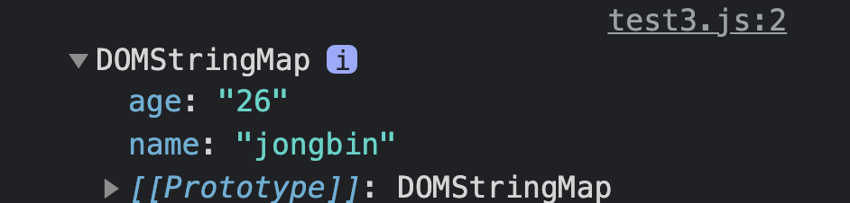
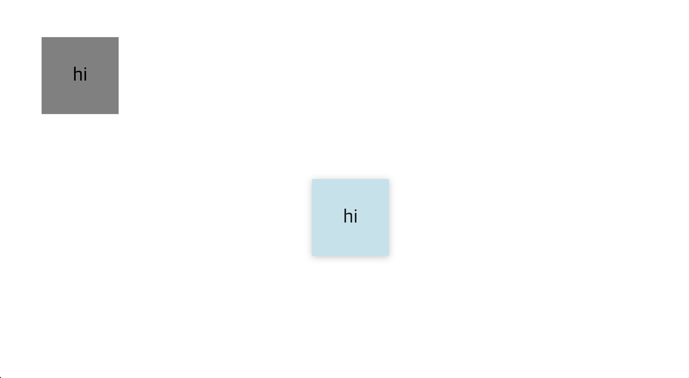

# 전역속성
전역속성은 어떤태그에도 전부다 사용할 수 있다.

<br>

# id
`id`는 식별자이며, 고유한 요소로 지정할 수 있다.

- 특정한 요소에만 js, style을 적용하고 싶을때 #idName으로 적용
- 딱 하나의 요소에만 적용할 수 있다.
- 공백이 들어가서는 안된다.
- 시작 단어는 무조건 영어 소문자

```html
<div id="name"></div>
```

<br>

# class
`id`와 비슷하지만 중복을 허용

- .classname으로 적용
- 중복이 가능하다(여러개의 요소에 지정가능)
- 하나의 요소에 여러개의 `class`가 지정할 수 있다.
- 여러개의 `class`가 지정될 경우 공백으로 구분한다.
- 하나의 클래스에는 공백이 들어가면 안된다.

```html
<div class="name"></div>
<!-- name클래스, hide클래스 두개의 클래스를 가짐 -->
<div class="name hide"></div>        
<div class="name"></div>
```

<br>

# style
css를 적용할 수 있다.   

- 태그안에 들어갈 수 있다(권장하지 않음)
- 빠르게 style을 적용할 수 있다.
- 우선적으로 적용

```html
<div style="color:#000">text</div>
```

<br>

# title
추가적인 설명을 툴팁으로 제공한다

- 마우스를 올리면 툴팁이 나온다
- 공백, 개행을 인식한다
- 가장 하위 자식의 `title`이 우선 적용 (상속이 됨)

```html
<div title="this is text">text</div>
```

<br>

# lang
요소의 수정 불가한 텍스트언어와 수정가능한 텍스트가 사용해야 하는 언어를 지정

- 사용자가 읽는 언어를 기준
- 웹 접근성을 높여주는 요소
- 상속이 됨
- `html lang="언어"`로 지정하고 부분적으로 지정이 가능

```html
<p lang="ko">글자</p>
<p lang="en">text</p>
```

<br>

# data
표준이 아닌 개발자가 지정한 속성(정보)

- `data-`로 시작하는 속성은 개발자가 지정한 data이다
- 사용자에게 보여지지는 않음
- 요소가 어떤 데이터를 지닐 수 있게 한다
- javascript나 css로 접근가능

```html
<!-- HTML -->
<div data-name="jongbin" data-age="26">JB</div>
```

```javascript
const data = document.querySelector("div");
console.log(data.dataset)       // dataset으로 불러옴
```


html의 `div`태그에 있는 `data-`로 지정했던 데이터들이 javascript에서 `dataset`으로 console에 찍어보니 잘 출력된다.

<br>

# draggable
요소의 드래그 사용 여부를 설정해줌(스크롤이 아님)

- `true`, `false`값으로 구분
- 기본값은 `auto`
- `javascript`로 동작을 감지해서 이벤트를 등록하거나 하는 코딩을 할 수 있다

```html
<div draggable="true">text</div>
```

## 드래그해서 위치를 변경하도록 대충 빠르게 만들어봤다.

```html
<!DOCTYPE html>
<html lang="en">
<head>
    <meta charset="UTF-8">
    <meta name="viewport" content="width=device-width, initial-scale=1.0">
    <title>Document</title>
    <style>
        div{
            width: 200px; 
            height: 200px; 
            margin: 100px; 
            background-color: lightblue;
            display: flex;
            justify-content: center;
            align-items: center;
            font-size: 50px;
        }
    </style>
    <script defer src="./test.js"></script>
</head>
<body>
    <main>
        <div draggable="true">hi</div>
    </main>
</body>
</html>
```

```javascript
// javascript
const div = document.querySelector("div");
console.log(div)

div.addEventListener("drag", (event) => {
    div.style.backgroundColor="gray"
})
div.addEventListener("dragend", (event) => {
    div.style.backgroundColor="lightblue"
    div.style.marginLeft = `${event.pageX}px`
    div.style.marginTop = `${event.pageY}px`
})
```





재설정되는 위치나, 여러 event들로 구현해야하지만 event로 인식하고 css를 바꾸거나 html요소를 제어할 수 있을 것을 확실하게 깨달았다!


<br>

# hidden
`hidden`을 적용해서 보여지지 않도록 할 수 있다.

- 개발자도구로는 볼 수 있다(html문서가 가지고 있음)
- boolean 값
- css에서 display를 변경하면 보이게 할 수 있음

```html
<div hidden>text</div>
<!-- 사용자에서 보여지지 않음 -->
```

~~나는 이방법 보다는 css에 `display:none;`으로 클래스를 추가 삭제해서 제어하는것이 더 편한것 같다...~~


