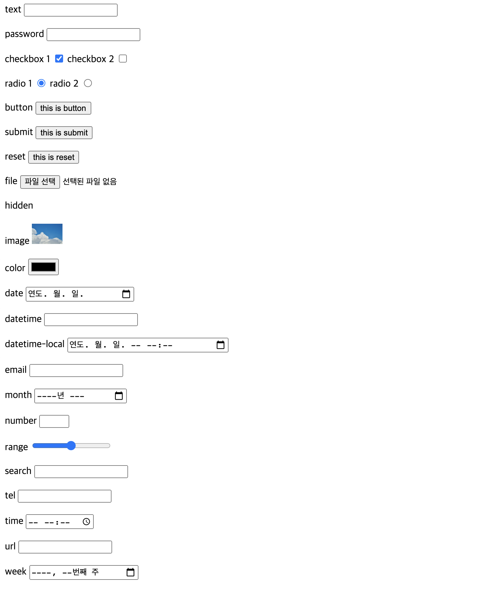
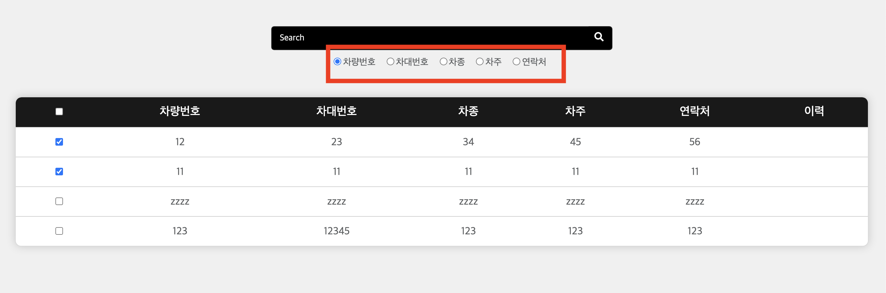
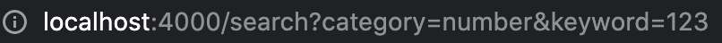
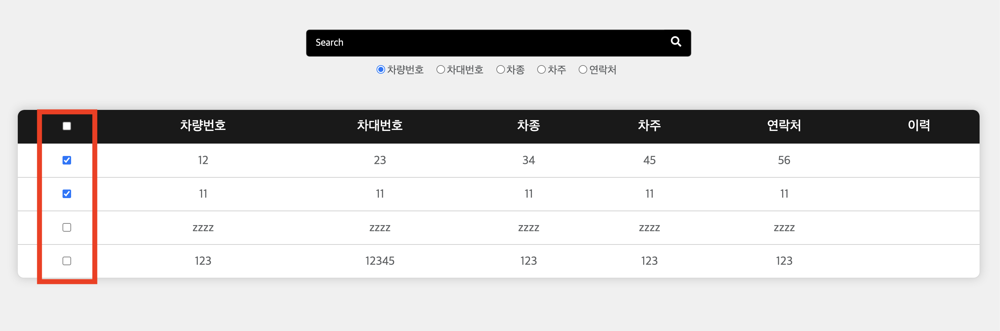
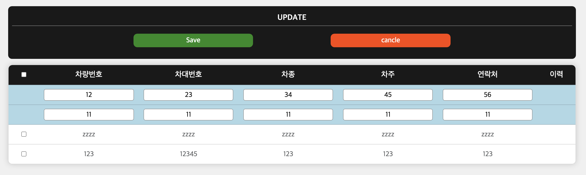
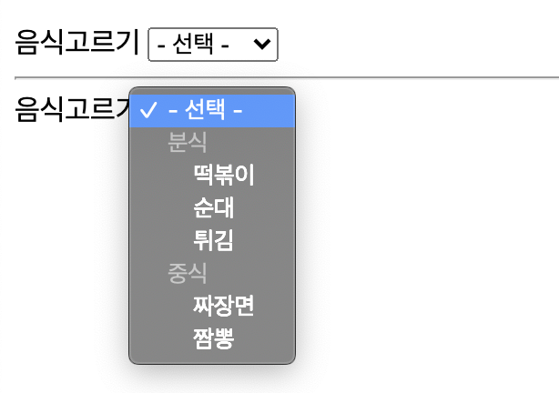

# form
`form`요소는 정보를 보내는 장치를 만들어준다(입력양식)

- 체크박스, 회원가입 입력란


## action
지정한 주소로 보내주기위해 주소를 지정할 수 있다.


## method
HTTP 메서드를 정의

메서드로는 3가지가 있다.

|메서드|기능|
|:---:|:---|
|`POST`| 양식데이터를 요청본문으로 전송 |
|`GET`| 양식데이터를 action의 URL과 `?` 구분자 뒤에 붙여 전송 |
|`DIALOG`| `<dialog>`내에 위치하면 제출과 함께 창을 닫음 |

<br>

~~직관적으로 보아도 GET은 받아오는 느낌이고, POST는 보내는 느낌이다~~

- GET메서드를 사용하면 주소창에 데이터를 보여주게된다(검색)
- POST메서드는 action의 URL로 데이터를 숨겨서 보낸다 (비밀번호, 설문조사)

<br>


# label
`input`태그와 함께 사용하여 어떤정보를 입력할지 설명해주는 역할

- `input`과 함께 사용하면 사용자가 정보를 입력할 때 조금 더 직관적으로 의도를 알 수 있고, UX측면, 접근성, 시멘틱적으로 보다 우수하다
- `for`속성을 이용해서 어떤 `input`을 가르키는지 나타낸다(`input`의 `id`를 가르킴)
- `label` 태그 내용(자식요소)으로 `input`태그를 넣어줄 경우 `for`속성을 사용하지 않아도 됨
- `inline` 요소
- 가능한 한 웹접근성을 위해서 label의 내용은 text로 작성

<br>

# fieldset
여러개의 `label`, `input`들이 있을때 구간을 나눠주는 역할

- `legend`태그(범례라는 뜻)을 이용해서 제목을 지정해줄 수 있다.
- `legend`태그는 무조건 `fieldset`의 첫번째 자식요소이여야한다
- fieldset을 이용하면 자식요소의 `input`요소들을 제어할 수 있다 (`disabled`)

```html
<form>
    <fieldset>
        <legend>주제</legend>

        <label for="name">이름</label>
        <input type="text" name="username" id="name">

        <label for="age">나이</label>
        <input type="text" name="userage" id="age">
    </fieldset>
</form>
```

<br>

# input
사용자가 정보를 입력할 수 있는 구역

`input`에는 `type`이라는 속성이 있는데 type에 따라 입력서식이나, 입력하는 정보들의 차이가 있다(유형이 다름)

## type
|type|설명|
|:---:|:---|
| `text` | 텍스트 입력칸(기본값) |
| `password` | text와 속성은 같으나, 데이터가 보이지 않음(*) |
| `checkbox` | 체크박스를 만듬(여러개 선택 가능) |
| `radio` | 라디오 버튼(한가지만 선택가능) |
| `button` | 누름버튼 |
| `submit` | 데이터 전송 버튼 |
| `reset` | 재설정 버튼 |
| `file` | 파일 선택칸을 만듬 |
| `hidden` | 사용자에게 보여지지 않는 창을 만듬 |
| `image` | 이미지로 된 전송버튼(`src="이미지경로"`) |
| `color` | 색상 선택칸을 만듬 |
| `date` | 날짜 입력칸(년, 월, 일) |
| `datetime` | 날짜 시간칸(년, 월, 일, 시, 분, 초, 초분할) - 표준시간o |
| `datetime-local` | 날짜 시간칸(년, 월, 일, 시, 분, 초, 초분할) - 표준시간x |
| `email` | email 주소칸 |
| `month` | 년과 달 입력칸 |
| `number` | 숫자 입력칸(`max`, `min`, `step`, `value`) |
| `range` | 동영상 컨트롤러 처럼 범위가 있는 칸을 만듬 |
| `search` | 검색칸 |
| `tel` | 전화번호 입력칸 |
| `time` | 시간 입력칸 |
| `url` | 주소 입력칸 |
| `week` | 년과 주 입력칸 |

수많은 태그들이 있지만 브라우저에 따라서도 지원하는 type이 있고 지원이 안되는 타입들이 있다 이때는 아래 링크에서 검색해서 확인해보자!

> https://caniuse.com/


<br>

## name
`input`들을 구분해주는 역할은 한다.
- `POST`로 데이터를 보낼때 백에서 `name`을 key로 데이터를 받는다

<br>

## placeholder
힌트의 역할을 한다
- 입력칸에 데이터를 입력하면 placeholder가 사라지고, 다시 빈칸으로 만들면 나타남

<br>

## autocomplete
자동완성이 가능하도록 한다
- 값으로 `on`, `off`
- 기본값은 `on`

<br>

## required
필수로 입력해야하는 입력칸을 명시
- `bollean`값 

<br>

## disabled
값을 입력할 수 없도록 함(`input`자체를 비활성화)
- 특수한 상황에 입력을 하지 못하게 할때 사용(주로 자바스크립트 이용)

<br>

## readonly
값을 입력할 수 없도록 함 (읽기전용)
- `value`를 주어 고정시킬 수 있다


## input 예시

```html
<form method="GET">
        <div>
            <label for="text">text</label>
            <input type="text" name="text" minlenght="10" maxlength="20">
        </div>
        <br>
        <div>
            <label for="password">password</label>
            <input type="password" name="password" minlenght="10" maxlength="20">
        </div>
        <br>
        <div>
            <label for="checkbox">checkbox 1</label>
            <input type="checkbox" name="checkbox" checked>
            <label for="checkbox">checkbox 2</label>
            <input type="checkbox" name="checkbox">
        </div>
        <br>
        <div>
            <label for="radio">radio 1</label>
            <input type="radio" name="radio" checked>
            <label for="radio">radio 2</label>
            <input type="radio" name="radio">
        </div>
        <br>
        <div>
            <label for="button">button</label>
            <input type="button" name="button" value="this is button">
        </div>
        <br>
        <div>
            <label for="submit">submit</label>
            <input type="submit" name="submit" value="this is submit">
        </div>
        <br>
        <div>
            <label for="reset">reset</label>
            <input type="reset" name="reset" value="this is reset">
        </div>
        <br>
        <div>
            <label for="file">file</label>
            <input type="file" name="file">
        </div>
        <br>
        <div>
            <label for="hidden">hidden</label>
            <input type="hidden" name="hidden">
        </div>
        <br>
        <div>
            <label for="image">image</label>
            <input type="image" name="image" src="../1_jb_space/10/img/sky2.jpeg" width="50px">
        </div>
        <br>
        <div>
            <label for="color">color</label>
            <input type="color" name="color">
        </div>
        <br>
        <div>
            <label for="date">date</label>
            <input type="date" name="date">
        </div>
        <br>
        <div>
            <label for="datetime">datetime</label>
            <input type="datetime" name="datetime">
        </div>
        <br>
        <div>
            <label for="datetime-local">datetime-local</label>
            <input type="datetime-local" name="datetime-local">
        </div>
        <br>
        <div>
            <label for="email">email</label>
            <input type="email" name="email">
        </div>
        <br>
        <div>
            <label for="month">month</label>
            <input type="month" name="month">
        </div>
        <br>
        <div>
            <label for="number">number</label>
            <input type="number" name="number" min="0" max="100" step="2">
        </div>
        <br>
        <div>
            <label for="range">range</label>
            <input type="range" name="range" min="0" max="1" step="0.1">
        </div>
        <br>
        <div>
            <label for="search">search</label>
            <input type="search" name="search">
        </div>
        <br>
        <div>
            <label for="tel">tel</label>
            <input type="tel" name="tel">
        </div>
        <br>
        <div>
            <label for="time">time</label>
            <input type="time" name="time">
        </div>
        <br>
        <div>
            <label for="url">url</label>
            <input type="url" name="url">
        </div>
        <br>
        <div>
            <label for="week">week</label>
            <input type="week" name="week">
        </div>
        <br>
    </form>
```

`text` 타입에 `minlenght`, `maxlenght`를 두어 글자수를 제한할 수 있고, `number`나 `range`에 `min`, `max`로 범위를 지정하고 `step`으로 간격을 조정할 수 있다. 또 `checkbox`나 `radio` 버튼에 `checked`(bollean값)으로 미리 체크될 값을 지정할 수 있다.



<br>
<br>

## \# 별첨
~~최근에 프로젝트를 하나 진행하고 있는 것이 있는데 상황에 따른 checkbox와 radio버튼을 사용한 사례가 있어서 되새기고자 정리했다.~~



다음과 같은 화면에서 처음에는 차량번호를 기준으로만 검색이 가능했었다.  
이때 post로 보내고 controller에서 db에 관련된 데이터를 가져올 수 있도록 구현을 했었다 생각해보니 "사용자가 차량번호가 아닌 고객의 이름, 연락처, 등에 따라서 검색을 원하는 경우가 생기지 않을까?" 라는 생각을 하게 되었고, 어떤 방식으로 만들어야할까 고민을 했었다.

이런 경우 검색은 무조건 한가지만 할 수 있으니 `radio`버튼으로 만들어서 같이 데이터를 보내줄 수 있지 않을까?라는 생각을 했고 바로 실행으로 옮겨보았다.

```html
<form id="search" method="GET">
    <div id="category">
        <input type="radio" name="category" value="number" checked>차량번호
        
        <input type="radio" name="category" value="i_number">차대번호
        <input type="radio" name="category" value="car_name">차종
        <input type="radio" name="category" value="owner">차주
        <input type="radio" name="category" value="phone">연락처
    </div>
    <input type="text" name="keyword" placeholder=" Search"/>
    <button class="search-btn">
        <a href="javascript:void(0)">
            <i class="fas fa-search"></i>
        </a>
    </button>

</form>
```
`form`의 `method`는 `GET`를 사용했다 따라서 해당 페이지의 주소창을 보게 되면 다음과 같다



`radio` 버튼 선택이 `caregory`, 검색어가 `keyword`이다

하나의 폼안에서 데이터가 두개가 같이 갈까 걱정이 많았지만 controler에서 console로 찍어보니 객체 형태로 전달이 가능했다. 

또한 사용자가 데이터를 수정해야하는 상황이 있을 수 있다고 생각했다.  
여기서 고민을 했던 한가지가 "사용자가 하나의 데이터씩 수정하기를 원할까? 여러개를 한번에 수정할 수 있다면 더 좋지 않을까?"였다 그래서 이번에는 `checkbox`를 이용해보기로 했다.  
`checkbox`를 이용해서 여러개를 선택한 뒤 db의 id를 기준으로 순서대로 반복문을 돌려서 업데이트사칼 수 있도록 작성하였다.



파란색이 수정중인 항목!

~~HTML을 살펴보니 `radio`에 오늘 공부한 `label`을 이용하면 더 좋을 것 같다 (수정해야겠다)~~


<br>
<br>

# select
값을 고를 수 있는 메뉴를 제공한다 

- 선택보기는 `option`을 이용하고, `option`의 속성 `value`는 전해줄 데이터를 의미한다.
- 처음에 "선택해주세요"같은 기본 선택문구를 이용하려면 `select`에 `required`을 추가하고, 해당 글의 `option`속성을 `value=""`로 한다
- `selected`는 미리 선택되어 있을 값을 지정(bollean)
- optgroup을 이용해서 보기를 그룹화시킬 수 있다.

```html
<form action="" method="get">
    <label for="food">음식고르기</label>
    <select name="food" id="food">
        <option value="">- 선택 -</option>
        <optgroup label="분식">
            <option value="1">떡볶이</option>
            <option value="2">순대</option>
            <option value="3">튀김</option>
        </optgroup>
        <optgroup label="중식">
            <option value="4">짜장면</option>
            <option value="5">짬뽕</option>
        </optgroup>
    </select>
</form>
```


<br>

# datalist
사용자가 입력할 수 있는 칸(보기를 추천)

- `select`와 유사하지만 수정할 수 있다는 큰 차이점 존재
- `input`의 속성 `list`에 `datalist`의 `id`를 반드시 명시

```html
<form method="GET">
    <label for="food">음식고르기</label>
    <input type="text" name="food" id="food" list="food-list">
    <datalist id="food-list">
        <option>빵</option>
        <option>회</option>
        <option>회덮밥</option>
        <option>고기</option>
    </datalist>
</form>
```

<br>

# textarea
멀티라인 텍스트를 입력받을 수 있는 칸

- 자식요소를 가질 수 있다.
- 미리 데이터를 입력시켜둘 수 있다.
- `pre`와 비슷하게 작동
- `rows`로 가로줄, `cols`로 세로줄의 수를 지정할 수 있다(크기, 제한을 하는것이 아님)
- `placeholder` 사용 가능
- 크기를 늘였다 줄였다 할 수 있음
- 크기를 고정시키기 위해 크기를 지정하고, css에 `resize: none;`을 추가

```html
<textarea name="" id="" cols="30" rows="10" placeholder="내용을 입력하세요.">
    미리 값도 쓸 수 있다! 
</textarea>
```
