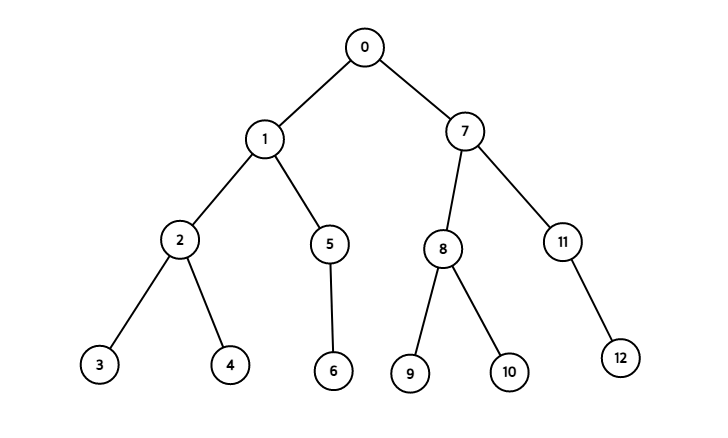

# DFS (Depth First Search)

DFS알고리즘이란 **깊이 우선 알고리즘**으로 **\*그래프탐색에** 이용된다.

## 그래프탐색
그래프안에 어떤 값이 있는지를 확인할 수 있다 하나의 정점에서 시작해서 차례대로 모든 정점을 방문한다


- 그래프: 자료구조의 일종으로, 정점(노드)과 간선(관계)의 집합
- 차수: 정점과 연결되어 있는 간선의 개수
- 정점: 노드(아래 사진의 동그라미) - 프로그래밍에서변수로 표현
- 간선: 정점을 연결해줌(관계, 선) - 어디에 연결되어있는지 저장(배열 등 자료구조)

<br>

왜 깊이 우선 탐색에 깊이 우선이라는 말이 붙었을까?



위 사진에서 각 숫자로 방문하는 순서를 기입했다 (트리의 전위순회)

이런 그래프가 있을때 아래로 내려가는 순서를 우선으로 해서 깊이 우선 탐색이라고 하는 것 같다 방문을 하는 방법은 전위, 중위, 후위 여러 방법을 사용해도 가능하지만 깊이! 내려가는 것을 우선으로 하는것 같다 구길링으로 구현해둔 코드를 봤을때도 보통 재귀함수를 통해서 더이상 간선으로 이어진 노드중에 방문하지 않은 노드가 없을 경우 다시 return하고, 돌아와서 진행한다

### DFS 깊이 우선 탐색은 <u>어떤 노드를 방문했는지 여부를 반드시 검사</u>한다  

~~따로 리스트같은걸 만들어서 if문으로 확인하면 될까싶다~~

<br>


위 그래프를 코드로 js로 구현해보면 이렇게 될 것 같다

```javascript
const graph = {
    0: [1, 7],
    1: [0, 2, 5],
    2: [1, 3, 4],
    3: [2],
    4: [2],
    5: [1, 6],
    6: [5],
    7: [0, 8, 11],
    8: [7, 9, 10],
    9: [8],
    10: [8], 
    11: [7, 12],
    12: [11]
}

let visitCheck = new Array(Object.keys(graph).length).fill(false)
let i;
let temp = [];

const dfs = (targetGraph, currentNode, visitNode) => { 
    visitNode[currentNode] = true;
    temp.push(currentNode);
    for (i = 0; i < targetGraph[currentNode].length; i++) {
        if (visitNode[targetGraph[currentNode][i]] === false) {
            dfs(targetGraph, targetGraph[currentNode][i], visitNode)
        }
    }
    i = 0;
    return currentNode
}
dfs(graph, 0, visitCheck)
console.log(temp)
```

결과는 다음과 같이 순서대로 잘나왔다

```
[
   0, 1, 2, 3,  4,  5,
   6, 7, 8, 9, 10, 11,
  12
]
```

혹시 몰라서 graph의 순서를 바꿔서 진행해 보았다 구글링해서 graph(data)
를 다음과 같이 바꿨다 (알파벳을 숫자로만 바꿔줌)

  
> 출처 https://www.fun-coding.org/Chapter18-dfs-live.html

<br>

```javascript
const graph = {
    0: [1, 2],
    1: [0, 3],
    2: [0, 6, 7, 8],
    3: [1, 4, 5],
    4: [3],
    5: [3],
    6: [2],
    7: [2],
    8: [2, 9],
    9: [8],
}
```
```
[
  0, 1, 3, 4, 5,
  2, 6, 7, 8, 9
]
```
정상적으로 모든 노드를 방문했다!!!!

역시 구현해보는게 도움이 많이 되는 것 같다!

참고로 장단점으로는 다음과 같다!
> DFS의 장점으로는 **운이 좋을 경우 최소 시간에 해를 찾을 수 있다**  
그러나 **최악의 경우 모든 경로를 탐색해야하므로 가장 오랜 시간**이 걸린다고 한다.


