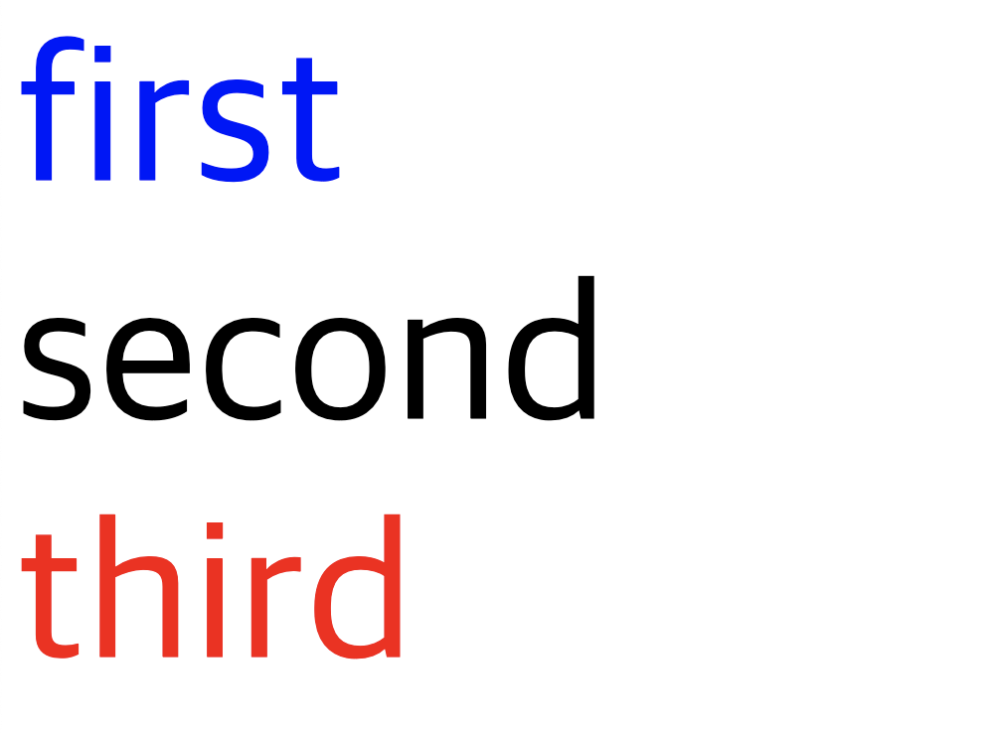

# CSS 선택자
CSS 규칙을 정의할 요소를 지정

## 주로 사용하는 선택자 (type, class, id)
1. type

    모든 요소에 적용하는 선택자
    ```css
    p {
        color: black;
        font-size: 30px;
    }
    ```
    - `p`태그 전체에 적용됨

2. class

    다수의 특정 요소에 적용하는 선택자
    ```css
    .class-name {
        color: red;
        font-weight: 700;
    }
    ```
    - class-name이라는 클래스를 가진 요소들에 모두 적용  
    - 하나의 요소에는 여러개의 클래스가 지정될 수 있다.


3. id

    유일한 특정 요소에 적용하는 선택자
    ```css
    #id-name {
        color: blue;
        font-size: 10px;
        font-weight: 500;
    }
    ```
    - id-name이라는 id를 가진 요소 단 한개에만 적용

## 속성선택자
- 대괄호를 사용해서 속성을 넣어준다
- 속성과 값을 넣어줄 수 있다.
- 속성과 값을 지정할 때 정확한 값이 아닌 시작위치, 포함 등등으로 선택할 수 있다.
- `속성^=""`: 해당 값(문자)로 시작하는
- `속성$=""`: 해당 값(문자)으로 끝나는  
- `속성*=""`: 해당 값(문자)을 포함하는

```css
/* target속성을 가지고 있는 a태그에 적용 */
a[target] {
    color: red;
}

/* type속성이 range인 input태그에 적용 */
input[type="range"] {
    background-color: black;
}

/* type태그 중에 값이 ran으로 시작하는 input태그에 적용  */
input[type^="ran"] {
    background-color: black;
}

/* type태그 중에 값이 t로 끝나는 input태그에 적용  */
input[type$="t"] {
    background-color: black;
}

/* type태그 중에 값이 t를 포함하는 input태그에 적용  */
input[type*="t"] {
    background-color: black;
}
```

<br>

# 가상클래스 선택자
selector 뒤에 콜론(`:`)을 붙이고 명시한다.

## 1. first-child  

전체의 형제요소 중 첫번째 요소만 선택됨
```css
li:first-child {
    color: skyblue;
}
```
형제요소 중에서 li를 가지고 첫번째 요소에 적용


## 2. last-child  

형제요소 중 마지막 요소만 선택됨
```css
li:last-child {
    color: green;
}
```


## 3. nth-child(n)

형제요소 중 n번째 요소만 선택됨
```css
li:nth-child(3) {
    color: green;
}
```
- 0부터 시작이 아님(첫번째 요소는 1)
- 괄호 안에 함수식으로 사용도 가능 ex) 2n -> 짝수, 2n-1 -> 홀수
- 함수를 넣은경우 1부터 순서대로 대입됨
- even을 넣으면 짝수, odd는 홀수


## 4. first-of-type

first-child는 형제 요소중에 지정한 타입에 적용이되지만, first-of-child는 형제 중에서 특정 타입중에서 첫번째에 적용
```css
p:first-of-type {
    color: red;
}
```
- 형제 요소에 다른 타입의 태그들이 섞여있더라도 `p`태그 중에서의 첫 번째에 적용이 된다
- 만약 클래스와 함께 사용한다면 (`.class:first-of-type{}`) 각각의 타입들의 첫번째 요소에 모두 적용한다


## 5. last-of-type

형재 요소중 해당 타입의 마지막 요소에 적용
```css
p:last-of-type {
    color: black;
}
```
    

## 6. nth-of-type(n)

형제요소들 중 해당 타입에 n번째 요소에 적용
```css
p:nth-of-type(2) {
    font-size: 30px;
}
```
- nth-child와 비슷하지만, 각각의 타입에 적용한다는 차이점이 존재

## 7. not
부정선택자
```css
seletor1:not(selector2) {
    /* css 내용 */
}

input:not([type="range"]) {
    background-color: black;
}
```
- `()` 괄호 안에 있는 내용은 포함하지 않음
- selector1을 대상으로 하지만 그중에 selector2는 해당되지 않음


## 8. link
방문기록을 사용해서 방문했는지 방문하지 않았는지에 따라 바뀐다.

```css
/* HTML */
<a href="address">Link</a>

a:link {
    color: tomato;
}
```

> 상태에 따라 css를 바꿔줌 (동적 가상클래스 선택자) 

## 9. hover
마우스를 해당 요소에 올려두었을때 css를 변경
```css
button {
    background-color: black;
}
button:hover {
    background-color: red;
    color: white;
}
```

## 10. active
동작이 실행될때(마우스를 클릭하고 떼기전) css를 변경
```css
button:active {
    background-color: white;
    color: black;
}
```
- `link`나 `button`에 많이 사용됨
- 이런 선택자를 사용할때는 LVHA(link-visited-hover-active)순서에 따라서 하는것을 권장

## 11. focus
포커싱(선택과 비슷, 텍스트창에 텍스트를 입력할때)이 되었을때 css를 변경
```css
button:active {
    background-color: blue;
    color: black;
}
```

## 12. enabled, disabled
`disabled`가 아닌 상태의 요소의 css를 변경 또는 `disabled`인 상태의 요소 css를 변경
```css
/* HTML */
<input type="text" />
<input type="text" disabled/>

input[type=text]:enabled {
    background-color: black;
}
input[type=text]:disabled {
    background-color: black;
}
```

## 13. checked
checked라는 속성을 가지는 요소의 css를 변경
```css
input[type-checkbox]:checked {
    outline: black;
}
```

<br>

# 가상 요소 선택자
selector 뒤에 더블콜론(`::`)을 붙이고 명시한다.

실제로 존재하지 않는 요소, 범위를 많들어 css를 지정한다

## 1. before
해당 요소 앞에 가상요소를 추가함
`content`라는 속성이 무조건 필요함(공백이라도)

```css
/* HTML */
<li>hi</li>
<li>hello</li>

/* li앞에 화살표가 추가됨 */
li::before{
    content: '➡︎'
    color: red;
}
```
- `after`는 before와 동일하게 작동하고, 해당 요소의 뒤에 추가됨

## 2. first-letter
첫번째 글자에만 스타일을 적용한다.

```css
p::first-letter {
    font-size:30px;
    color: red;
}
```
- `before`와 함께 사용되면 `before`가 더 앞에 있기 때문에 `before`에 적용이 된다

## 3. fist-line
첫번재 줄에 스타일을 적용한다

```css
p::first-line {
    font-size:30px;
    color: red;
}
```
- 개행이 된 기준 (창이 커져서 첫 라인에 더 많은 글자 수가 포함되어도 적용)

## 4. selection
선택된 영역에 css를 적용(마우스 드래그)

```css
p::selection {
    background-color: red;
}
```

<br>

# 선택자 결합
결합을 통해서 보다 세부적으로, 더 많은 요소에 css를 적용되게 할 수 있다

## 하위 선택자
공백 한칸으로 구분하고, 적용범위를 좁힐 수 있다.
```html
<!-- HTML  -->
<ul>
    <li>hi 111</li>
    <li>hello 111</li>
    <ul>
        <li>hi 222</li>
        <li>hello 222</li>
    </ul>
</ul>
```

```css
/* CSS */
ul li:last-of-type {
    color: red;
}
```
- `ul` 하위요소중 `li`중에 마지막 요소에 css 적용
- hello 111, hello 222에 css가 적용된다
- 중간에 다른 요소를 거치더라도 적용이 됨


## 자식 선택자
자신의 직속 자식요소 중에서 css를 지정하기 위해 사용 (`>` 사용)

```html
<!-- HTML  -->
<ul>
    <li>hi 111</li>
    <li>hello 111</li>
    <ul>
        <li>hi 222</li>
        <li>hello 222</li>
    </ul>
</ul>
```

```css
/* CSS */
ul > li:last-of-type {
    color: red;
}
```
- `ul` 직속 하위 요소중 `li`중에 마지막 요소에 css 적용
- hello 111에만 css 적용


## 형제 선택자
1. 일반 형제 선택자

    형제 요소 중에서 css를 적용함

    `selector1 ~ selector2 {}`일때 html에서 위치상 `selector1` 뒤에 존재하는 요소중에서 **모든** `selector2`를 찾아서 css 적용 (`~`로 표시)

    ```html
    <!-- HTML -->
    <div>
        <span>span</span>
        <div>div</div>
        <p>ppp</p>
    </div>
    ```

    ```css
    /* CSS */
    span ~ p {
        color: red;
    }
    ```
    - span뒤의 p에 적용하므로 ppp가 빨간색으로 적용됨


2. 인접 형제 선택자

    해당 요소 바로 뒤에 있는 형제 요소에 css를 적용한다 (`+`로 표시)


    ```css
    /* CSS */
    span + p {
        color: red;
    }
    ```
    - 위 html을 대상으로 `span`뒤에 `p`가 위치하지 않았으므로 아무것에도 적용되지 않음
    - 만약 선택자가 `span + div`였다면 `div`에 빨간색 글자색상을 적용


## 그룹화
선택자를 `,`로 묶으면 해당 요소에 전체 적용
```css
p, span {
    background-color: skyblue;
}
```

<br>

# 범용 선택자
- 전체를 선택함 (`*`)
- 모든 요소에 적용
- 가장 상단에 명시하는 것을 권장

```css
* {
    color: black;
}
```

<br>

# 상속
css는 상속이 가능한데 이것을 **제어할 수 있는 방법이 3가지** 있다

```html
<div class="first">
    1
    <div class="second">2</div>
    <div class="third">3</div>
</div>
```

```css
.first {
    color: tomato;
}

.second {
    color: initial;
}

.third {
    color: initial;
}
```

## initial
- 상속을 받지 않는다는 의미
- 위 코드에서 second 클래스에 해당하는 요소의 color는 기본값이 됨
- all 속성으로 해당 요소의 모든 속성을 지정할 수 있음 (`all: initial;`)  

## inherit
상속을 받지만 현재 자신의 css가 더 우선이 되는데 무조건 상속값을 사용하도록 지정함(부모요소에서)

```css
.first {
    color: tomato;
}

.first * {
    all: inherit;
}
```

## unset
1. 부모로 받은 상속값이 존재할때: `inherit`으로 동작
2. 부모에게 상속박을 값이 없을때: `initial`로 동작

- 보통 초기화를 할때 사용한다

<br>

## \# 이걸 보면서 궁금한점이 그럼 `inherit`과 `initial`이 만나면 어떻게 될까?

```html
<!DOCTYPE html>
<html lang="en">
<head>
    <meta charset="UTF-8">
    <meta name="viewport" content="width=device-width, initial-scale=1.0">
    <title>Document</title>
    <style>
        * {
            font-size: 100px;
        }
        .first {
            color: blue;
        }
        .first * {
            color: inherit;
        }
        .second {
            color: initial;
        }
        .third {
            color: red;
        }
    </style>
</head>
<body>
    <div class="first">
        first
        <div class="second">second</div>
        <div class="third">third</div>
    </div>
</body>
</html>
```


`inherit`이 무시가 되었다 

혹시나 순서가 영향을 미치지는 않을까 싶어서 `inherit`을 가장 아래로 바꿔보았다

```css
* {
    font-size: 100px;
}
.first {
    color: blue;
}
.second {
    color: initial;
}
.third {
    color: red;
}
.first * {
    color: inherit;
}
```


그 결과 정상적으로 모두 color가 파란색이 되었다. 

같은 레벨이라서 순서가 영향을 주는 것 같다


<br>
<br>

# 우선순위

1. 선언된 위치에 따라서 적용된다  
    인라인스타일 > (head태그 내 위치에 따라) 내부, 외부 스타일

2. 명시도가 높은것(적용범위가 낮은것)이 우선됨  
    ### \# 우선순위 (위의 요소가 강함)
    - !impoirtant (css 작성시 제일 뒤에 명시)
    - 인라인스타일
    - Id
    - Class/Attribute/Pseudo Class
    - Type
    - *
    - 상속받은 값

3. 코드의 위치에 따라서 나중에 선언된 것이 우선됨