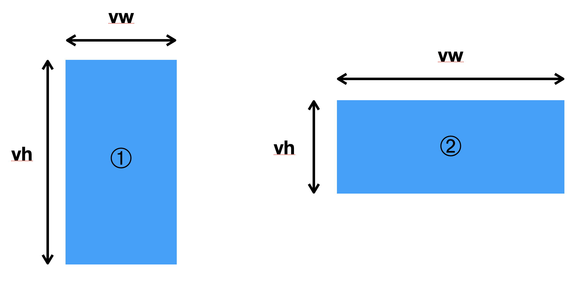
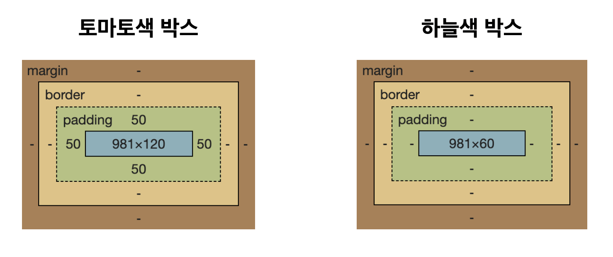

# 단위와 값

1. 상대길이 단위: `em`, `rem`, `vw`, `vh`

2. 절대길이 단위: `px`


## px
하나의 점(픽셀)을 의미한다

- 모든 상대단위는 px로 계산된다

<br>

> ~~의문이었던 점이 픽셀은 해상도에 따라 다르다고 알고 있다 사용자마다 모니터의 크기가 다른데 어떻게 고정된 단위라고 말할 수 있을까?~~  
<br>
찾아보니 일반적은 모니터와 브라우저의 픽셀개념은 조금 다르다고 한다. 모니터는 해상도를 기준으로 하기 때문에 픽셀이 달라질 수 있다, 하지만 브라우저는 DIP라는 다른 단위를 기준으로 픽셀을 산정하기 때문에 같다고 할 수 있는것이다 DIP는 한 박스 안에 같은 내용을 얼마나 많은 점을 찍어서 표현할 수 있는지를 나타낸다고 한다. 브라우저는 이를 이용해서 DIP 대비의 px값을 산정하기 때문에 모든 사용자가 같은 고정된 크기로 인식할 수 있는 것이다.

<br>

## em
em은 부모의 `font-size`를 기준으로 한다
- 1em = 부모의 `font-size`
- `font-size: 2em`이 되면 부모의 `font-size`의 두배
- %와 동일하다

<br>

## rem
rem은 root의 font-size를 기준으로 한다
- root의 `font-size`는 보통 16px이므로 `font-size: 2rem`은 32px이 된다
- rem이 직관적으로 사용하기에 편함

<br>

## vw
viewport를 기준으로 한다
- 모니터의 크기가 아닌 프로그램의 보이는 부분을 말함
- 1vw, 1vh = viewport의 각각 1%를 뜻함

<br>

## vmin, vmax
vw와 vh중 더 큰 크기를 기준으로 한다



1번에서는 vh가 vw보다 크고, 2번에서는 vw가 vh보다 크다

<u>더 큰 길이가 vmax, 작은 길이가 vmin</u>

따라서 1번은 vh의 길이가 vmax가 되고 2번은 vw가 vmax가 된다
~~동영상의 전체화면 보기에서 이런것을 활용하지 않을까 라는 생각이 들었다~~

<br>

## %
부모의 값이 100%임을 기준으로 한다

~~한때 헷갈렸던 일이 있는데 padding과 margin에 따라 달라지는 것이다.~~

```html
<!DOCTYPE html>
<html lang="en">
<head>
    <meta charset="UTF-8">
    <meta name="viewport" content="width=device-width, initial-scale=1.0">
    <title>Document</title>
    <style>
        * {
            font-size: 50px;
            text-align: center;
        }
        .container {
            background-color: beige;
            margin: 100px;
            height: 300px;
        }
        .outer {
            background-color: tomato;
            padding: 50px;
            width: 100%;
            box-sizing: border-box;
        }
        .inner {
            background-color: lightblue;
            width: 100%;
            box-sizing: border-box;
        }
    </style>
</head>
<body>
    <div class="container">
        <div class="outer">margin
            <div class="inner">padding</div>
        </div>
    </div>
</body>
</html>
```


박스 세개를 만들었다 모든 박스의 가로길이는 100%이다

베이지색의 가장 외부 박스에는 margin속성을 넣어주었고, 토마토색상의 두번째 박스에는 padding속성을 넣었다 

margin을 넣은 박스(베이지)는 자신의 길이를 100이라고 했을때 그 자식요소가 100이 된것을 확인할 수 있었지만 padding을 적용한 박스(토마토)는 자식요소가 padding만큼 줄어든 것을 확인할 수 있었다.

<br>



이때 알수 있었던 것이 개발자 도구에서 봤을때 가장 내부의 파란색박스를 기준으로 %가 정의됨을 알 수 있었다(내가 정의한 값이 아님)

<br>

## 함수표기법

```css
.class {
    width: calc(100% - 50px);
}

.class2 {
    width: min(100%, 100px);
}
.class3 {
    width: max(100%, 100px);
}
```

- ## `calc()`
    - 값을 계산해서 넣을 수 있다.
    - 사칙연산(+, -, /, *)이 가능하다
    - 연산자 좌우에는 공백을 주는 것을 권장한다
    - 브라우저가 자동으로 계산한다
- ## `min()`
    - 더 작은 값을 자동으로 선택한다
- ## `max()`
    - 더 큰 값을 자동으로 선택한다

`min()`과 `max()`는 IE에서는 전혀 지원하지 않는다


