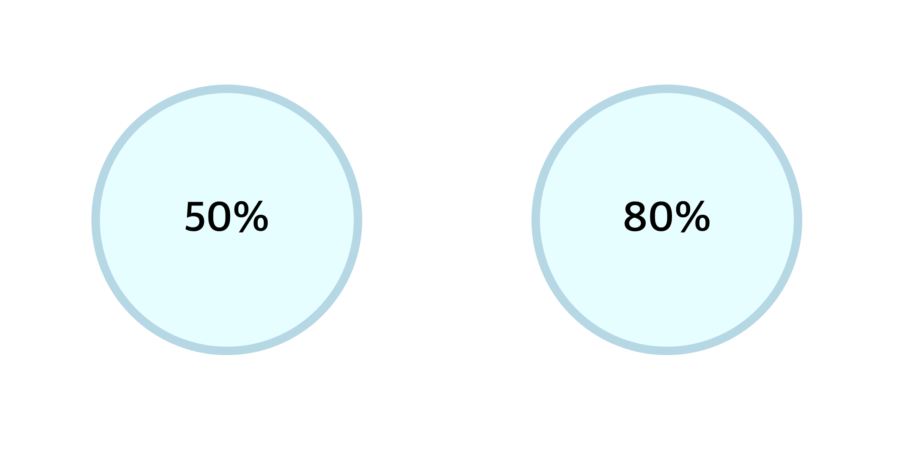

# 박스모델
브라우저에서는 전부 네모 형태로 계산이 되어진다

바깥쪽부터 **margin영역-border영역-padding영역-content영역**으로 나눠져있다.

## width, height
요소의 너비 및 높이를 설정할 수 있다.

```css
.box {
    width: 100px;
    height: 100px;
}
```
- 초기값은 `auto`
- 상속이 되지 않는다
- `auto`기 때문에 블록요소의 경우 너비가 최대(100%) 높이는 내부 content만큼을 차지한다
- 인라인 요소의 경우 너비 및 너비가 내부 content만큼 차지한다(width, height를 지정할 수 없다)

<br>

## max, min
최대, 최소의 너비 및 높이를 설정할 수 있다.

```css
    .box {
        width: 50%;
        height: 100px;
        min-width: 100px;
    }
    /* 최소 크기가 100px */
```
- `max-width`, `min-width`, `max-height`, `min-height`
- 만약 퍼센트(%)로 지정을 했을 경우 최대의 크기, 최소의 크기를 지정할 수 있다.

<br>

## margin
(단축속성)다른 요소와의 간격을 조절할 수 있다 = 요소의 외부 여백을 설정

```css 
.box {
    width: 100px;
    height: 100px;
    margin: 10px;
    /* === margin: 10px 10px 10px 10px; */
    /* 각각 다른 값을 입력할 수 있고, 특정방향의 margin을 주지 않으려면 0을 입력한다 */
}
```
- `margin`은 단축속성으로 `margin-top`, `margin-right`, `margin-bottom`, `margin-left`로 구분될 수 있다
- 단축속성은 공백으로 구분된다.
- `margin`의 단축속성은 `margin: top right bottom left;`로 시계순서대로 이루어진다
- 단축속성의 값으로 두개를 입력시 top, bottom / left, right로 묶은것이다.
- 단축속성의 값으로 세개를 입력할 경우 top / left, right / bottom 으로 나눠진다
- %를 값으로 입력하면 부모의 가로길이(width)를 기준으로 한다
- 음수값을 사용할 수 있다

<br>

## margin collapsong(마진상쇄)
~~예전에 다뤄본적이 있었는데 다시 한번 상기시킬 수 있었다~~  

마진이 겹쳐져서 상쇄되는 특성이다  

- 인라인 요소에는 마진상쇄 현상이 일어나지 않는다
- 겹치는 경우 **더 큰 값**으로 표현된다

이런 현상이 발생될 수 있는 경우
1. 인접 형제
    - 두 형제의 위아래의 여백이 상쇄됨(좌우는 x)
2. 부모 자식요소간
    - 부모요소의 여백과 자식요소의 여백이 만났을때(상하) -> border나 padding값으로 구분해줄 수 있다
3. 빈블록
    - 빈블록인 경우 `margin-top`과 `margin-bottom`이 만날 수 있는 조건이 되므로 더 큰 값으로 상쇄된다

<br>

## padding
(단축속성)요소 내부의 여백을 줄 수 있다

```css
.box {
    padding:10px;
}
```

- `margin`과 동일하게 표현된다
- 패딩상쇄는 존재하지 않는다
- 음수값을 사용할 수 없다
- 퍼센트(%)를 사용할 경우 부모요소의 가로길이(width)를 기준으로 한다
- 만약 요소의 크기가 100px일때 padding을 추가하면 그만큼 크기가 늘어난다

<br>

## border
(단축속성)요소의 테두리를 설정해줄 수 있다
```css
.box {
    border: 1px solid #000;
}
```

- `border`의 초기값은 0이다
- `border-style`, `border-width`, `border-color`로 구성된다
- `border-style`: 어떤 스타일인지(solid, dashed, double...)(기본값은 `none` - 보이지 않음)
- `border-width`: 테두리 선의 굵기를 설정한다. 키워드(thin, medium, thick)또는 단위(px)을 사용한다
- `border-color`: 테두리 선의 색상을 설정한다
- 모든 속성은 하나를 입력하면 전체, 두개이면 (상하 / 좌우), 세개이면 (상 / 좌우 / 하) .... 이런식으로 사용이 가능하다
- `border: width style color;`식으로 작성한다
- `border-bottom`처럼 bottom, top, left, right로 지정할 수 있다

<br>

## border-radius
테두리 경계를 둥글게 설정해준다
```css
.box {
    width: 100px;
    height: 100px;
    border: 1px solid #000;
    border-radius: 10px
}
```

- 원리: 모서리 끝에원이 생기는대 이때 `border-radius`의 값으로 넣은 값이 반지름이 된다
- 가로 세로를 기준으로 50%를 `border-radius`로 주게되면 원이 만들어진다
- 값은 % 또는 px로 지정해준다
- 네가지 값을 입력할 경우 왼쪽 상단부터 시계방향으로 설정이 된다
- 두개의 경우 대각선을 기준으로 왼쪽상단, 오른쪽하단 / 오른쪽 상단, 왼쪽하단으로 묶어진다

~~문득 만약 50%를 넘어가는 값을 주었을 때가 궁금해졌다. 원이 생기고 그것의 반지름이라면 네잎클로버같은 무늬가 나오지 않을까 기대했다.~~
```html
<!DOCTYPE html>
<html lang="en">
<head>
    <meta charset="UTF-8">
    <meta name="viewport" content="width=device-width, initial-scale=1.0">
    <title>Document</title>
    <style>
        .container {
            background-color:lightcyan;
            margin: 300px;
            height: 300px;
            width: 300px;
            border: 10px solid lightblue;
            border-radius: 80%;
        }
    </style>
</head>
<body>
    <div class="container"></div>
</body>
</html>
```
`border-radius: 80%;`로 해준 결과 50%와 동일한 결과를 보였고 px로 50%가 넘는 200px을 주었을때도 동일했다




<br>

## box-sizing

요소의 크기를 어떤 것을 기준으로 할지 설정

```css
.box {
    width: 100px;
    height: 100px;
    padding: 10px;
    border: 3px solid block
}
/* 이경우 가로 세로의 길이가 126px이됨 */

.box {
    width: 100px;
    height: 100px;
    padding: 10px;
    box-sizing: border-box;
}
/* 이 경우 가로 세로의 길이가 100px이됨 */
```

- 126px = content(100px) + padding상하 or 좌우(20px) + border상하 or 좌우(6px)
- 기본값은 `content-box`
- `border-box`: `border`를 기준으로 지정한 크기로 설정한다(`padding`, `border`를 포함)
- 수치로 명확하게 구분할 수 있다(장점)
- 보통 최상단에서 (`*{ box-sizing: border-box; }`)로 표현한다


