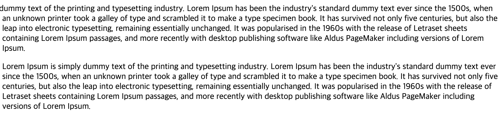

# 폰트 관련 속성

```html
<p>hi jongbin</p>
```

## 1. color
글자의 색상을 변결할 수 있다

```css
p {
    color: #fff;
}
```
- 브라우저에 내장된 색상 (blue, red, white...)
- rgb(red, green, blue), 투명도가 추가된 rgba
- 색상코드인 #(여섯자리)


## 2. font-size
글자의 크기를 조정
```css
p {
    font-size: 30px;
}
```
- px, em, rem 등등의 단위
- 16px을 기본으로 사용


## 3. font-style
폰트를 변경
```css
p {
    font-size: italic;
}
```
- 보통 이탈릭체를 만들기 위해서 사용함
- `oblique`도 기울림꼴로 표현할 수 있음
- 기본값은 `normal`


## 4. font-weight
글자의 굵기를 조정
```css
p {
    font-weight: 500;
}
```
- 기본값은 `normal` (400)
- 보통 100 단위의 숫자를 사용
- `bold`(700)
- 폰트마다 지원하는 값이 다름 


## 5. font-family
글꼴을 변경하기 위해 사용

```css
p {
    font-family: 'Roboto', sans-serif;
}
```
- 사용자마다 글꼴을 사용할 수 없는 경우를 대비해 여러개를 나열 (앞에것부터 우선 사용)
- `,`로 구분함
- 원하는 폰트를 쓰고, 맨 마지막에는 브라우저에서 가져와서 사용할 수 있는 글꼴을 적는다

## 6. line-height
글자의 줄의 높이를 조정
```css
p {
    line-height: 
}
```
- 폰트마다 `line-height`가 다르다
- `line-height`를 박스의 높이와 동일하게해서 글자를 가운데 정렬 할 수도 있다.

## shorthand

```css

```

## 단축속성
여러개의 속성을 한줄로 나타낼 수 있다.
```css
    p {
        font-size: 30px;
        font-family: 'Roboto', sans-serif;
        font-style: italic;
        font-weight: 500;
        line-height: 1.5;
    }

    /* 이렇게 표현 가능 */
    p {
        font: italic 500 30px/1.5 'Roboto', sans-serif;
    }
```
- 생략하는 경우 기본값을 사용
- 공북으로 구분
- 필수로 `font-size`, `font-family`를 포함
- `font-style`, `font-variant`, `font-weight`, `line-height`를 표현 가능
- `font-variant`는 작은 대문자로 변환해줌
- `line-height`는 `font-size`위에 슬래시(`/`)와 함께 붙여준다

## letter-spacing
글자간의 간격
```css
p {
    letter-spacing: 5px;
}
```
- 글자마다 다르고 기본값은 `normal`
- rem, em 등 다른 단위도 사용가능
- 음수도 가능하다 (겹쳐짐)


## word-spacing
단어간의 간격
```css
    word-spacing: 5px;
```
- 글자마다 다르고 기본값은 `normal`
- rem, em, % 등 다른 단위도 사용가능
- 음수도 가능하다 (겹쳐짐)


## text-align
글자를 정렬하는 방법을 명시
```css
    p {
        text-align: center:
    }
```
- left, right, center
- 적용이 안되는 경우 : inline요소 -> 부모요소에 지정하면 해결!


## text-indent
들여쓰기를 얼마나 하는지 지정
```css
    p {
        text-indent: 30px;
    }
```
- 음수도 가능하다 ()
- 기본값은 0
- 상속되는 속성
- inline요소는 적용되지 않음
- %도 사용가능

~~음수를 사용하면 창밖으로 나가게 되는지 궁금해서 확인해보았다~~

`text-indent: -300px;`



창 밖으로 나가서 볼 수 없음을 알 수 있었다!


## text-decoration
단축속성으로 네가지를 나타낼 수 있다.

```css
p {
    text-decoration: underline skyblue 5px double 
}
```

- 공백으로 구분
- 순서가 중요하지 않음
- `text-decoration-line`: 밑줄을 긋거나(`underline`, `overline`, `line-through`)하는 장식종류 (기본값은 `none`)
- `text-decoration-color`: 장식의 색
- `text-decoration-style`: `solid`, `wavy`, `dashed`등의 장식의 스타일 (기본값은 `solid`)
- `text-decoration-thickness`: 선의 두께


## word-break
자신의 영역 이외로 나가게 될경우 줄바꿈을 하는데 단어가 분리되지 않는다 (줄바꿈의 기준 설정)
```css 
p {
    word-break: break-all;
}
```
- 기본값일때 영어의 경우 요소를 뚫고나감, 한글은 줄바꿈
- `break-all`: 줄바꿈을 한다
- `keep-all`: 요소를 벗어나도 줄바꿈이 되지 않음


## text-transform

```css
p {
    text-transform: uppercase
}
```
- 한글에는 적용할 수 없음
- 기본값은 `none`
- `uppercase`: 대문자ㅣ
- `lowercase`: 소문자
- `capitalize`: 문장의 제일 앞글자만 대문자
- 개발자도구로 보았을때는 소문자로 표시 (보여질때 css가 적용되어 대문자로 보임)