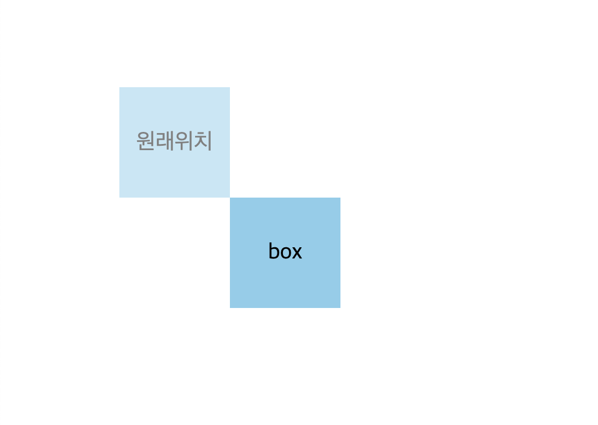

# display
### 1. 박스요소의 기본값을 변경 (`block`, `inline`, `inline-block`)

```css
.box {
    display: block;
}
```

### 2. 보이지 않도록 변경 (`none`)
```css
.box {
    display: none;
}
.box1 {
    visibility: hidden;
}
```
- `none`: 코드 상으로 존내하지만 보이지 않음 (랜더링할때 아에 무시됨)
- `visibility: hidden;`: 레이아웃 상에 공간을 차지하지만 눈에 보이지 않음
- 둘 다 비슷한 속성이지만 자리를 차지하는가의 차이가 있다.

<br>

# float
요소를 배치할 수 있는 속성 (`none`, `left`, `right`)
```css
.box {
    float: left;
}
```
- 자신의 부모 요소를 기준으로 배치된다
- 기본값은 none
- 요소의 위에 배치된 느낌을 준다

<br>

# normal flow
일반적인 흐름 - 레이아웃을 변경하지 않았을때
- 블록 요소와 인라인요소에 따라 배치된다.

<br>

# position
요소를 배치할 수 있다 (기본값은 `static`)

- `static`, `relative`, `absolute`, `fixed`, `sticky` 5가지 값이 있다
- 기본값인 `static`은 top, bottom, left, right값을 줘도 영향이 없다
- top, bottom, left, right값은 음수값을 사용할 수도 있다
- 반대가 되는 (top, bottom), (left, rignt)를 동시에 사용하게 되면 top과 left가 우선된다


<br>

## \# relative
일반적인 문서흐름에 배치하나, 자기 자신을 기준으로 top, bottom, left, right에 따라 요소를 배치한다
```css
.box {
    width: 100px;
    height: 100px;
    background-color: skyblue;
    position: relative;
    top: 100px;
    left: 100px;
}
```


박스의 가로세로 길이는 100px이다. box의 top, left값에 100px을 주었기 때문에 위에서 100px, 왼쪽에서 100px 떨어진 곳에 위치한다 

<br>

## \# absolute
요소는 일반적인 흐름에서 벗어나고, 자신의 부모요소(**static이 아닌 요소**)를 기준으로 top, bottom, left, right값만큼 떨어진 곳에 위치한다


```html
<!-- CSS -->
<style>
    .container {
        margin: 100px;
        position: relative;
        text-align: center;
        font-size: 20px;
        line-height: 100px;
    }
    .box {
        width: 100px;
        height: 100px;
        background-color: skyblue;
    }
    .box1{
        
        position: relative;
        top: 100px;
        left: 100px;
    }
    .box2{
        position: absolute;
        top: 0;
        opacity: .5;
    }
    .box3 {
        opacity: .3;
    }
</style>

<!-- HTML -->
<div class="container">
    <div class="box box1">
        relative
    </div>
    <div class="box box2">
        absolute 
    </div>
    <div class="box box3">
        원래 위치
    </div>
</div>
```


ralative의 원래 위치는 absolrute이고, absolute의 원래 위치는 원래위치 박스가 된다.

- `absolute`를 사용하면 요소를 겹칠 수 있다. (떠있는 느낌으로 위치하기 때문에)
- `absolute`는 자신의 부모요소를 기준으로 하는데 이때 부모요소는 `static`이 아닌(`relative`, `absolute` 등) 요소를 찾는다
- `static`하지 않은 부모 요소가 없으면 `body`를 기준으로 한다


~~마우스오버하는 뒤집어 지는 버튼을 만든 적이 있는데 이때 `absolute`를 사용했다~~
```html
<!-- HTML -->
<div class="btn reverse-y">
    <button class="btn-4">btn-4</button>
    <button class="btn-4">btn-4</button>
</div>

<!-- CSS -->
<style>
    .reverse-y .btn-4{
        position: absolute;
        text-align: center;
        width: 100%;
        height: 100%;
        padding: 10px;
        font-weight: 700;
        border: #0066ff solid 3px;
        /* 포인터 이벤트 대상 x */
        pointer-events: none;
        box-sizing: border-box;
        font-size: 30px;
    }
    .reverse-y .btn-4:first-child{
        border: #0066ff solid 3px;
        color: #fff;
        background-color: #0066ff;
        /* 뒤집어준다 */
        transform: rotateY(180deg);
        transition: all 0.3s ease;
        /* 중앙을 기준으로 */
        transform-origin: 50% 50%;
        border-radius: 5px;
    }
</style>
```
이렇게 하게되면 딱지처럼 앞면은 첫번째 요소 뒷면은 두번째 요소가 된다 여기에 `hover`했을때 `transform`으로 회전시켜주면 된다.

<br>

## \# fixed
일반적인 문서흐름에서 벗어나고, 뷰포트(창)를 기준으로 top, bottom, left, right값만큼 떨어진 곳에 위치한다
```css 
.box {
    position: fixed;
    bottom: 50px;
    right: 50px
}
```

- 화면에 고정된 것처럼 보인다
- 항상보이는 메뉴바, 최상단으로 올라갈 수 있는 버튼에 많이 사용됨


상단에 보이는 가로로 긴 메뉴와 오른쪽 하단의 화살표버튼은 `fixed`를 이용해서 <u>페이지 어느곳에 있더라도 보이게 된다</u>

<br>

## \# sticky
일반적인 문서흐름에 따르나, 가장 가까운 스크롤 되는 부모요소를 기준
으로 한다

```css
.box {
    position: sticky;
    top:100px;
}
```

- top, bottom, left, right에 값을 줄 수 있다.
- 어느 위치에 걸리는듯한 느낌을 준다
- 스크롤되는 요소의 자식이어야한다

<br>

# overflow
(단축속성) 내용이 요소의 크기를 벗어났을때 어떻게 처리할지를 지정한다
```css
.box {
    overflow: visible;
}
```

- `visible`: 넘어서더라도 눈에 보인다(기본값)
- `hidden`: 보이지 않게 한다
- `scroll`: 스크롤이 되는 요소로 만든다
- `auto`: 넘치면 스크롤 넘치지 않으면 그대로(visible)
- x축과 y축을 설정할 수 있다(`overflow-x`, `overflow-y`)

## \# 가로로 스크롤를 하는 법
`white-space: nowrap`를 사용해서 공백을 없애준다

## \# 스크롤바 바꾸기
브라우저 마다 기본적으로 제공하는 스크롤바의 모양이 다른데 스크롤바의 css를 내가 설정할 수 있다
```html
<!-- HTML -->
<div class="container">
    <div class="box">1</div>
    <div class="box">2</div>
    <div class="box">3</div>
    <div class="box">4</div>
    <div class="box">5</div>
    <div class="box">6</div>
    <div class="box">7</div>
</div>

<!-- CSS -->
<style>
    .container {
        width: 300px;
        height: 300px;
        margin: 100px 200px;
        overflow: auto;
        background-color: aliceblue;
    }
    .box {
        width: 100px;
        height: 100px;
        background-color: skyblue;
        display: flex;
        justify-content: center;
        align-items: center;
        border: 1px solid #000;
    }
    .container::-webkit-scrollbar{
        width: 50px;
    }
    .container::-webkit-scrollbar-thumb { 
        background-color: skyblue; 
        border: 1px solid #000;
        border-radius: 10px;
    } 
    .container::-webkit-scrollbar-track { 
        background-color: lightblue; 
    }
</style>
```


- `::-webkit-scrollbar-thumb`: 스크롤바의 색상
- `::-webkit-scrollbar-track`: 스크롤바 이외 부분(트랙)의 색상

<br>

# z-index
z축(사용자에게 보여지는)의 순서를 지정한다(높을수록 위로 쌓인다)

```css 
.box {
    z-index: 10;
}
```

- 겹쳐있는 경우 `z-index`가 높은것이 위로
- 기본값은 `auto`
- 정수(음수, 0, 양수) 사용가능
- `position: static`인 요소는 뒤로 배치된다

