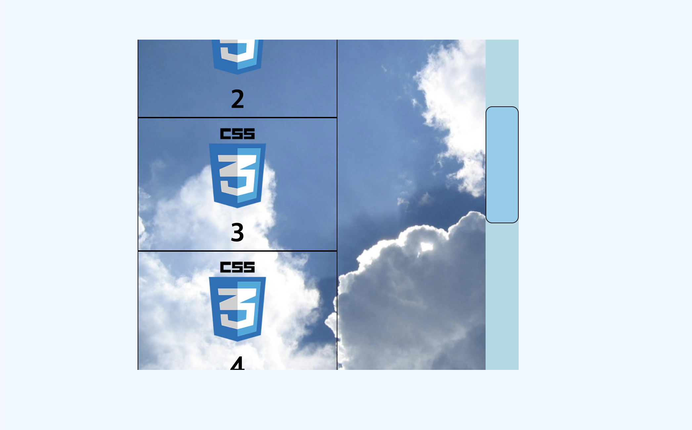
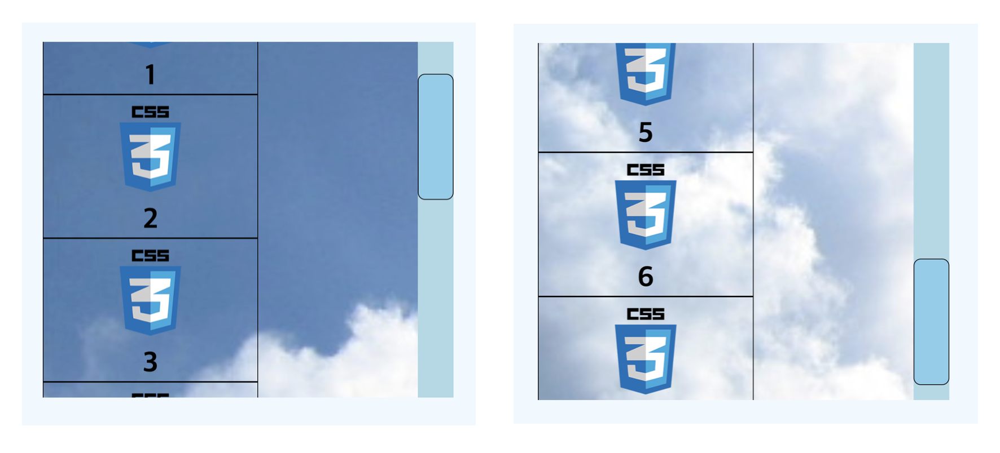

# 색상 표현 방법

## 1. HEX(16진수)
`#`으로 시작해서 여섯개의 문자가 붙는 16진수의 색상표현
- 동일한 문자이면 6자리를 3자리로 축약해서 사용가능 
- `#000000` -> `#000` (검은색)
- `#ffffff` -> `#fff` (흰색)


## 2. rgb
red, green, blue의 정도를 0~255사이의 숫자로 나타낸다
- `rgb(red, green, blue);`
- `rgb(0, 0, 0)` (검은색)
- `rgb(255, 255, 255)` (흰색)

## 3. rgba
rgb와 동일하지만 투명도를 명시할 수 있다
- `rgba(red, green, blue, alpha);`
- `rgba(0, 0, 0, 0.5)` (검은색에 투명함은 50%) 
- `rgba($color: #000000, $alpha: 1.0)` - HEX로도 표현이 가능하다 

<br>

# color
글자 색상을 지정한다
```css
p {
    /* 글자색을 초록색으로 */
    color: rgb(0, 255, 0);
}
```
- 키워드: blue, red, green 등등 (transparent는 투명함)

<br>

# opacity
투명도를 나타낸다
```css
.box {
    background-color: #000;
    opacity: 0.5;
}
```

- 0부터 1까지의 값을 입력할 수 있다.
- 소수점 앞의 0을 생략할 수 있다 (0.5 -> .5)
- 0은 완전히 투명하기 때문에 보이지 않음
- 1은 투명도가 아에 없으므로 불투명
- 내부의 모든 요소에 영향을 준다

<br>

# background-color
배경색상을 지정한다
```css
.box {
    background-color: #000;
}
```

<br>

# background-image
배경으로 이미지를 지정할 수 있다.
```css
.box{
    background-image: url("파일경로");
}
```

- 기본값은 `none`
- 만약 `background-color`와 같이 사용이 되면 `background-image`가 위로 올라온다

<br>

# background-repeat

```css
.box{
    background-image: url("파일경로");
    background-repeat: 
}
```
- 기본값은 `repeat`
- `repeat`: 요소의 크기를 채울만큼 반복 (`repeat-x`, `repeat-y`)
- `no-repeat`: 반복하지 않고 한번만 나옴

<br>

# background-position
`background-image`의 위치를 지정할 수 있다
```css
.box {
    background-image: url("파일경로");
    background-position: x, y;
    /* background-position: 100px, 200px; */
}
```
- x축과 y축을 설정할 수 있다
- 기본적으로 왼쪽 상단을 기준으로 한다
- 키워드: `top`, `bottom`, `left`, `right`, `center`

<br>

# background-origin
원점을 지정할 수 있다.
```css
.box {
    background-image: url("파일경로");
    background-origin: border-box;
}
```
- `border-box`: 배경을 테두리박스에 배치
- `padding-box`: 배경을 안쪽 여백에 배치
- `content-box`: 배경을 컨텐츠 박스에 배치

<br>

# background-size
배경의 크기를 지정할 수 있다.
```css
.box {
    background-image: url("파일경로");
    background-size: cover;
}
```

- 기본값은 `auto`(원본값)
- `contain`: 더 짧은 가로 또는 세로에 맞춰 꽉채움(비율 유지)
- `cover`: 더 긴 가로 또는 세로에 맞춰 꽉 채움(비율 유지)
- 값을 지정할 수 있음 ex) `background-size: 100px 100px;` (비율 유지x)
- %를 입력할 수 있음 ex) `background-size: 100%;` = 가로에 맞춤

<br>

# backgroud
단축속성으로 여러가지를 설정할 수 있다.
```css
.box {
    background: url("파일경로") no-repeat center/100px blue;
}
```

- 몇개만 선택해서 작성할 수 있다.
- 공백(스페이스)로 구분한다
- `color`는 마지막에만 올 수 있다.
- `size`는 `position` 뒤에만 올 수 있고 `/`로 구분한다 (`position/size`)

<hr>

- 8개의 하위 속성을 가짐(지정이 가능)
- `background-attachment`: 배경이미지를 고정(스크롤 여부)(`기본값: scroll`)
    - `scroll`: 페이지와 함께 스크롤
    - `fixed`: 페이지와 함께 스크롤되지 않음
    - `local`: 요소 내용과 함께 스크롤
- `background-clip`: 어느 영역까지 차지할지를 지정(`기본값: border-box`)
    - `border-box`: 테두리 영역까지
    - `padding-box`: 요소 내부 여백까지
    - `content-box`: 컨텐프박스까지
    - `text`: 텍스트 위에만 
- `background-color`: 배경의 색상을 지정(`기본값: transparent`)
- `background-image`: 배경을 이미지로 지정(`기본값: none`)
- `background-origin`: 원점을 지정(`기본값: padding-box`)
- `background-position`: 배경의 위치를 지정(`기본값: 0% 0%`)
- `background-repeat`: 배경의 반복을 지정(`기본값: repeat`)
- `background-size`: 배경의 크기를 지정(`기본값: auto auto`)


<br>
<br>

~~backgroun-attachment가 뭔지 헷갈려서 직접 해봤다.~~

세가지(`scroll`, `fixed`, `local`)의 구분이 명확하게 가지 않았다. 
1. `scroll`
    `scroll`을 적용했을때 스크롤을 해도 배경이 고정되어 있다
    

2. `fixed`  
    적용을 하고 scroll과 차이를 모르겠지만 MDN을 참고하니 상위 요소가 스크롤할때 영향을 끼친다는 것을 알게되었다.
    자신의 요소에서는 고정, 상위요소를 스크롤하면 보여지는 이미지가 다르다
    

3. `local`
    local은 내부에서 요소와 함께 스크롤이 된다.
    