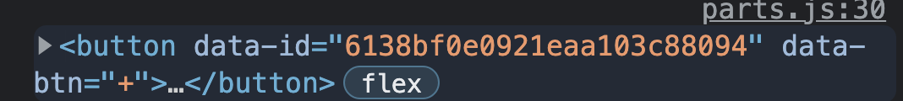

여러개의 버튼에 이벤트리스너를 등록하는 방법을 고민해봤다

왜냐하면 표에 버튼을 만들었을 경우 행마다 버튼이 존재하게 되는데 한 페이지에서 보여지는 테이블의 행이 얼마나 될지 알 수 없기때문에 수묺은 이벤트리스너를 일일이 다 등록하는 것은 굉장히 비효율적일 것이라고 생각했다

그러다 최근에 this라는 개념에 대해서 공부를 하다가 이벤트리스너에서 받아오는 값이 있다는 것을 다시 인지하게 되었다
```javascript
ele.addEventListener("click", (event) => {
    console.log(event)
})
```

이렇게 했을때 event로 `addEventListener`에 넣어준 인자에 따른 이벤트 객체가 넘어온다

click을 했을 경우 클릭한 요소에 대한 객체가 넘어온다 그중에 target이라는 프로퍼티가 있는데 이는 클릭한 요소를 가르킨다.


위 테이블에서 오른쪽에 위치한 빨간색과 초록색 요소는 버튼인데 이 버튼을 눌렀을때 바로 옆에 있는 값들을 증가시켜주기 위해 이벤트리스너를 사용했다.

<br>

먼저 결과부터 보자면 다음과 같은 형태이다
```javascript
// 요소 선택
const table = document.querySelector("table");

table.addEventLustener("click", handlerButton);

const handlerButton = (event) => {
    if (event.target.dataset.id === "비교값") {
        // 옆의 요소를 찾아 innerHTML을 조작
    }
}
```

우선 적용한 원리는 각각의 요소를 다워야 하기때문에 전체 테이블에 클릭 이벤트를 설정해놨다

click이벤트가 발생하면 이벤트리스너에서는 클릭한 요소에 대한 객체를 준다 함수의 파라미터(`evnet`)로 명시해주고 객체의 프로퍼티를 사용하면 여러 정보를 알 수 있다.

그 중 `target`이라는 프로퍼티를 `console.log(event.target);`으로 출력해보면 다음과 같이 출력이 된다.


그 후에 이벤트객체로 받아와 target을 미리 HTML에서 넣어두었던 dataset과 비교한다

> html dataset  
태그의 속성으로 `data-`로 시작하는 dataset의 이름을 명시하고 값을 할당한다  
ex) `<p data-id = "123">텍스트</p>` 

이렇게 data를 명시해두면 이후 javascript로 다룰 수 있다.

내가 한 경우에는 ejs를 이용해서 db에서 가져온 각 데이터의 id값을 버튼에 넣어줬다.

<br>

이런 방식을 사용하면 각각의 버튼에 이벤트리스너를 수없이 등록하는 고생을 할 필요가 없다 다만, 이전에 html에서 dataset을 만들어주고 해당 값을 받은 객체의 target과 비교하여 해당 버튼이 어떤 데이터를 수정할 것인지 코드를 작성하면 된다.

<br>

~~보통 내가 js로 이벤트리스너를 등록할때 하나하나 등록해줬었는데 이번에 시도한 방법을 사용하면 특수한 경우에 효율적일것 같다~~


