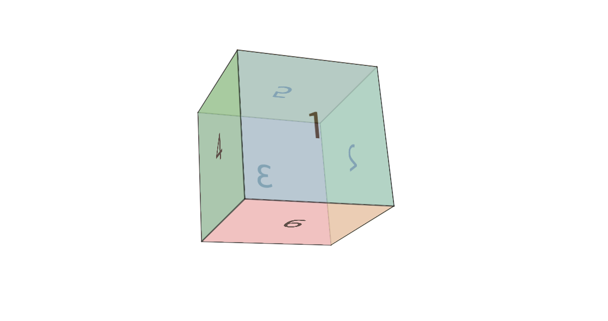

# 👉  transform (2D)
회전, 크기 조절, 기울이기, 이동효과 등을 부여할 수 있다

- **<u>원본의 자리를 유지한다</u>**
- 값으로 함수를 사용 (`matrix`, `translate`, `scale`, `rotate`, `skew`)
- 여러개의 함수를 함께 사용하면 오른쪽에서부터 적용한다
- (0,0) (왼쪽 위) - x축은 오른쪽으로 진행, y축은 이래쪽으로 진행 

<br>

## ✅ scale
`scale()`은 2d를 기준으로 크기를 변경
```css
.box {
    transform: scale(sx);
    transform: scale(sx, sy);
}
```
- 값으로 한개 또는 두개(sx), (sx, sy)
- 값을 입력하면 곱해짐 ex) width:200px -> scale(1.5) -> width:300px(자리차지 200px) 
- `scaleX()`, `scaleY()`, `scaleZ()`
- `scale3d(x, y, z)` -> 각각 곱해짐

<br>

## ✅ rotate
회전하는 함수
```css
.box {
    transform: rotate(a);
}
```

- 값을 하나만 받는다(Z)
- 사용하는 단위 deg(각도), grad(1회전이 400), rad(π*rad = 180도), turn(한바퀴를 기준)
- 양수는 오른쪽으로 회전, 음수는 왼쪽으로 회전
- `rotateX()`, `rotateY()`, `rotateZ()`
- 각각 축을 기준으로 회전한다
- `rotate3d(x, y, z, a)` -> 각 값은 0과 1 사이값 / a는 각도를 나타낸다


<br>

## ✅ translate
요소를 이동하게함
```css
.box {
    transform: translate(x, y);
    transform: translateX(x);
    transform: translateY(y);
}
```
- 값으로 한개(x, 0) 또는 두개(x, y)
- 값으로 px이나 %
- %를 사용할 경우 요소를 기준으로 한다
- `translateX`(x축만 이동), `translateY`(y축만 이동), `translateZ`(z축만 이동)
- `translate3d(tx, ty, tz)` -> 각 값에 px같은 단위로 입력

<br>

## ✅ skew
기울이는 함수
```css
.box {
    transform: skew(ax);
    transform: skew(ax, ay);
}
```
- 값을 하나만 사용할 경우 x축만 적용
- 값으로 각도(deg)를 입력
- 90도를 기울이면 보여지지 않음
- z축이 없다


## ✅ transform-origin
(별도의 프로퍼티) 기준점을 변경한다
```css
.box {
    transform-origin: center;
}
```

- 기본값은 center (50% 50% 0)
- top, buttom, left, right 사용가능
- px, % 사용가능

<br>

## ✅ perspective
(별도의 프로퍼티)요소에 원근감을 준다
```css
.container {
    perspective: 500px;
}
```

- 부모요소에 적용한다
- 개별적인 투영점을 설정할때는 각 값에 transform: perspective(px)을 준다
- 개별적으로 줄때 맨 앞에 위치한다 (오른쪽에서부터 계산해서 그런것 같다)
- `transform-style: preserve-3d`는 부모의 perspective를 자식까지도 전달해준다(IE 지원x)

## ✅ perspective-origin
어느 방향에서 보는지를 지정
```css
.box {
    perspective-origin: 50% 50%;
}
```

- 키워드를 조합해서 사용가능 (top, buttom, left, right)
- %로 입력가능

<br>

## 🎲 주사위 만들기

블로그를 참고하면서 해보려고 하는데 scene - object - face 패턴을 사용하는 것이 좋다고 한다

```html
<div class="scene">
    <div class="dice">
        <div class="dice-face face-1">1</div>
        <div class="dice-face face-2">2</div>
        <div class="dice-face face-3">3</div>
        <div class="dice-face face-4">4</div>
        <div class="dice-face face-5">5</div>
        <div class="dice-face face-6">6</div>
    </div>
</div>

<style>
    .scene { 
        margin: 300px;
        width: 150px;
        height: 150px;
        perspective: 700px;
    }
    .dice { 
        position: relative;
        width: 100%;
        height: 100%;
        transform-style: preserve-3d;
        transform: rotate3d(1, 1, 0, 30deg);
    }
    .dice--face {
        position: absolute;
        width: 100%;
        height: 100%;
        display: flex;
        justify-content: center;
        align-items: center;
        font-size: 40px;
        font-weight: 500;
        border: 1px solid #000;
        opacity: .6;
    }
    .face--1 { background-color: skyblue; transform: rotateY(0deg) translateZ(75px); }
    .face--2 { background-color: gold; transform: rotateY(90deg) translateZ(75px); }
    .face--3 { background-color: darksalmon; transform: rotateY(180deg) translateZ(75px); }
    .face--4 { background-color: mediumaquamarine; transform: rotateY(-90deg) translateZ(75px); }
    .face--5 { background-color: goldenrod; transform: rotateX( 90deg) translateZ(75px); }
    .face--6 { background-color: pink; transform: rotateX(-90deg) translateZ(75px); }
</style>
```


각각의 면에 색상을 입히고 rotate를 이용해서 회전시켜준다!
부모요소에 perspective를 주어 원근감을 줌 
