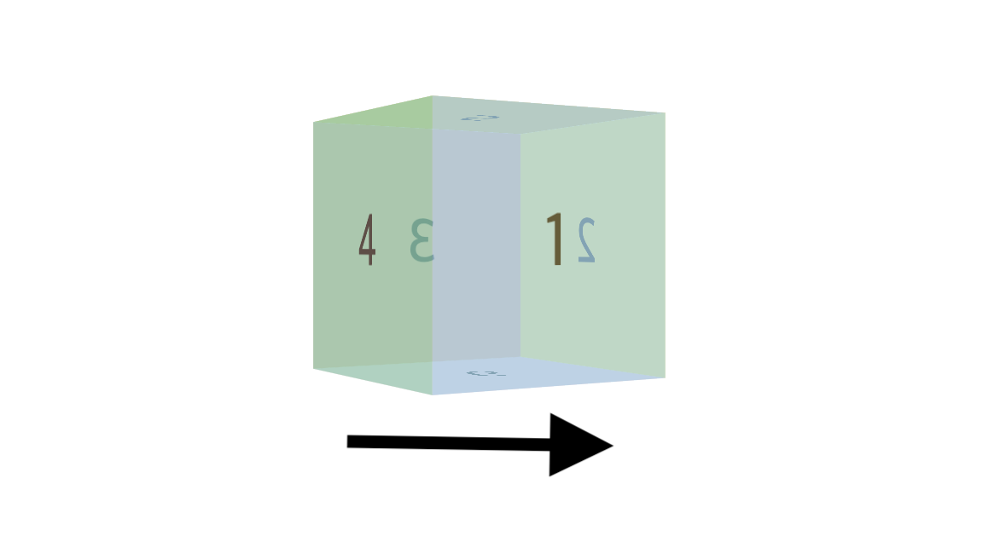

# 👉 animation
(단축속성) 전환시키는 과정을 지정

- 특정 액션을 하지 않아도 동작하게 할 수 있다
- 여러가지 과정을 지정할 수 있다
- keyframe을 사용

```css
/* 단축속성사용 */
.box {
    animation: 3s ease 1s infinitie reverse forwards running test;
    animation: duration function delay count direction mode state name;
}
```
- 시간 항목이 두개이면 앞은 duration, 뒤는 delay가 지정된다


## ✅ 기본값

|프로퍼티|값|
|:---|:---:|
| `animation-name` | none |
| `animation-duration` | 0s |
| `animation-timing-function` | ease |
| `animation-delay` | 0s |
| `animation-iteration-count` | 1 |
| `animation-direction` | normal |
| `animation-property` | all |
| `animation-fill-mode` | none |
| `animation-play-state` | running |

<br>

## ✅ @ketframes
여러가지의 애니메이션을 정해놓을 수 있다
```css
@keyframes 이름 {
    from{
        내용
    }
    to {
        내용
    }
}

@keyframes 이름 {
    0% { 내용 }
    25% { 내용 }
    50% { 내용 }
    75% { 내용 }
    100% { 내용 }
}
```

- from, to 로 지정가능
- %별로 지정가능
- animation에 이름을 입력하고 다른 속성을 입력해서 사용 (`alternate` 속성을 주면 다시 되돌아옴)

<br>

## ✅ animation-name
미리 작성한 keyframe중 어떤 keyframe을 사용할지 명시

- 기본값은 `none`
- 이름 규칙
    - 대소문자 구분
    - 특수문자는 `-`,`_`만 사용가능하다
    - 글로벌 값으로 지정해서는 안됨(`initial`, `inherit`, `revert`, `unset`...)

<br>

## ✅ animation-duration
동작하는 시간을 명시 (한 사이클을 완료하는데 걸리는 시간)

- ms, s단위 사용
- 음수 사용 불가

<br>

## ✅ animation-delay
시작하기 전에 지연되는 시간을 지정

- ms, s단위 사용
- 음수값 허용(바로 재생되고, 중간부터 시작함)

<br>

## ✅ animation-timing-function
동작하는 방식을 지정(시간에 흐름에 따른 변화 속도)

- `ease`, `ease-in`, `ease-out`, `ease-in-out`, `linear`, `cubic-bezier`
- 기본값은 `ease`

<br>

## ✅ animation-iteration-count
반복하는 횟수를 지정
```css
.box {
    animation-iteration-count: infinite;
}
```
- 값으로 숫자가 들어가거나 `infinite`(무한반복)이 들어갈 수 있음
- 0.5도 가능 (50% 재생)


<br>

## ✅ animation-direction
반대로 재생할 수 있음
```css
.box {
    animation-direction: reverse;
}
```
- `normal`: 원래대로 진행(기본값)
- `reverse`: 반대로 진행 
- `alternate`: 정방향, 역방향으로 반복해서 진행
- `alternate-reverse`: 역방향, 정방향 반복해서 진행


<br>

## ✅ animation-play-state
재생 유무를 설정(일시정지)
```css
.box {
    animation-play-state: paused;
    }
.box:hover {
    animation-play-state: running;
}
/* 마우스를 올리면 애니메이션이 작동 떼면 일시정지 */
```
- `running`: 재생되고 있는 상태(기본값)
- `paused`: 일시정지

<br>

## ✅ animation-fill-mode
애니메이션이 실행하기 전과 후를 지정
```css
.box {
    animation-fill-mode: forwards;
    animation: test 1s;
    width: 50px;
    height: 50px;
}
@keyframes test {
    from {
        width: 100px;
    }
    to {
        width: 200px;
    }
}
/* 끝나도 200px을 유지 */
/* backwards라면 시작할때부터 100px */
```
- `none`: 재생될때만 keyframes에 있는 스타일 적용(기본값)
- `forwards`: 끝난 모습의 스타일을 유지
- `backwards`: 지연시간동안에도 스타일을 적용
- `both`: `forwards`, `backwards` 둘 다 적용


<br>
<br>

이전에 작성했던 주사위를 animation을 이용해서 회전시켜보았다
```css
@keyframes rotate {
    0% {
        transform: rotate3d(0,0,0);
    }
    100% {
        transform: rotate3d(0,1,0, 360deg);
    }
}
```
이렇게 하면 y축으로 계속 회전하였다.



```css
@keyframes rotation {
    0% {
        transform: rotate3d(0,0,0);
    }
    100% {
        transform: rotate3d(1,1,1, 360deg);
    }
}
```
x,y,z에 모두 값을 주니 둥둥 떠서 돌아가는 듯한 느낌의 애니메이션이 재생되었다!!
