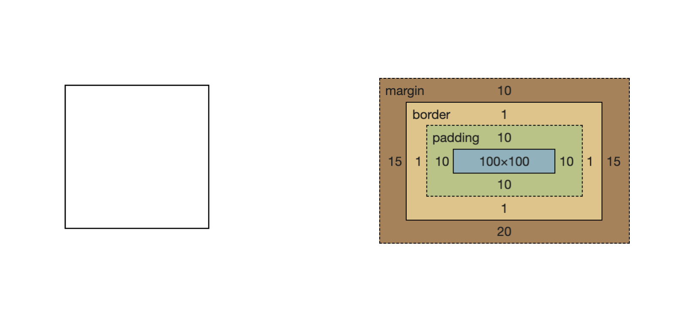
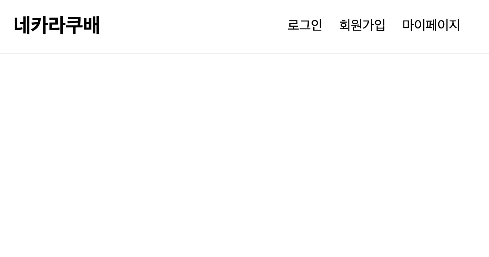
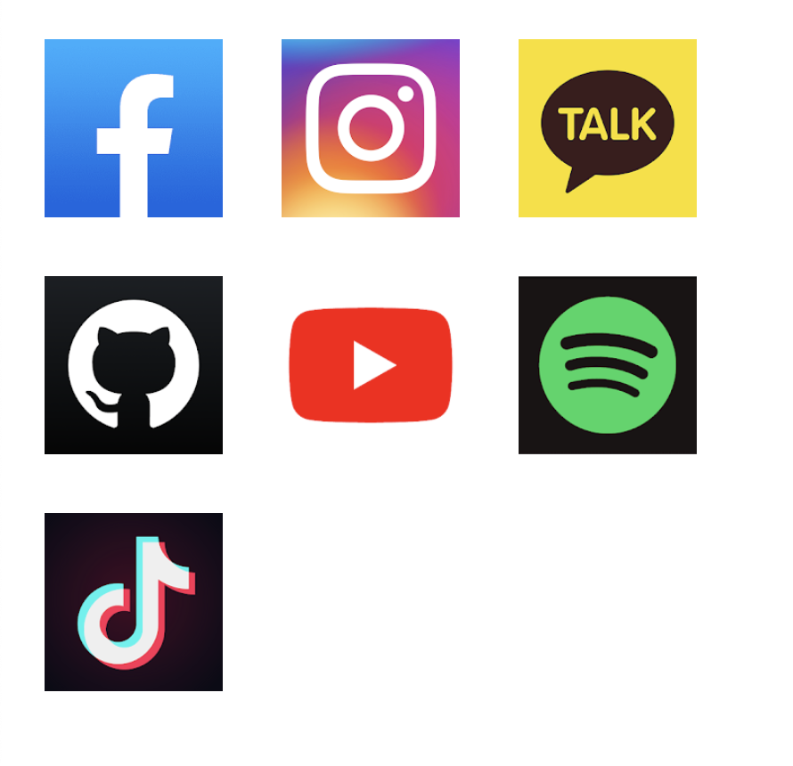
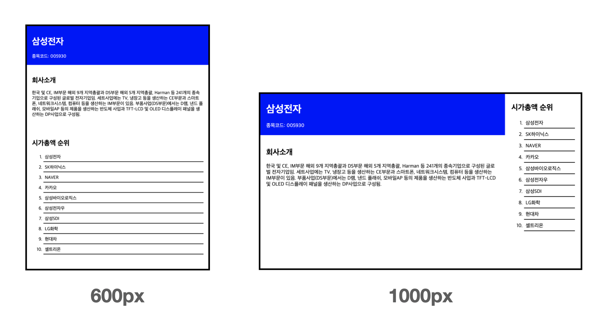
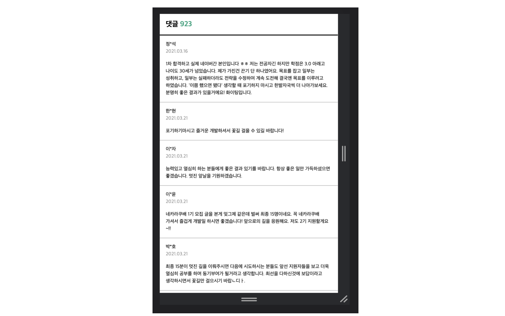

# 👉 1번
```html
<!DOCTYPE html>
<html lang="en">
<head>
    <meta charset="UTF-8">
    <meta name="viewport" content="width=device-width, initial-scale=1.0">
    <title>Document</title>
    <style>
        .content{
            width: 100px;
            height: 100px;
            margin: 10px 15px 20px;
            padding: 10px;
            border: 1px solid #000;
        }
    </style>
</head>
<body>
    <div class="content"></div>
</body>
</html>
```



1번은 비교적 쉽게 풀었다

<br>
<br>

# 👉 2번
```html
<!DOCTYPE html>
<html lang="en">
<head>
    <meta charset="UTF-8">
    <meta name="viewport" content="width=device-width, initial-scale=1.0">
    <title>Document</title>
    <style>
        nav{
            position: absolute;
            top: 0;
            left: 0;
            height: 64px;
            width: 100%;
            display: flex;
            justify-content: space-between;
            align-items: center;
            border-bottom: 1px solid rgb(231, 231, 231);
            padding: 0 16px;
            box-sizing: border-box;
        }
        .head {
            font-size: 24px;
            font-weight: bold;
        }
        .menu {
            display: flex;
            margin: 0 10px;
        }
        .menu li {
            padding: 10px;
            list-style: none;
        }
    </style>
</head>
<body>
    <nav>
        <div class="head">네카라쿠배</div>
        <ul class="menu">
            <li>로그인</li>
            <li>회원가입</li>
            <li>마이페이지</li>
        </ul>
    </nav>
</body>
</html>
```

`nav`태그를 사용해 head 클래스와 menu 클래스를 묶어주고, `display: flex;`와 `justify-content: space-between;`를 사용해서 각 끝으로 위치시켰다 line-height를 사용해서 중앙정렬 시키지 않고 임의로 `align-item: center;`를 사용해서 수직정렬 시켰다

우측의 메뉴도 `ul`, `li`를 사용해서 나열하고(dot은 `list-style: none;`로 없앰) `display: flex;`를 사용해서 수직이 아닌 수평으로 나열되게 했다.



<br>
<br>

# 👉 3번

```html
<!DOCTYPE html>
<html lang="en">
<head>
    <meta charset="UTF-8">
    <meta name="viewport" content="width=device-width, initial-scale=1.0">
    <title>Document</title>
    <style>
        .box {
            width: 400px;
            height: 400px;
            display: grid;
            grid-template-columns: repeat(3, 1fr);
        }
        img {
            align-self: center;
            justify-self: center;
            width: 100px;
            height: 100px;
        }
    </style>
</head>
<body>
    <div class="box">
        
        
        
        
        
        
        
    </div>
</body>
</html>
```

각 이미지를 `div`태그인 `box`클래스로 감싸고 box 클래스에 `display: grid;`를 주고 `grid-template-columns: repeat(3, 1fr);` 한 줄에 세개의 영역으로 각 영역을 나눠주었다

`box`는 400px이고, `img`는 100px이기때문에 균형이 맞지 않았는데(가운데정렬되지 않음) 이를 `align-self: center;` `justify-self: center;`를 해서 각 요소의 중앙정렬되게 했다



<br>
<br>

# 👉 4번
```html
<!DOCTYPE html>
<html lang="en">
<head>
    <meta charset="UTF-8">
    <meta name="viewport" content="width=device-width, initial-scale=1.0">
    <title>Document</title>
    <style>
        body {
            margin: 0;
        }
        header {
            padding: 20px;
            width: 100%;
            background-color: blue;
            color: #fff;
            box-sizing: border-box;
        }
        header p {
            margin: 0;
        }
        main {
            padding: 20px;
        }
        aside {
            padding: 20px;
        }
        aside li {
            border-bottom: 2px solid #000;
            padding: 5px;
            margin-bottom: 5px;
        }
        @media screen and (min-width: 720px){
            .container {
                display: flex;
            }
            aside {
                width: 200px;
            }
        }
        </style>    
</head>
<body>
    <div class="container">
        <div class="warp">
            <header>
                <h1>삼성전자</h1>
                <p>종목코드: 005930</p>
            </header>
            <main>
                <section>
                    <h2>회사소개</h2>
                    <p>한국 및 CE, IM부문 해외 9개 지역총괄과 DS부문 해외 5개 지역총괄,
                        Harman 등 241개의 종속기업으로 구성된 글로벌 전자기업임. 세트사업에는
                        TV, 냉장고 등을 생산하는 CE부문과 스마트폰, 네트워크시스템, 컴퓨터
                        등을 생산하는 IM부문이 있음. 부품사업(DS부문)에서는 D램, 낸드 플래쉬,
                        모바일AP 등의 제품을 생산하는 반도체 사업과 TFT-LCD 및 OLED 디스플레이
                        패널을 생산하는 DP사업으로 구성됨.</p>
                </section>
            </main>
        </div>
        <div class="warp-aside">
            <aside>
                <h2>시가총액 순위</h2>
                <ol>
                    <li>삼성전자</li>
                    <li>SK하이닉스</li>
                    <li>NAVER</li>
                    <li>카카오</li>
                    <li>삼성바이오로직스</li>
                    <li>삼성전자우</li>
                    <li>삼성SDI</li>
                    <li>LG화학</li>
                    <li>현대차</li>
                    <li>셀트리온</li>
                </ol>
            </aside>
        </div>
    </div>
</body>
</html>
```

제목을 `header`, 회사소개를 `main`으로 이 둘을 감싸는 `warp`클래스를 만들어주고, 시가총액 순위는 `aside`로 따로 구분했다

요구사항을 반영해 스타일을 적용하고 미디어쿼리를 사용해서 뷰포트 `720px`을 기준으로 요소들의 배치를 다르게 했다

```css
@media screen and (min-width: 720px){
    .container {
        display: flex;
    }
    aside {
        width: 200px;
    }
}
```
(`header`, `main`)과 (`aside`)의 배치를 뷰포트의 크기에 따라 다르게 해주기 위해 이를 `container`클래스로 감싸고 만약 뷰포트의 크기가 `720px`보다 커지면 `container`클래스의 `display`를 `flex`로 바꿔 양쪽으로 배치되게 했다

이때 min-width와 max-width가 많이 헷갈려서 정리해봤다

## `media screen`의 `max-width`, `min-width`

만약 **max**-width: 1024px이 사용되면, **최대** `width`가 1024px이 되는 경우이므로 <u>1024px보다 작은 경우를 말한다</u>

또는 **min**-width: 1024px이 사용되면, **최소** `width`가 1024px이 되는 경우이므로 <u>1024px보다 큰 경우를 말한다</u>

따라서 내가 한 방식은 `(min-width: 720px)`이므로 최소 720px이 되는 경우이므로 720px보다 클 경우를 뜻한다

### ✅ <u>여러개를 사용해서 구간을 지정해줄 수 있다</u>




<br>
<br>

# 👉 5번
```html
<!DOCTYPE html>
<html lang="en">
<head>
    <meta charset="UTF-8">
    <meta name="viewport" content="width=device-width, initial-scale=1.0">
    <title>Document</title>
    <style>
        /* 초기화 */
        body {
            margin: 0;
        }
        p {
            margin: 0;
        }

        /* 소제목 ("댓글" 텍스트, 댓글수) */
        .container .head {
            border-bottom: 3px solid #000;
            padding: 0 20px;
            box-sizing: border-box;
        }
        .container .head .h2 {
            margin: 0;
        }
        .container .head h2 span {
            color: #06a27d;
        }

        /* 각 댓글 */
        .container .items {
            width: 100%;
            box-sizing: border-box;
        }
        .container .items .item {
            border-bottom: 1px solid #939393;
            padding: 18px 20px;
            word-break: keep-all;
            line-height: 1.5;
        }
        .container .items .item:last-child {
            border-bottom: none;
        }
        .container .items .item p:nth-child(2){
            color: #939393;
            margin-bottom: 18px;
        }
    </style>
</head>
<body>
    <div class="container">
        <div class="head">
            <h2>댓글 <span>923</span></h2>
        </div>
        <div class="items">
            <div class="item">
                <p>정*석</p>
                <p>2021.03.16</p>
                <p>1차 합격하고 실제 네이버간 본인입니다 ㅎㅎ 저는 전공자긴 하지만 학점은 3.0 아래고 나이도 30세가 넘었습니다. 제가 가진건 끈기 단 하나였어요. 목표를 잡고 일부는 성취하고, 일부는 실패하더라도 전략을 수정하여 계속 도전해 결국엔 목표를 이루려고 하였습니다. '이쯤 했으면 됐다' 생각할 때 포기하지 마시고 한발자국씩 더 나아가보세요. 분명히 좋은 결과가 있을거에요! 화이팅입니다.</p>
            </div>
            <div class="item">
                <p>한*현</p>
                <p>2021.03.21</p>
                <p>포기하기마시고 즐거운 개발하셔서 꽃길 걸을 수 있길 바랍니다!</p>
            </div>
            <div class="item">
                <p>이*자</p>
                <p>2021.03.21</p>
                <p>능력있고 열심히 하는 분들에게 좋은 결과 있기를 바랍니다. 항상 좋은 일만 가득하셨으면 좋겠습니다. 멋진 앞날을 기원하겠습니다.</p>
            </div>
            <div class="item">
                <p>이*윤</p>
                <p>2021.03.21</p>
                <p>네카라쿠배 1기 모집 글을 본게 엊그제 같은데 벌써 최종 15명이네요. 꼭 네카라쿠배 가셔서 즐겁게 개발일 하시면 좋겠습니다! 앞으로의 길을 응원해요. 저도 2기 지원할게요~!!</p>
            </div>
            <div class="item">
                <p>박*호</p>
                <p>2021.03.21</p>
                <p>최종 15분이 멋진 길을 이뤄주시면 다음에 시도하시는 분들도 앞선 지원자들을 보고 더욱 열심히 공부를 하며 동기부여가 될거라고 생각합니다. 최선을 다하신것에 보답이라고 생각하시면서 꽃길만 걸으시기 바랍ㄴ디ㅏ.</p>
            </div>
            <div class="item">
                <p>김*성</p>
                <p>2021.03.21</p>
                <p>존버필승입니다 화이팅하십쇼</p>
            </div>
        </div>
    </div>
</body>
</html>
```
모바일 화면을 기준으로 해야해서 개발자도구의 모바일모드?로 변경해서 했다

필요한 부분이 있어서 `body`와 `p`태그의 `margin`을 0으로 초기화했다

댓글수를 나타내는 제일 상단의 텍스트는 `head`클래스로 묶고, 텍스트는 `h2`, 초록색인 댓글수는 `h2` 내부에 `span`을 사용해서 색상을 변경했다

각 댓글을 `item`클래스 댓글 전체를 `item`클래스로 묶고 각 `item`클래스의 내부에는 이름, 날짜 내용이 있다. 이를 `p`태그 세개로 표현하고 `:nth-child()`를 사용해서 중간의 날짜의 색상을 변경했다

단어가 끊기지 않도록 item 클래스에 `word-break: keep-all;`로 설정했다


