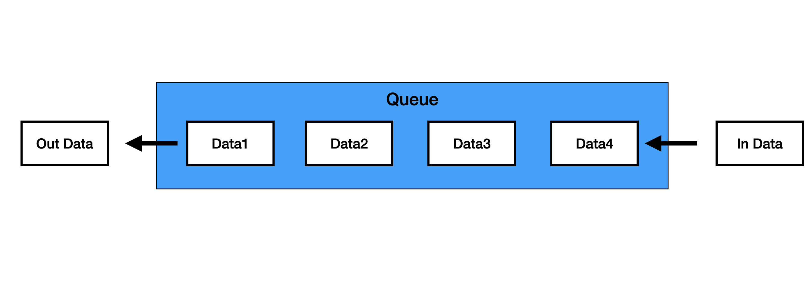

~~알고리즘 문제를 풀게 되었는데 큐를 다루게 되었다 그래서 큐에 대해서 공부를 다시 한번 해보려고 한다~~


# 큐 (Queue)
큐는 기본적인 자료구조의 한가지이다
- FIFO(First In First Out): 먼저 들어온 데이터가 가장 먼저 나온다
- 선형과 환형이 있다



<br>

백준의 알고리즘 문제 18258번 (큐2)를 풀었다 예전에 파이썬으로 리스트를 이용해 구현해 본적이 있어서 리스트로 구현해보았다


리스트로 구현한 코드는 다음과 같다

```javascript
const fs = require("fs")
const filePath = process.platform === 'linux' ? '/dev/stdin' : './1_18258.txt';

let input = fs.readFileSync(filePath).toString().trim().split("\n");

const n = input[0];             // 첫번째 입력은 n
input.shift();                  // input에서 제거해준다

let queue = [];                 // 데이터를 저장하는 배열(큐)

const push = (data) => {        // 데이터를 인자로 받고 큐에 넣는다
    queue.push(data);
}

const pop = () => {             
    if (queue.length === 0) {
        console.log(-1);
    } else {
        console.log(queue[0]);  // shift하기 전에 출력
        queue.shift();          // shift로 맨 앞의 데이터를 없애준다
    }
}

const size = () => {
    console.log(queue.length);  // 큐의 길이를 출력
}

const empty = () => {
    if (queue.length >= 1) {
        console.log(0);
    } else {
        console.log(1);
    }
}

const front = () => {
    if (queue.length === 0) {
        console.log(-1);
    } else {
        console.log(queue[0]);
    }
}

const back = () => {
    if (queue.length === 0) {
        console.log(-1);
    } else {
        console.log(queue[queue.length-1]);
    }
}


let cmd = 0;
for (const temp of input) {     // for of문을 사용해서 입력문을 순회
    cmd = temp.split(" ");      // push의 경우 데이터가 나뉘어 들어오기때문에 split
    if (cmd[0] ===  "push") { push(parseInt(cmd[1])); }
    if (cmd[0] ===  "pop") { pop(); }
    if (cmd[0] ===  "size") { size(); }
    if (cmd[0] ===  "empty") { empty(); }
    if (cmd[0] ===  "front") { front(); }
    if (cmd[0] ===  "back") { back(); }
}
```

쉽다고 생각했는데 결과적으로는 시간초과로 실패였다.

아무래도 배열을 사용해서 오래걸리는건가 싶어서 다른 방법으로 구현해보기로 했다.

<br>

## 👉 문제 해결 방향  

예전에 들었던 기억으로 `shift()`가 앞부분을 삭제한 후에 나머지 부분을 앞으로 당겨줘야하기 때문에 정렬을 한다고 들어서 pop을 할때 shift를 다른것으로 대체하려고 했다. 그래서 생성자함수로 객체를 만들어보자라는 생각을 했고 ES6 문법인 class를 이용해보기로 했다.

```javascript
onst fs = require("fs")
const filePath = process.platform === 'linux' ? '/dev/stdin' : './1_18258.txt';

let input = fs.readFileSync(filePath).toString().trim().split("\n");

const n = input[0];
// shift를 제거했는데 생각해보니 마지막에 if문으로 거르기 때문에 필요없다고 생각했다

// 클래스를 사용했다
class Queue {         
    // 객체를 생성하고 초기화 (constructor)                      
    constructor() {
        this.storage = {};      // 데이터를 객체에 저장
        this.head = 0;          // 제일 앞부분을 의미하는 head
        this.tail = 0;          // 제일 뒷부분을 의미하는 tail
        this.sizes = 0;         // 들어간 데이터의 수
        this.node = 0;          // 객체에 데이터를 저장하기 위해(storage의 프로퍼티 이름) 이용할 프로퍼티
    }

    push(data) {
        if(this.sizes === 0) {      // 만약 빈 큐일 수 있기 때문에 나눠줌
            this.storage[this.node] = data;
            this.head = this.node;
            this.tail = this.node;
        } else {
            this.storage[this.node] = data;
            this.tail = this.node;
        }
        this.sizes++;       // push되면 데이터를 추가하기 때문에 sizes를 1 증가
        this.node++;        // 프로퍼티 이름을 바꿔주기 위해 1증가
    }

    pop() {
        if(this.sizes === 0) {
            console.log(-1);
        } else {
            console.log(this.storage[this.head]);   // head의 값을 출력
            delete this.storage[this.head];         // head를 삭제
            this.head++;        // head가 삭제되었기 때문에 다음 값을 가르키기 위해 1증가 (this.node가 1씩 증가하기때문)
            this.sizes--;       // 데이터가 삭제되었기 때문에 크기는 1 감소
        }
    }

    size() {
        console.log(this.sizes);
    }

    empty() {
        if (this.sizes === 0) {
            console.log(1);
        } else {
            console.log(0);
        }
    }

    front() {
        if (this.sizes === 0) {
            console.log(-1);
        } else {
            console.log(this.storage[this.head]);
        }       
    }

    back() {
        if (this.sizes === 0) {
            console.log(-1);
        } else {
            console.log(this.storage[this.tail]);
        }
    }
}

const q = new Queue();      // new 키워드로 객체 생성
let cmd = 0;
for (const temp of input) {
    cmd = temp.split(" ");
    if (cmd[0] ===  "push") { q.push(parseInt(cmd[1])); }
    else if (cmd[0] ===  "pop") { q.pop(); }
    else if (cmd[0] ===  "size") { q.size(); }
    else if (cmd[0] ===  "empty") { q.empty(); }
    else if (cmd[0] ===  "front") { q.front(); }
    else if (cmd[0] ===  "back") { q.back(); }
}
```

잘 몰랐기때문에 어렵게 만들어서 이번에는 무조건 맞을것이라고 생각했지만 한번 더 <u>시간초과가 나왔다.</u>

테스트케이스를 아무리 넣어봐도 정답이었지만 어딘가 느리게 하는 부분이 있음이 틀림없었다

<br>

## 👉 문제 해결 방향
구현한 방식에는 문제가 없다고 판단했고 반복되는 요소중에 시간이 많이 걸리는 부분이 있는가라는 생각을 하게 되었다 그래서 줄일 수 있는 부분을 찾아보다가 `console.log()`속도를 검색해봤다
나와 같은 문제를 겪은 사람이 있었고 console.log는 큰 차이를 보이지는 않지만 반복적인 사용이 속도를 저하시킬 수 있다는 글을 봤다.

그래서 배열에 추가시키고 한번에 출력해보는 방안을 고려했다

`console.log()`부분을 `return`으로 바꾸고 마지막에 입력데이터를 순회할때 배열에 추가해서 `join("\n")`을 이용해 한번에 출력했다

```javascript
const fs = require("fs")
const filePath = process.platform === 'linux' ? '/dev/stdin' : './1_18258.txt';

let input = fs.readFileSync(filePath).toString().trim().split("\n");

const n = input[0];

class Queue {
    constructor() {
        this.storage = {};
        this.head = 0;
        this.tail = 0;
        this.sizes = 0;
        this.node = 0;
    }

    push(data) {
        if(this.sizes === 0) {
            this.storage[this.node] = data;
            this.head = this.node;
            this.tail = this.node;
        } else {
            this.storage[this.node] = data;
            this.tail = this.node;
        }
        this.sizes++;
        this.node++;
    }

    pop() {
        if(this.sizes === 0) {
            return -1;
        } else {
            const temp = (this.storage[this.head]);
            delete this.storage[this.head];
            this.head++;
            this.sizes--;
            return temp;
        }
    }

    size() {
        return this.sizes;
    }

    empty() {
        if (this.sizes === 0) {
            return 1;
        } else {
            return 0;
        }
    }

    front() {
        if (this.sizes === 0) {
            return -1;
        } else {
            return this.storage[this.head];
        }       
    }

    back() {
        if (this.sizes === 0) {
            return -1;
        } else {
            return this.storage[this.tail];
        }
    }
}

const q = new Queue();
let cmd = 0;
const result = [];
for (const temp of input) {
    cmd = temp.split(" ");
    if (cmd[0] ===  "push") { q.push(parseInt(cmd[1])); }
    else if (cmd[0] ===  "pop") { result.push(q.pop()); }
    else if (cmd[0] ===  "size") { result.push(q.size()); }
    else if (cmd[0] ===  "empty") { result.push(q.empty()); }
    else if (cmd[0] ===  "front") { result.push(q.front()); }
    else if (cmd[0] ===  "back") { result.push(q.back()); }
}

console.log(result.join("\n"));
```

결국 성공했다! 그렇다면 배열에 데이터를 `push`하는것이 `console.log()`보다 빠르다는 것이고 `console.log()`를 자주 사용하는 것은 프로그램의 속도를 저하시킬 수 있다는 것이 맞는 것 같다 
