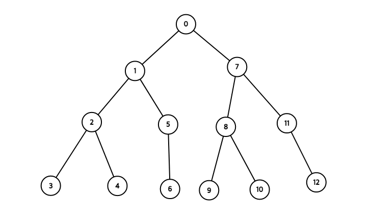
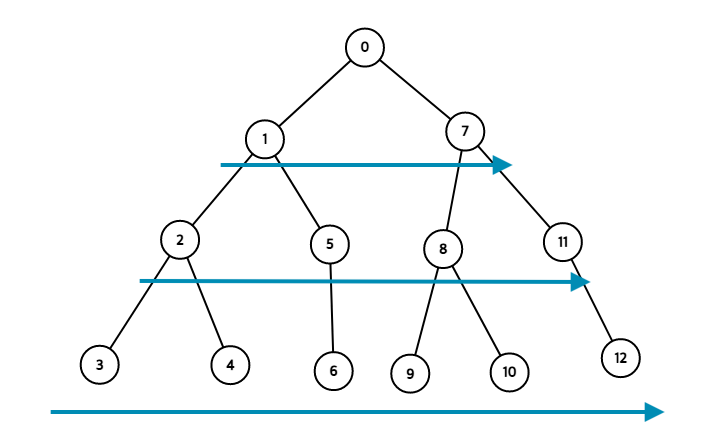

지난번에 DFS를 다뤘던 적이 있는데 이번에는 백준에서 문제를 풀다가 DFS와 함께 BFS를 사용하게 되었는데 지난번에 DFS를 구현할때 재귀함수를 이용해 풀어서 이번에도 재귀적으로 풀어보려다가 도저히 답을 찾을 수 없어 BFS에 대해 먼저 알아보기로 했다


# BFS (Breadth-First Search)
BFS는 너비 우선 탐색이다 BFS인 깊이 우선 탐색과는 다르게 한쪽 노드를 깊이 탐색하는 것이 아닌 넓게 탐색한다
- 재귀적으로 구현할 수 없다
- FIFO(선입선출)을 원칙으로 하는 큐를 이용해서 구현한다
- DFS와 마찬가지로 탐색한 노드를 확실하게 구별해야 한다

이미지를 통해 과정을 살펴보면 다음과 같다



이런 그래프가 있을때 0번째 정점노드에서 시작한다면, DFS는 (0-1-2-3-4-5-6-7-8-9-10-11-12)의 순서대로 탐색을 진행했었다 BFS의 경우 (0-1-7-2-5-8-11-3-4-6-9-10-12) 순서대로 진행한다



위에서부터 화살표대로 탐색을 진행한다

<br>

## 구현
DFS를 구현했을때처럼 재귀적인 방법으로 가능할 것이라고 생각해 코드를 작성하다가 도저히 불가능한 일인것을 깨달았다.

BFS는 큐를 이용해서 구현을 한다고 해서 블로그들을 참고해서 배열을 사용했다.
방문했는지를 확인해야하기 때문에 방문한 노드들을 담는 배열 한개와 방문한 노드의 자식노드들을 대기열에 추가할 수 있는 방문해야하는 노드를 담는 배열 하나 **총 두개의 배열을 사용한다**.

백준의 1260번인 DFS와 BFS를 풀면서 구현했다 코드는 다음과 같다
```javascript
const fs = require("fs");
const filePath = process.platform === 'linux' ? '/dev/stdin' : './1_1260.txt';

let input = fs.readFileSync(filePath).toString().trim().split("\n");

for (let i = 0; i < input.length; i++) {
  input[i] = input[i].split(" ").map(item => +item);
}
const n = input[0][0];    // 정점의 개수
const m = input[0][1];    // 간선의 개수
const v = input[0][2];    // 탐색을 시작할 정점
input.shift();    // input을 온전히 정점에 대한 데이터만 남기기 위함

// 작은 수부터 방문하도록 해야 하기 때문에 정렬을 했었지만 아래에서 정렬을 다시 해줘야하므로 주석처리했다
// input.sort((a, b) => {return a[0] - b[0]})
// input.sort((a, b) => {return a[1] - b[1]})

// input의 정보를 객체형태 graph로 만들어 준다 리스트를 확인하면서 있을때 각 프로퍼티에 추가하도록 했다
const graph = {};
for (let i = 0; i < input.length; i++) {
  for (let j = 0; j < 2; j++){
    if(graph[input[i][j]] === undefined){
      graph[input[i][j]] = j === 0 ? [input[i][1]] : [input[i][0]]
    } else if (graph[input[i][0]].indexOf(input[i][1]) === -1){
      graph[input[i][0]].push(input[i][1])
    } else if (graph[input[i][1]].indexOf(input[i][0]) === -1){
      graph[input[i][1]].push(input[i][0])
    }
  }
}

// 이전에 재귀적으로 구현했었는데 bfs 코드를 작성해보고 이번에는 동일하게 배열을 이용했다
function dfs(graph, v) {
  let visit = [];
  let notVisit = [];

  notVisit.push(v);
  while(notVisit.length > 0) {
    // 깊이 우선으므로 뒤에 들어온 노드를 탐색해줘야한다
    const temp = notVisit.pop();    
    if(visit.indexOf(temp) === -1){
      visit.push(temp)
      // 만약 간선이 이어져있지 않은 경우를 대비
      if (graph[temp] !== undefined){
        // 탐색할 노드의 배열에 추가할때 추가하는 데이터를 역순으로 정렬해준다(작은수부터)
        notVisit = [...notVisit, ...(graph[temp].sort((a, b) => {return b-a}))];
      }
    }
  }
  // 탐색한 노드를 출력
  console.log(visit.join(" "))
}

function bfs(graph, v) {
  let visit = [];
  let notVisit = [];
  
  notVisit.push(v);
  // 탐색할 노드가 없을때까지
  while(notVisit.length > 0) {
    // 너비우선 탐색이므로 들어온 노드대로 이후에 다시 추가해줘야 하기 때문에(FIFO) 
    const temp = notVisit.shift();
    if(visit.indexOf(temp) === -1){
      visit.push(temp)
      if (graph[temp] !== undefined){
        // 앞에서부터 하므로 오름차순으로 정렬해준다
        notVisit = [...notVisit, ...(graph[temp].sort((a, b) => {return a-b}))];
      }
    }
  }
  console.log(visit.join(" "))
}

dfs(graph, v)
bfs(graph, v)
```

DFS와 BFS의 가장 큰 차이점은 탐색해야할 노드들이 담긴 배열이 **큐(BFS)인가 스텍(DFS)인가**의 차이라고 생각한다

DFS의 경우 한쪽으로 먼저 깊게 들어가기 때문에 마지막으로 들어온 값이 제일 작아야하고, 제일 먼저(`pop()`) 탐색되어야한다 반면에 BFS는 넓게 퍼지면서 탐색하기 때문에 순서대로 공평하게? 탐색을 해야하기 때문에 들어온 순서대로(`shift()`) 탐색한다

정렬도 DFS의 경우에 역순으로 해줘야 맨 마지막으로 들어온 값이 제일 작다 반대로 BFS는 오름차순으로 해줘야 순차적으로 탐색을 할 수 있다.