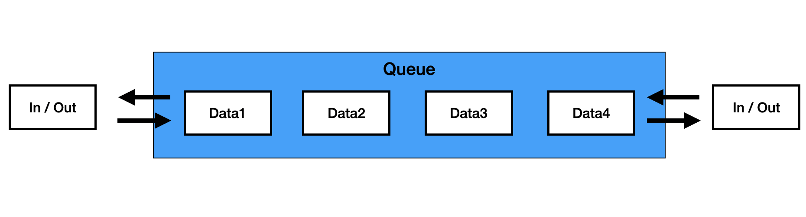

알고리즘 문제를 풀다가 Deque를 접하게 되었다. 원래 deque는 그냥 큐를 뒤집어둔거 라고 생각해서 그렇다면 굳이 큐랑 구분을 두지 않아도 될텐데 왜 따로 구분하지? 라는 생각을 했었는데 방향 뒤집었을때와 기존의 방향 두가지를 모두 지니고 있기 때문에 구분을 하는 것이었다

# 👉 Deque
덱은 큐와 동일하게 FIFO의 특성을 지닌다. 

큐는 head(앞)에서 데이터가 나오고 tail(뒤)에서 데이터가 들어가는 구조였다


하지만 덱이 큐와 다른 가장 큰 차이점은 **앞뒤로 들어가고, 앞뒤로 데이터가 나올 수 있다**는 것이 있다




- 덱은 크기가 가변적이다
- 앞뒤로 데이터의 입력 및 출력이 가능하다

구현을 할때 기존에 큐를 구현한 방식과 비슷하게 작성하였다. ~~(백준10866번 문제)~~

```javascript
class Deque {
    constructor() {
        this.head = null;
        this.tail = null;
        this.sizes = 0;
    }

    push_front(data) {
        const node = { data };
        if (this.head === null){
            this.head = node;
            this.tail = node;
        }
        else {
            let temp = this.head;
            temp.prev = node
            this.head = node;
            this.head.next = temp;
        }
        this.sizes++;
    }
    
    push_back(data) {
        const node = { data };
        if (this.head === null){
            this.head = node;
            this.tail = node;
        }
        else {
            const temp = this.tail
            temp.next = node;
            this.tail = node;
            this.tail.prev = temp
        }
        this.sizes++;
    }

    pop_front() {
        if (this.head === null){
            return -1;
        }else {
            const temp = this.head;
            this.head = this.head.next;

            if (this.sizes === 1){
                this.head = null
                this.tail = null
            }
            this.sizes--;
            return temp.data;
        }
    }

    pop_back() {
        if (this.head === null){
            return -1;
        }else {
            const temp = this.tail;
            this.tail = temp.prev;

            if (this.sizes === 1){
                this.head = null
                this.tail = null
            }
            this.sizes--;
            return temp.data;
        }
    }

    size() {
        return this.sizes;
    }

    empty() {
        if(this.sizes === 0) {
            return 1
        } else {
            return 0
        }
    }

    front() {
        if(this.sizes === 0) {
            return -1
        } else {
            return this.head.data;
        }
    }
    
    back() {
        if(this.sizes === 0) {
            return -1
        } else {
            return this.tail.data;
        }
    }
}
```

- `push_front()`: 앞쪽으로 데이터를 삽입
- `push_back()`: 뒤쪽으로 데이터를 삽입
- `pop_front()`: 앞에 있는 데이터를 반환
- `pop_back()`: 뒤에 있는 데이터를 반환
- `size()`: 덱의 사이즈를 반환
- `empty()`: 덱이 비어있는지 확인(0, 1)
- `front()`: 덱의 제일 앞부분을 반환
- `back()`: 덱의 제일 뒷부분을 반환

pop_front를 하는 것은 복잡하지 않았다 기존의 큐와 거의 동일하게 작성했다 하지만 pop_back 코드를 모두 작성하려고 보니 this.temp의 전 데이터를 찾을 수 없었다
그래서 처음 데이터를 입력하면서부터 next와 비슷한 역할을 하는 prev를 추가했다.
next는 다음 데이터를 가르키지만, prev는 이전 데이터를 가르켜 tail에서 이전 데이터를 찾을 수 있다.

<br>

덱을 구현해보면서 큐와 가장 큰 차이점이라고 생각 든 점이 각각의 데이터에 **prev를 추가해 이전 데이터를 알 수 있게 해서 한 방향이 아닌 양방향으로 입출력이 가능하도록** 하는 것이라는 생각을 할 수 있었다.