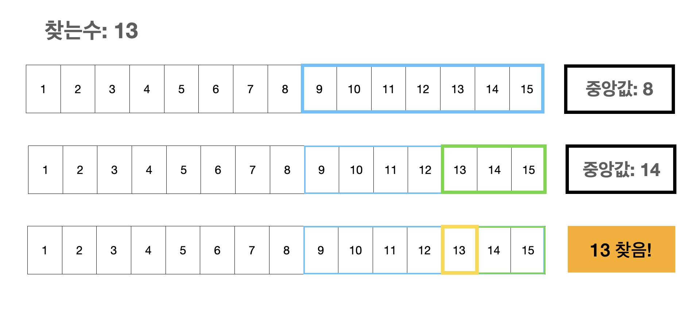
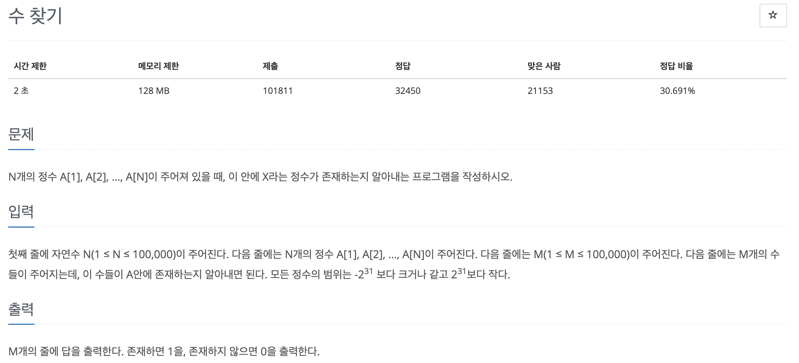

~~백준 단계별로 알고리즘으로 문제를 풀고 있는데 새로운 알고리즘을 들어설때마다 기대가 된다 새로운 방법을 보았을때 신기하기도 하고 내가 만들었을때 그 쾌감이 좋다..! 오늘은 큐와 덱 문제를 모두 풀고 이분탐색에 대해서 공부해 보려고 한다~~

# 이분탐색
이분탐색은 굉장히 단순한 생각에서 나온것 같다

결론만 두고 본다면 모든 탐색 대상을 탐색하지 않고 데이터가 있을만한 부분을 탐색한다

예를 들어 배열이 있을때 `[1, 2, 3, 4, 5]` 5가 있는지 없는지를 확인한다면 보통의 경우 1부터 5까지 확인을 하게 된다. 하지만 이분탐색을 적용하게 되면 특정값(ex - 중앙값)을 기준으로 배열을 나누고(`[1, 2, 3]`, `[4, 5]`) 있을만한 뒷부분을 탐색해서 앞부분의 배열을 탐색하는 시간을 줄여 효율적이게 된다.

크기가 큰 배열에서 이러한 방식을 계속 적용해서 반으로 반으로 줄여나가는 방법이다



범위를 줄여나가면서 탐색을 효율적으로 하는 것이다.

### 하지만 이분탐색을 적용하기 위해서는 **<u>정렬이 되어있어야 한다(중앙값 계산)</u>**

<br>
<br>

백준 1920번 문제



찾아본 내용대로라면 우선 정렬을 해줘야 할 것 같다

나는 오름차순으로 정렬을 하고, 입력을 각 변수로 할당했다
```javascript
const n = parseInt(input[0]);
let arr = input[1].split(" ").map(item => +item).sort((a, b) => a-b);
const m = parseInt(input[2]);
let target = input[3].split(" ").map(item => +item);

console.log(n, arr, m, target);
```
```
// 실행 결과
5 [ 1, 2, 3, 4, 5 ] 5 [ 1, 3, 7, 9, 5 ]
```

찾아야하는 숫자의 개수를 m으로 할당했기 때문에 `for`문을 `m`만큼 반복해주도록 한다

탐색할 구간을 구하려면 중앙값을 구해야 하기 때문에 `left`와 `right`라는 변수를 만들어 할당했다 for문마다 찾아야 하는 수가 다르므로 `left`와 `right`를 각각 배열의 양쪽 끝 인덱스로 초기화해줬다
```javascript
for (let i = 0; i < m; i++){
    left = 0;
    right = arr.length-1;
    while (true) {
        mid = parseInt((left+right)/2);
        if (arr[mid] === target[i]){
            console.log(1)
            break;
        } else if (arr[mid] > target[i]){
            right = mid-1;
        } else if (arr[mid] < target[i]){
            left = mid+1;
        }
        if (left > right) {
            console.log(0)
            break;
        }
    }
}
```
배열의 크기가 얼만큼일지, 얼마나 배열을 분할해야하는지 알 수 없기 때문에 `while`문 무한루프를 사용했다.

중앙값은 양쪽 끝값의 인덱스를 더하고 나눈값을 사용했다. 만약 중앙값으로 찾은 수가 내가 찾으려는 수라면 해당 숫자를 찾은 것으로 생각했고, 만약에 크거나 작으면 해당 방향으로 배열의 범위를 줄였다.

문제를 풀면서 막혔던 부분이 있었는데 조건을 설정하는 부분이다 다음과 같다
```javascript
// 정답
else if (arr[mid] > target[i]){
    right = mid-1;
} else if (arr[mid] < target[i]){
    left = mid+1;
}

// 처음 접근
else if (arr[mid] > target[i]){
    right = mid;
} else if (arr[mid] < target[i]){
    left = mid;
}
```
`left`와 `right`를 변경해줄때 `mid`값으로 바꿨었다. 하지만 이렇게 하니까 무한루프에서 빠져나올 수 없었다. 생각해보니 mid값과 찾는 값이 같았다면 앞에서 처리됬을테니 1씩 배열의 크기를 좁혀주면 되겠구나 싶었다. 줄여주게 되면 아래에서 없을때 무한루프를 탈출하고 0을 출력하는 부분을 `left > right`를 조건으로 사용할 수 있었다.

이렇게 하니 결과적으로 정답처리 되었다!!!

<br>

### 전체코드
```javascript
const fs = require("fs");
const filePath = process.platform === 'linux' ? '/dev/stdin' : './1_1920.txt';

let input = fs.readFileSync(filePath).toString().trim().split("\n");

const n = parseInt(input[0]);
let arr = input[1].split(" ").map(item => +item).sort((a, b) => a-b);
const m = parseInt(input[2]);
let target = input[3].split(" ").map(item => +item);

for (let i = 0; i < m; i++){
    left = 0;
    right = arr.length-1;
    while (true) {
        mid = parseInt((left+right)/2);
        if (arr[mid] === target[i]){
            console.log(1)
            break;
        } else if (arr[mid] > target[i]){
            right = mid-1;
        } else if (arr[mid] < target[i]){
            left = mid+1;
        }
        if (left > right) {
            console.log(0)
            break;
        }
    }
}
```


