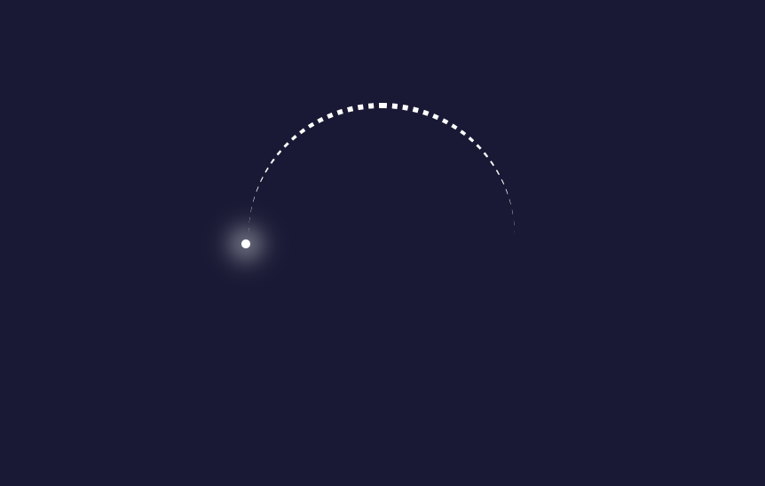
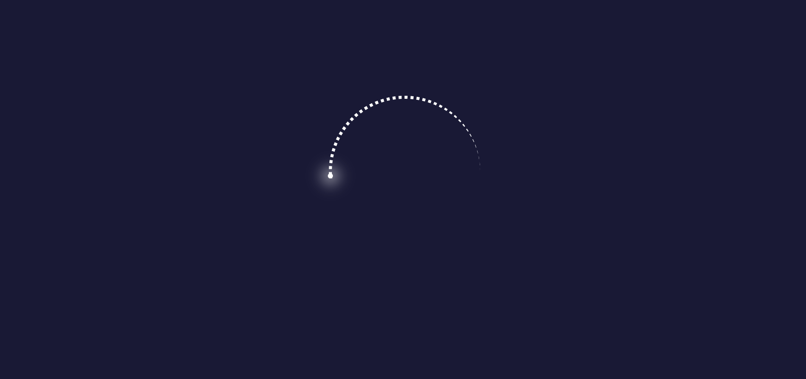
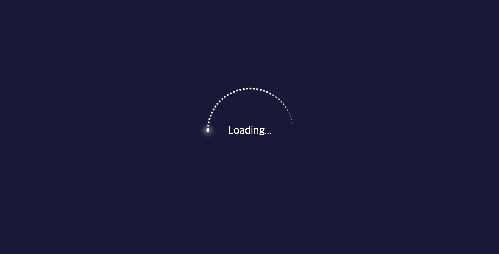

text-animation을 before를 이용해 만들어보니 다른 애니메이션도 만들어보고 싶다는 생각이 들었다. 그래서 간단하게 로딩하는 페이지에서 보여줄 수 있는 애니메이션을 만들어 보기로 했다.

이전에 강의 영상을 보면서 transform의 rotate를 이용하면 되겠다라고 생각했던적이 있어서 이것을 활용해봤다
우선 계획은 동그란 틀을 잡아주고, 이미지나 무언가를 이용해서 별똥별같은 것이 rotate를 이용해서 회전시키는것이 계획이었다.

간단하게 한 파일내에서 모든 것을 하기위해 head태그 내에 style태그를 사용했다
```html
<!DOCTYPE html>
<html lang="en">
<head>
    <meta charset="UTF-8">
    <meta name="viewport" content="width=device-width, initial-scale=1.0">
    <title>Document</title>
    <style>
        * {
            margin: 0;
            padding: 0;
            box-sizing: border-box;
        }
        body {
            display: flex;
            justify-content: center;
            align-items: center;
            min-height: 100vh;
            background-color: rgb(25, 25, 55);
        }
        div {
            width: 150px;
            height: 150px;
            border-top: 3px dotted #fff;
            border-radius: 50%;
            color: #fff;
            position: relative;
        }
        div::before {
            content: "";
            width: 5px;
            height: 5px;
            position: absolute;
            border-radius: 50%;
            top: 50%;
            left: -4px;
            background-color: #fff;
            box-shadow: 0 0 10px 3px #fff;
            z-index: 10;
        }
    </style>
</head>
<body>
    <div></div>
</body>
</html>
```

`margin`과 `padding`을 초기화 시켜주고 `body`에 `flex`를 적용해 중앙정렬시킨 뒤에 html에는 `div`태그 하나를, `style`로는 크기 및 `border`를 이용해서 꼬리 부분을 표현하고, `::before`로 머리부분을 표현하려고 했다.

머리부분에는 빛나는 느낌을 주기위해 shadow를 이용했다. 



이렇게 만들어보니 양 끝부분이희미하게 줄어들어버렸다 아무래도 `border-radius`의 특성 때문인것 같았다 오른쪽 부분은 희미해지는 것이 자영스러워서 오히려 좋았지만 머리 부붙과 연결이 끊기는 것이 아니다싶어 `border-left`를 동일하게 추가하고, `::after`를 이용해서 그냥 가려버리자! 라는 말도 안되는 방법을 실행해 보았다

```css 
div::after {
    content: "";
    width: 200%;
    height: 60%;
    position: absolute;
    bottom: -14%;
    left: -20%;
    background-color: rgb(25, 25, 55);
}
```


결과적으로 나쁘지는 않았다... 다른 좋은 방법을 찾아봐야겠지면 현재로써는 나름의 최선이었다..

이제 만들어진 원을 회전시키면 된다 따라서 keyframe을 이용해서 회전시켰다.
```css
/* div에 추가! */
div { animation: rotate 2s linear infinite; }

@keyframes rotate{
    0% {
        transform: rotate(0deg);
    }
    100% {
        transform: rotate(-365deg);
    }
}
```

허전한 느낌이 들어 중앙에 loading이라는 텍스트로 넣어주었다.

### ▶️ 결과


<br>

### ▶️ 전체 코드
```html
<!DOCTYPE html>
<html lang="en">
<head>
    <meta charset="UTF-8">
    <meta name="viewport" content="width=device-width, initial-scale=1.0">
    <title>Document</title>
    <style>
        * {
            margin: 0;
            padding: 0;
            box-sizing: border-box;
        }
        body {
            display: flex;
            justify-content: center;
            align-items: center;
            min-height: 100vh;
            background-color: rgb(25, 25, 55);
        }
        div {
            width: 150px;
            height: 150px;
            border-top: 3px dotted #fff;
            border-left: 3px dotted #fff;
            border-radius: 50%;
            color: #fff;
            position: relative;
            animation: rotate 2s linear infinite;
        }
        div::before {
            content: "";
            width: 5px;
            height: 5px;
            position: absolute;
            border-radius: 50%;
            top: 50%;
            left: -4px;
            background-color: #fff;
            box-shadow: 0 0 10px 2px #fff;
            z-index: 10;
        }
        div::after {
            content: "";
            width: 200%;
            height: 60%;
            position: absolute;
            bottom: -14%;
            left: -20%;
            background-color: rgb(25, 25, 55);
        }
        @keyframes rotate{
            0% {
                transform: rotate(0deg);
            }
            100% {
                transform: rotate(-365deg);
            }
        }
        p {
            position: absolute;
            color: #fff;
            font-size: 1.2em;
        }
        
    </style>
</head>
<body>
    <div></div>
    <p>Loading...</p>
</body>
</html>
```

내가 아직 부족해서 이정도로만 간단히 만들어봤지만 조금씩 연습해서 좀더 다이나믹한 애니메이션을 만들 수 있겠지! 하며 공부하기를 다시 한번 다짐할 수 있었다.

가상 요소 선택자의 사용성이 정말 다양할 것 같다는 생각도 할 수 있었고, 마지막으로 shadow를 사용하면서 헷갈렸기 때문에 shadow에 대해서 정리했다

<br>

# ✅ `shadow`
shadow는 그림자를 줄 수 있는 css이다. text-shadow로는 텍스트의 그림자를 표현할 수 있고, bos-shadow로는 다른 요소들에 그림자를 이용해 다양한 효과를 보여줄 수 있다.

```css
.box {
    box-shadow: 10px 5px 5px #000;
}
```

- 단축속성으로 최대 6개의 값을 입력할 수 있다.
- `inset`: 선택사항으로 입력해주면 내부의 그림자를 형성하게 된다.
- `offset-x`, `offset-y`: 그림자의 위치를 x좌표, y좌표로 지정
- `blur-radius`: blur를 숫자값으로 입력해준다. (크면 클 수록 그림자 테두리가 흐려지므로 크기는 더 커지고 색은 더 밝아진다)(음수값x)
- `spread-radius`: 그림자의 크기를 지정 (양수 값은 그림자가 더 커지고 확산하며, 음수 값은 그림자가 줄어든다)
- `color`: 그림자의 색상을 지정

<br>

- 두개의 값이 명시된 경우 `offset-x`, `offset-y`가 지정
- 세개의 값이 명시된 경우 순서대로 `offset-x`, `offset-y`, `blur-radius`가 지정
- 네개의 값이 명시된 경우 순서대로 `offset-x`, `offset-y`, `blur-radius`, `spread-radius` 가 지정


