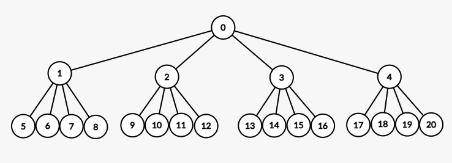
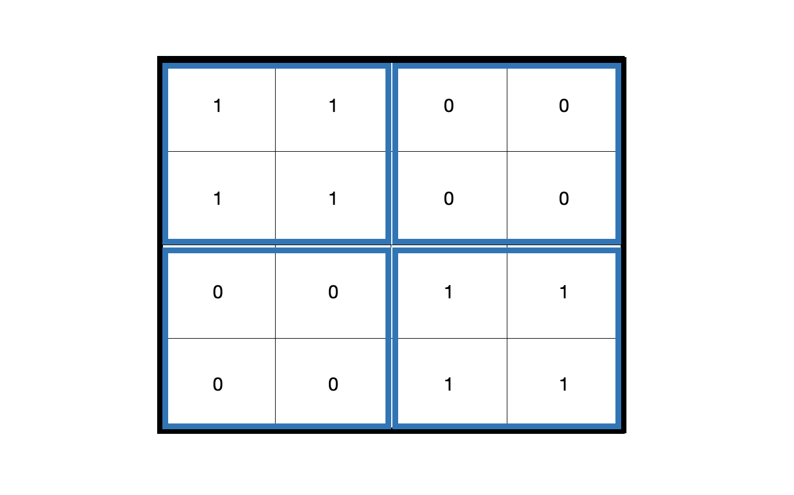
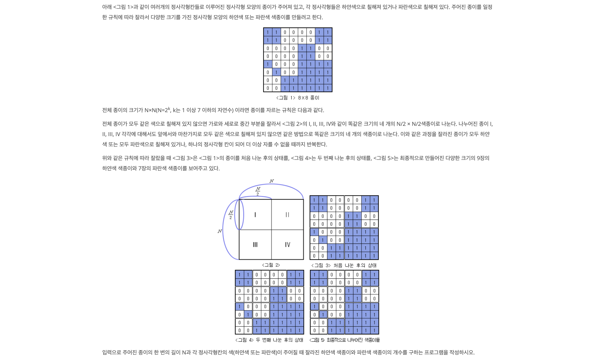

오늘은 백준 알고리즘 분할정복 문제를 풀어봤다.

사용할 알고리즘은 **쿼드트리**이다

# 👉 쿼드트리 (Quad Tree)
트리의 자식이 4개임을 뜻한다





- 계층적이다
- 사분면으로 표현할 수 있다
- 재귀적으로 표현이 가능하다
- 0과 1로 표현하거나 점을 표현한다
- 정사각형으로 이루어져 네개로 나눠진다

# 백준 문제 2630


요약하자면, 0과 1로 이루어진 정사각형의 무리 속에서 오직 0으로 이루어진 정사각형과 1로 오직 1로 이루어진 정사각형이 몇개 존재하는가를 각각(하얀색, 파란색) 출력해주면 된다

내 접근 방향은 반복문을 사용해서 같은 숫자(0 또는 1)로 이루어졌는지 확인하고, 아니라면 트리의 자식이 네개이기 때문에 4로 나누어주고 재귀적인 호출을 하는 방법을 사용해보려고 한다 

```javascript
const solve = (x, y, size) => {
    temp = input[x][y];
    for (let i = x; i < size; i++){
        for (let j = y; j < size; j++){
            if(temp === input[i][j]) {
                continue;
            } else {
                solve(x, y, size/4);
                solve(x, y, size/4);
                solve(x, y, size/4);
                solve(x, y, size/4);
            }
    }
}
```
이전부분에서 입력을 2차원 배열로 숫자로 변환하고, 위 코드는 각각의 사이즈의 정사각형의 숫자가 동일한지 확인하는 코드이다. 

`x`와 `y`는 현재의 인덱스를 뜻하고, `size`는 정사각형의 크기를 나타낸다.

문제는 쿼드트리는 자식노드가 4개가 된다고 해서 4로 나눠주면 될것이라고 생각한 것이다.. 하지만 숫자 4는 하나의 정사각형에서 4개의 정사각형으로 나눠지는 것이기 때문에 재귀적인 호출이 4번 있어야 하고, 나눠주는 값은 2가 되어야 한다고 생각을 고쳤다.

그리고 재귀호출을 할때 `x`와 `y`의 인덱스를 변경해서 인자로 넣어줘야 하는데 어떻게 값을 변경해서 넣어줘야 할지가 고민이었다. 사분면을 그려두고 생각해보니 정사각형으로 이루어지기 때문에 `size`를 줄여준만큼 각 `x`, `y`의 인덱스를 증가시켜주면 겹치지 않는 정사각형을 형성하면서 재귀적으로 `solve()`(재귀함수)를 호출할 수 있었다

<br>

```javascript
let white = 0;
let blue = 0;

const solve = (x, y, size) => {
    temp = input[x][y];
    for (let i = x; i < x+size; i++){
        for (let j = y; j < y+size; j++){
            if(temp === input[i][j]) {
                continue;
            } else {
                solve(x, y, size/2);
                solve(x+(size/2), y, size/2);
                solve(x, y+(size/2), size/2);
                solve(x+(size/2), y+(size/2), size/2);
                return;
            }
        }
    }
    if (temp === 0){
        white++;
    } else {
        blue++;
    }
    return;
}
```


만약 재귀함수를 호출한다면 정사각형 내부의 색상(0 또는 1)이 서로 일치하지 않는다는 뜻이기 때문에 뒤에 이어진 색상별 정사각형을 세주는 과정을 진행하지 않아야 하기 때문에 함수를 `return`했다

마지막으로 위에서 정사각형 내의 색상(0 또는 1)이 일치하는지를 확인하고 재귀함수가 호출되는 조건을 거치지 않고 통과했다면 그 정사각형은 동일한 색상을 가지고 있는 정사각형이라는 뜻이기 때문에 처음에 임시변수 `temp`에 저장한 색상(0 또는 1)을 조건문에 추가해서 각 색상을 카운트해주는 변수 (`white`, `blue`)에 1씩 증가시킨다

추가적으로 `solve()`의 윗 부분에 만약 `size`가 1이라면 temp에 따라 이하 과정을 진행하지 않고 각 색상을 카운트해주는 변수에 추가하도록 했다.

마지막으로 각 색상을 카운트해주는 변수 `white`와 `blue`를 출력해줬다

<br>

```javascript
const fs = require("fs");
const filePath = process.platform === 'linux' ? '/dev/stdin' : './1_2630.txt';

let input = fs.readFileSync(filePath).toString().trim().split("\n");

const n = parseInt(input.shift());
input = input.map(item => item.split(" ").map(item2 => +item2));

let white = 0;
let blue = 0;

const solve = (x, y, size) => {
    temp = input[x][y];
    if (size === 1) {
        if (temp === 0){
            white++;
        } else {
            blue++;
        }
        return;
    }
    for (let i = x; i < x+size; i++){
        for (let j = y; j < y+size; j++){
            if(temp === input[i][j]) {
                continue;
            } else {
                solve(x, y, size/2);
                solve(x+(size/2), y, size/2);
                solve(x, y+(size/2), size/2);
                solve(x+(size/2), y+(size/2), size/2);
                return;
            }
        }
    }
    if (temp === 0){
        white++;
    } else {
        blue++;
    }
    return;
}

solve(0, 0, n);

console.log(white);
console.log(blue);
```

맞았습니다!라는 결과를 볼 수 있었다. 

쿼크트리는 노드가 자식노드 4개로 분리되어 지형을 나타낼때 필요없는 부분이거나 필요한 부분을 적은 연산으로 계산할 수 있기 때문에 지형 관리 기법에 사용된다고 한다(3d게임 등) 또는 2차원의 이미지에서 특정 비트나 픽셀단위를 탖는데 유용하다고 한다

<br>

~~아직은 두루뭉실하지만 쿼드트리를 공부하면서 든 생각이 이분탐색의 절반으로 나누는 부분이 일차원에서 이차원적으로 계산하는 것과 비슷하다는 생각을 했다. 쿼드트리나, 이분탐색처럼 검색 자체를 빠르게 하기보다는 검색하는 부분을 줄여서 무언가를 구현한다면 메모리를 적게 사용하거나 보다 효율적인 코드를 작성할 수 있겠다라는 생각이 들었다~~


