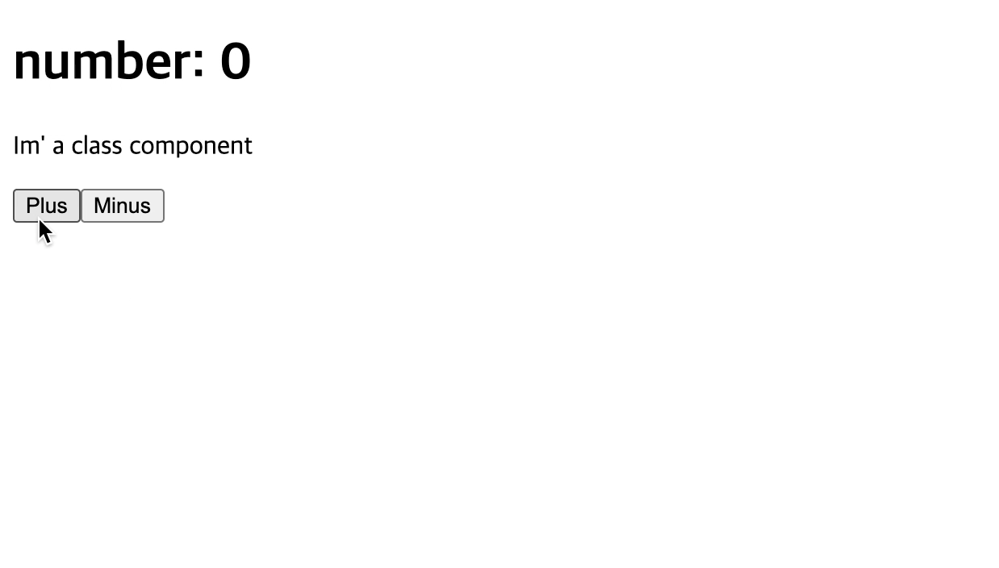

이전에 리액트의 기초에 들어서면서 함수를 통해서 데이터를 전달받고 `App`에서 `return`을 통해 랜더링하는 방식을 사용해봤다.
```javascript
import React from "react";

function People({ name, age }) {
  return (
    <div>
      <h2>My name is {name}</h2>
      <p>and i {age} years old</p>
    </div>
  );
}

const PeopleIntro = [
  {
    name: "jb",
    age:20
  },
  {
    name: "mc",
    age:21
  },
  {
    name: "jh",
    age:22
  },
  {
    name: "ji",
    age:23
  },
  {
    name: "jy",
    age:24
  }
];

function App() {
  return (
    <div>
      {PeopleIntro.map(item => (
        <People name={item.name} age={item.age} />
      ))}
    </div>
  );
}
export default App;
```


<br>

data를 저장하는 객체를 따로 만들고, 그 객체를 html로 `App`으로 전달하기 위해 component를 따로 생성(`people`)해서 `App`에서 `map`을 이용해 각각의 데이터를 사용할 수 있었다.

이번에 공부해볼 내용은 **state**라는 내용이다.
리액트에서 데이터는 무조건 부모 컴포넌트에서 자식 컴포넌트로 전달된다. 데이터를 전달해 이용할 수 있는 방법에는 두가지가 있다

1. props
2. state

# props
`props`는 부모컴포넌트에서 전달받은 읽기 전용 데이터이다

위 코드에서 사용한 방법이 `props`를 사용한 방법이다. 부모에세서 전달받아 사용하기 때문에 수정이 불가능하며 읽기만 가능하다

<br>

# state
`state`는 `props`와 다르게 부모 컴포넌트에서 전달받는 것이 아니고, 자식컴포넌트 내에서 만들어진다.

따라서 자식 컴포넌트(현재 다루는 컴포넌트)에서는 데이터의 수정이 가능하다 또한 변경된 데이터를 가지고 다시 랜더링 할 수 있다.

```javascript
import React from "react";

class App extends React.Component{   
  state = {
    count: 0    
  }
  plus = () => {
    this.setState(current => ({count: current.count + 1}))
  }
  minus = () => {
    this.setState(current => ({count: current.count - 1}))
  }
  render() {
    return (
    <div>
      <h1>number: {this.state.count}</h1>
      <p>Im' a class component</p>
      <button onClick={this.plus}>Plus</button>
      <button onClick={this.minus}>Minus</button>
    </div>
    )
  }
}
export default App;
```

위 코드를 설명하자면, 먼저 `App` 컴포넌트는 함수가 아니기 때문에 `return`을 가지지 않는다 그래서 `extends React.Componenet`를 이용해서 `render`라는 함수를 사용할 수 있다

`React.Componenet`는 `state`라는 특별한 것을 사용할 수 있는데 컴포넌트 내에서 `state`라는 객체를 만들어 동적인 데이터처럼 다룰 수 있다. 위 코드에서는 `state`내에 `count`라는 프로퍼티에 0이라는 값을 할당했다

`render`함수를 이용해서 랜더링 할때 state의 데이터를 이용하려면 `this.state.프로퍼티`로 데이터를 가져올 수 있다.

`state`는 동적인 데이터를 다루기 위함이라고 했기 때문에 예제로 버튼을 누르면 숫자를 1씩 더하거나 빼는 것을 만들어 보았다.

데이터를 조작하기 위해서 `plus`와 `minus`라는 함수를 화살표함수로 만들어줬다. 이때 `this.state.count++;` 이런식으로 state의 데이터를 직접적으로 다루게 되면 에러가 출력된다.

```
Compiled with warnings.

src/App.js
  Line 21:5:  Do not mutate state directly. Use setState()  react/no-direct-mutation-state

Search for the keywords to learn more about each warning.
To ignore, add // eslint-disable-next-line to the line before.
```

이 뜻은 `state`를 직접적으로 제어하지 말라는 뜻이다. react에서는 `state`를 제어하기 위해서 `setState`라는 함수를 제공한다


`setState`를 이용해서 `this.setState({count: this.state.count +1});`이렇게 작성을 할 수 있는데 이는 좋은 방법이 아니다 <u>따라서 `this.setState(current => ({count: current.count + 1}))`처럼 화살표 함수를 이용해서 `current`라는 새로운 `state`로 +1을 하도록 만들어주면 된다!</u>

state는 동적데이터 즉 변하는 고정되지 않은 데이터를 다룰때 유용하기 때문에 많이 사용된다.

<br>

위 코드는 다음과 같이 동작한다




