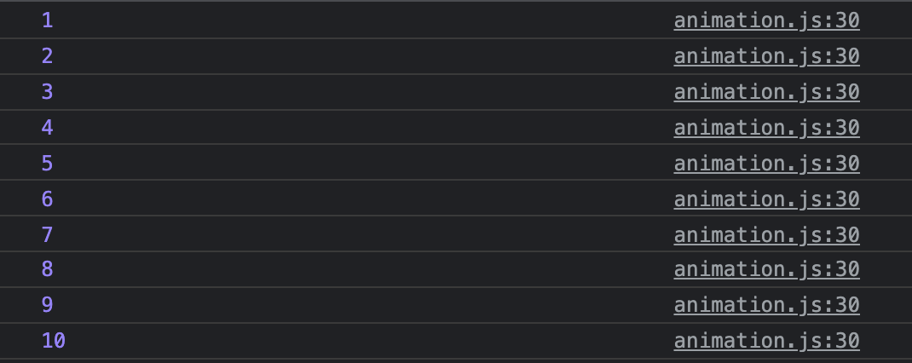
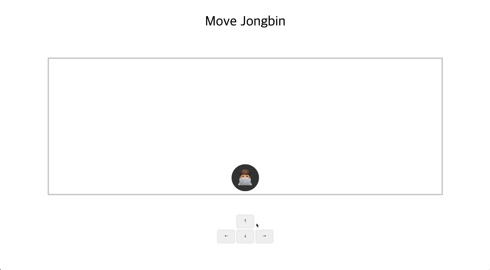

유튜브 동영상을 보다가 requestAnimationFrame이란것을 알게 되었다.

기존에 자바스크립트를 이용해서 애니메이션을 구현할때 `setTimeout()`이나 `setInterval()`을 사용하는 경우가 있었는데 이런 함수를 이용한 애니메이션 구현의 단점을 극복한 방법이 `requestAnimationFrame()`이다

<br>

## ✅ requestAnimationFrame()를 왜 사용하는가?
`setTimeout()`이나 `setInterval()`은 뚝뚝 끊기는 프레임 누락 현상이 발생할 수 있다 하지만 `requestAnimationFrame()`는 초당 60프레임을 지원하기 때문에 사용자는 전혀 불편함을 느끼지 않는다 

<br>

## ✅ requestAnimationFrame()와 이전 방법의 차이점
`setTimeout()`, `setInterval()`과의 차이점은 브라우저가 실행 시기를 결정한다는 점이다 또한 setInterval은 계속 반복적인 코드를 구현할 수 있지만 `requestAnimationFrame()`은 반복적이지 않기 때문에 재귀적인 호출을 이용해서 구현한다

<br>

# 👉 `requestAnimationFrame()`
인자로는 리페인팅 하기 전에 실행될 콜백함수를 받는다 MDN을 살펴보게 되면 다음과 같이 설명되어 있다.

> window.requestAnimationFrame()은 브라우저에게 수행하기를 원하는 애니메이션을 알리고 다음 리페인트가 진행되기 전에 해당 애니메이션을 업데이트하는 함수를 호출하게 합니다. 이 메소드는 리페인트 이전에 실행할 콜백을 인자로 받습니다.  
(https://developer.mozilla.org/ko/docs/Web/API/Window/requestAnimationFrame)

반환값으로는 숫자값을 반환하는데 아이디값이라고 생각하면 될 것 같다 내가 만든 코드에서 해당 부분을 확인해 보았다.

```javascript
if (direction !== null) {
  rafId = requestAnimationFrame(move);
  console.log(rafId);
}
window.addEventListener("keyup", () => {
  cancelAnimationFrame(rafId)
})
```



위 숫자 1부터 10까지 모두 `requestAnimationFrame()`의 반환값을 할당해서 출력한 값이다.

<br>

이 함수를 사용해서 내가 원하는대로 움직이는 이미지를 만들어보기로 했다. 키보드의 화살표 버튼처럼 만들어주고, 마우스로 눌렀을때 해당 방향으로 이동하도록 만들었다.
```javascript
const jongbin = document.querySelector(".jongbin");
const controller = document.querySelector(".controller");
const topBtn = controller.querySelector(".top");
const bottomBtn = controller.querySelector(".bottom");
const leftBtn = controller.querySelector(".left");
const rightBtn = controller.querySelector(".right");
let yPos = 0;
let xPos = 0;
let rafId;

const move = () => {
  if (direction === "↑") {
    yPos -= 3;
    jongbin.style.transform = `translate(${xPos}px, ${yPos}px)`;
  } 
  if (direction === "↓") {
    yPos += 3;
    jongbin.style.transform = `translate(${xPos}px, ${yPos}px)`;
  } 
  if (direction === "←") {
    xPos -= 3;
    jongbin.style.transform = `translate(${xPos}px, ${yPos}px)`;
  } 
  if (direction === "➞") {
    xPos += 3;
    jongbin.style.transform = `translate(${xPos}px, ${yPos}px)`;
  } 
  rafId = requestAnimationFrame(move);
}

const handleUp = () => {
  cancelAnimationFrame(rafId);
}
const moveTop = () => {
  direction = "↑"
  move();
}
const moveBottom = () => {
  direction = "↓"
  move();
}
const moveLeft = () => {
  direction = "←"
  move();
}
const moveRight = () => {
  direction = "➞"
  move();
}

topBtn.addEventListener("mousedown", moveTop);
bottomBtn.addEventListener("mousedown", moveBottom);
leftBtn.addEventListener("mousedown", moveLeft);
rightBtn.addEventListener("mousedown", moveRight);
controller.addEventListener("mouseup", handleUp);
```



마우스로 버튼을 누른 상태에 움직이도록 만들어두고, 떼면 동작을 멈춘다

버튼을 눌렀을때 방향을 설정하고 move함수를 호출해서 해당 방향으로 이동하게끔 css(`transform: translate`)를 변경해주었다.

<u>멈출때는 `cancelAnimationFrame()`를 이용한다. 이 함수는 이전에 실행한 `requestAnimationFrame()`의 반환값을 전달받아 해당 애니메이션을 멈추게 한다</u>

만약 멈추지 않으면 끝도없이 동작하게 만들 수 있다

<br>

추가적으로 마우스로 눌렀을때 말고 키보드 키를 눌렀을때 동작하도록 만들어 보았다.
```javascript
const jongbin = document.querySelector(".jongbin");
const controller = document.querySelector(".controller");
const topBtn = controller.querySelector(".top");
const bottomBtn = controller.querySelector(".bottom");
const leftBtn = controller.querySelector(".left");
const rightBtn = controller.querySelector(".right");
let yPos = 0;
let xPos = 0;
let direction = null;
let rafId;
const move = () => {
    if (direction === "↑") {
        yPos -= 3;
        jongbin.style.transform = `translate(${xPos}px, ${yPos}px)`;
    } 
    if (direction === "↓") {
        yPos += 3;
        jongbin.style.transform = `translate(${xPos}px, ${yPos}px)`;
    } 
    if (direction === "←") {
        xPos -= 3;
        jongbin.style.transform = `translate(${xPos}px, ${yPos}px)`;
    } 
    if (direction === "➞") {
        xPos += 3;
        jongbin.style.transform = `translate(${xPos}px, ${yPos}px)`;
    } 
    // rafId = requestAnimationFrame(move);
    if (direction !== null) {
        rafId = requestAnimationFrame(move);
        console.log(rafId);
    }
    window.addEventListener("keyup", () => {
        cancelAnimationFrame(rafId)
    })
}

const handleUp = () => {
    direction = null;
    cancelAnimationFrame(rafId)
}
const moveTop = () => {
    direction = "↑"
    move()
}
const moveBottom = () => {
    direction = "↓"
    move()
}
const moveLeft = () => {
    direction = "←"
    move()
}
const moveRight = () => {
    direction = "➞"
    move()
}

const keyMoveDown = (event) => {
    if (event.key === "ArrowUp") {
        direction = "↑";
        move();
    }
    if (event.key === "ArrowDown") {
        direction = "↓";
        move();
    }
    if (event.key === "ArrowLeft") {
        direction = "←";
        move();
    }
    if (event.key === "ArrowRight") {
        direction = "➞";
        move();
    }

}
const keyMoveUp = () => {
    direction = null;
}

topBtn.addEventListener("mousedown", moveTop);
bottomBtn.addEventListener("mousedown", moveBottom);
leftBtn.addEventListener("mousedown", moveLeft);
rightBtn.addEventListener("mousedown", moveRight);
controller.addEventListener("mouseup", handleUp);

window.addEventListener("keydown", keyMoveDown)
window.addEventListener("keyup", keyMoveUp)

```

`addEventListener`의 `keydown`과 `keyup`을 추가해줬다 이외 `keydown`을 적용했을때 `cancelAnimationFrame()`가 잘 먹히지 않는 부분이 있어서 `direction`이라는 변수를 확인하도록 만들었다 잘 먹히지 않는 이유를 생각해봤는데 `keydown`을 사용하면 키를 눌렀을때 한번만 호출되는 것이 아니고 주기적으로 실행이 된 것을 확인할 수 있었다. 그래서 중간에 아이디값이 누락이 되거나 하는것 같다 이후 한번만 호출해 주는 이벤트를 찾아봐야겠다

