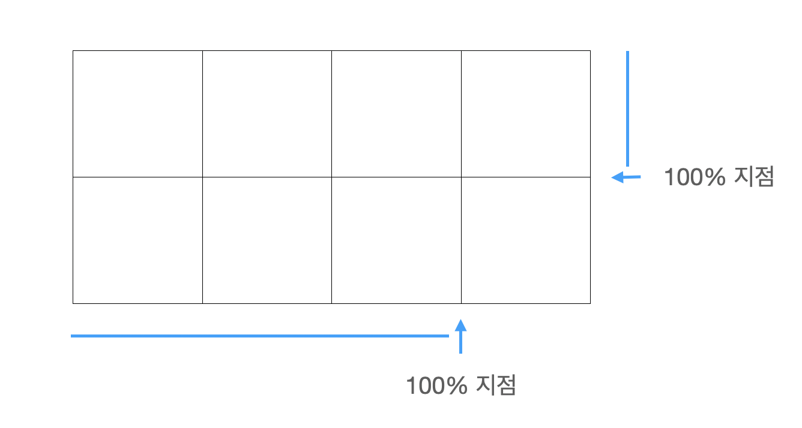
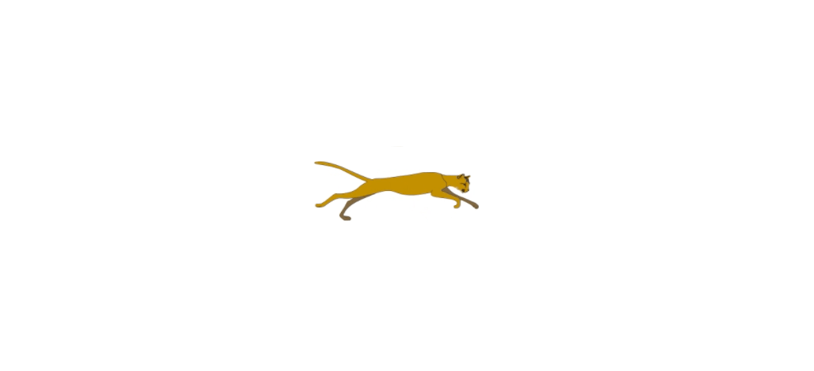

`requestAnimationFrame()`을 다루면서 애니메이션에 대해서 더 찾아보다가 이미지 스파라이트라는 것을 알게 되었다 


# 👉 이미지 스트라이트 (image sprite)
이미지 스프라이트는 여러가지 이미지를 합쳐서 하나로 관리하는 방법이다. 이미지 스프라이트를  사용하는 이유는 성능적인 측면이 가장 크다 만약 페이지를 랜더링할때 이미지 열개를 로드하는 것 보다 열개의 이미지를 하나의 이미지로 합쳐서 로드하는 것이 시간적으로 훨씬 효율적일 것이다.

하지만 수정이 많이 필요하거나 이미지가 제각각인 경우 사용하는데 불편함이 있을 수 있을 것 같다 표시해주려는 이미지의 위치정보를 정확하게 알고 position값을 지정해줘야 하기 때문이다

<br>

## ✅ 사용법
하나의 이미지를 `background-image`로 이미지를 나타내고 `background-position`를 이용해서 보여줄 부분을 설정하면 된다.
```css
.box {
    width: 5rem;
    height: 5rem;
    background-image: url(파일경로);
    background-repeat: no-repeat;
    background-position: 0 25%;
```

<br>
<br>

이런 방법을 사용해서 간단한 애니메이션을 만들어봤다.

`background-position`을 사용해서 하나의 이미지를 계속해서 변화시켜주면 움직이는 듯한 이미지를 만들 수 있다.

> https://www.pngegg.com/

위 페이지에서 스프라이트 이미지 하나를 무료로 이용했다.

도라에몽이 뛰어다니는 것을 만들어봤다.
```css
.doraemon {
    position: absolute;
    left: 50%;
    bottom: 10px;
    margin-left: -2.5rem;
    width: 5rem;
    height: 6rem;
    background-image: url(./doraemon.png);
    background-repeat: no-repeat;
    background-size: 400% 200%;
    animation: walk .6s step-start infinite;
}
@keyframes walk {
    0% {background-position: -2% 0;}
    20% {background-position: 30% 0;}
    40% {background-position: 60% 0;}
    60% {background-position: 95% 0;}
    80% {background-position: -2% 100%;}
    100% {background-position: 30% 100%;}
}
```

`keyframes`를 정의해서 과정동안의 position값을 지정해줬다.


<br>

position값을 지정하는게 꽤나 어렵게 느껴져서 다른 이미지로 다시 한번 연습해 봤다.
```css
.tiger {
    position: absolute;
    left: 50%;
    bottom: 100px;
    margin-left: -2.5rem;
    width: 7rem;
    height: 3rem;
    background-image: url(./tiger.png);
    background-repeat: no-repeat;
    background-size: 200% 400%;
    animation: tiger .6s step-start infinite;
}
@keyframes tiger {
    0% {background-position: 0 0;}
    14.2% {background-position: 100% 0;}
    28.4% {background-position: 0 calc(100%/3);}
    42.6% {background-position: 100% calc(100%/3);}
    56.8% {background-position: 0 calc(100%/3*2);}
    71% {background-position: 100% calc(100%/3*2);}
    84.2% {background-position: 0 100%;}
    100% {background-position: 100% 100%;}
}
```

어느정도 감이 잡히기 시작했다

내가 한 방법은 이미지의 사이즈를 해당 행과 열만큼 배로 해준다 (4x2의 이미지라면, `background-size: 400% 200%`)



위 이미지를 참고해서 필요한 부분의 position값을 입력해준다 소숫점 계산이 애매해서 `calc()`을 사용해서 나타냈다.

