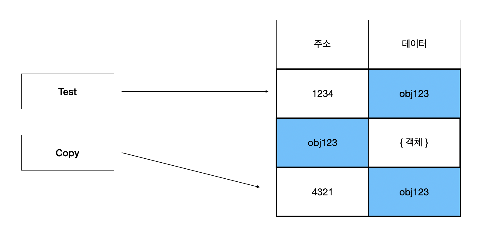

공부하면서 생긴 두가지 의문과 궁금증에 대해서 찾아보려고 한다

# HTML

## ✅ 와 background-image의 차이

최근 스프라이트 이미지를 공부하고 img태그로는 사용할 수 없을것 같은데.. 라는 생각을 하다가 근데 왜 img태그와 background-image속성으로 이미지를 표현하는데 뭘 사용하는게 좋은 방법이지 라는 생각을 하게 되었다.

우선 이미지를 표현하는 방법에는 두가지가 있다.

1. `img`태그를 이용하는 방법
```html

```

2. `background-image`를 이용하는 방법
```css
.imgBox {
    background-image: url(filePath);
}
```

우선 가장 큰 차이점으로는 `background-image`에는 <u>대체텍스트(`alt`)가 존재하지 않는다</u> 따라서 만약 이미지의 로딩이 정상적으로 작동하지 않았을때 대체텍스트를 띄우지 않으며 사용자에게 어떤 컨텐츠도 보여지지 않는다

이러한 점과 그외 사용 용도를 정리해 보자면 다음과 같다

### ▶️ `img`태그를 사용할 때
1. 이미지를 포함한 프린트가 필요할때 (background-image는 출력되지 않음)
2. 본문의 중요한 내용으로 대체텍스트가 필요할때

### ▶️ `background-image`를 사용할 때
1. 이미지 스프라이트를 사용할때 (성능적인 면으로 로딩 시간을 단축, 필요한 부분을 `background-position`으로 지정해서 보여줄 수 있음)
2. 이미지 위에 텍스트가 필요한 경우 (img태그도 텍스트를 `position: absolute`로 가능)
3. 순수하게 디자인적 요소로 사용되는 경우

<br>

# JS

## ✅ 깊은 복사와 얉은복사
알고리즘 문제를 풀면서 어떤 변수에 할당된 객체를 다른 변수에 그대로 복사를 하고 내부 데이터를 변경했을때 기존의 객체가 변경되는 것을 경험했다.

객체를 복사할때 객체를 가르키는 값이 복사되어 동일한 객체를 가르키기 때문이다


위 사진처럼 객체를 생성하면 값으로 참조주소가 들어가고 복사를 하게되면 값인 참조주소를 복사해오기 때문에 동일한 객체를 참조하게 된다

<br>

## ▶️ 얇은 복사
얉은 복사로 객체를 복사하면 객체내의 객체를 제외한 값들은 기존의 객체와 다른 값이 된다
얇은 복사를 하는 방법으로는 펼침연산자를 이용하거나, `Object.assign({}, obj)`, 배열의 경우 `slice()`를 이용하면 된다.

```javascript
const test = {
    1: "before",
    2: "before",
    3: { test:"before" }
}

// 복사
const copy1 = test;                      
const copy2 = Object.assign({}, test);
const copy3 = {...test};

// 데이터 수정
test[1] = "after"
copy1[3]["test"] = "after"

// 확인
console.log("test", test)
console.log(`copy1`, copy1)
console.log("copy2", copy2)
console.log("copy3", copy3)

// 객체내 객체 확인
console.log(test[3] === copy1[3])
console.log(test[3] === copy2[3])
console.log(test[3] === copy3[3])
```
```
test { '1': 'after', '2': 'before', '3': { test: 'after' } }
copy1 { '1': 'after', '2': 'before', '3': { test: 'after' } }
copy2 { '1': 'before', '2': 'before', '3': { test: 'after' } }
copy3 { '1': 'before', '2': 'before', '3': { test: 'after' } }
true
true
true
```

객체 내 객체 값은 얉은복사이므로 같은 참조주소를 가지고 있다. 반면에 키인 "1", "2"는 기존의 객체와 연결이 끊어진 것을 확인할 수 있다.

<br>

## ▶️ 깊은 복사
객체 내 객체까지도 별도의 객체로 구분(복사)하기 위해서는 깊은 복사가 필요하다 깊은 복사를 수행하기 위한 방법으로는 다음과 같다

<br>

### 1. 재귀함수로 복사  

반복문을 이용해서 키의 데이터값의 타입이 객체일 경우 다시 얉은 복사를 수행하는 재귀함수를 구현한다

### 2. `JSON.stringify()`사용  

JSON.stringify()를 사용해서 문자열로 만들어주면 객체와의 연결이 끊긴다
이후 다시 객체로 만들어준다 (단점으로는 효율이 좋지 않다)

```javascript
const test = {
    1: "before",
    2: "before",
    3: { test:"before" }
}

const deep1 = JSON.parse(JSON.stringify(test));
console.log(deep1);
console.log(deep1[3] === test[3]);
```
```
{ '1': 'after', '2': 'before', '3': { test: 'after' } }
false
```

### 3. lodash 라이브러리 사용

```javascript
const test = {
    1: "before",
    2: "before",
    3: { test:"before" }
}

const deep2 = _.cloneDeep(test);
console.log(deep2);
console.log(deep2[3] === test[3]);
```
```
{ '1': 'after', '2': 'before', '3': { test: 'after' } }
false
```


