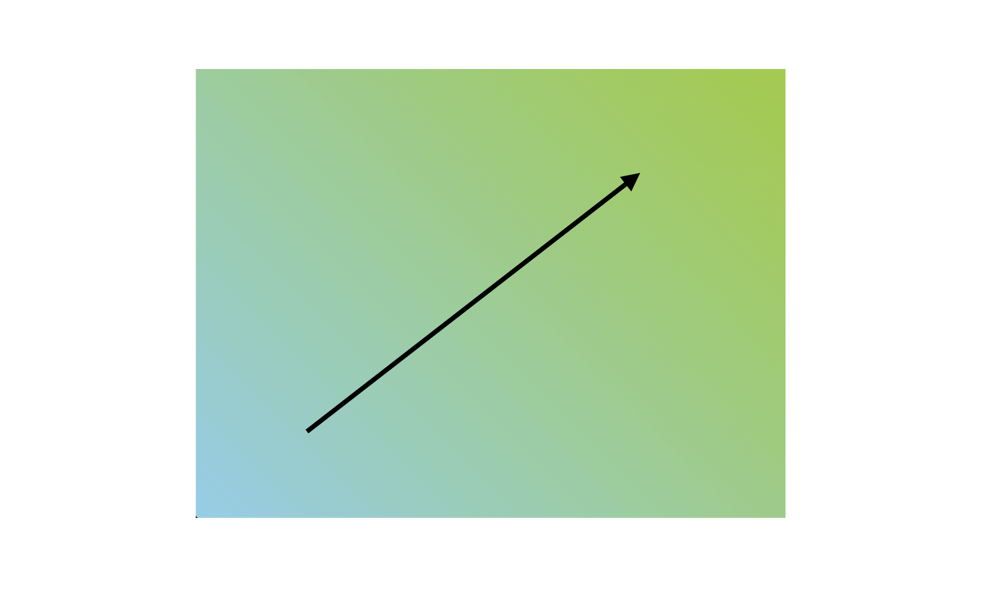
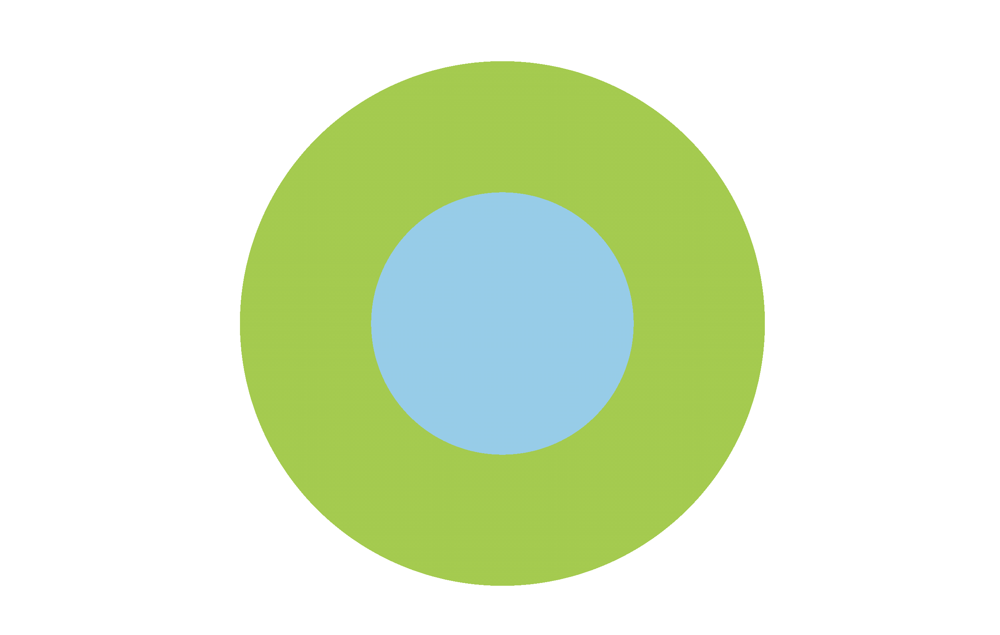

우연히 gradient라는 것을 알게 되었다 유용하게 사용될 것 같아 정리해보려고 한다.

# 👉 gradient
gradient에는 두가지의 종류로 나눌 수 있다.

1. 선형 그라디언트(linear gradient)
2. 원형 그라디언트(radial gradient)

`gradient`는 `background-image`처럼 사용된다 (동시에 사용될 수 없음)

사용법은 다음과 같다
```css
.box {
    background: linear-gradient(방향, 색상...);
    /* background: linear-gradient(to right, #FFFACD 0%, #FFFACD 50%, #afeeee 50%, #afeeee 100%); */
}
```


## ✅ linear-gradient

- 맨 처음에 들어갈 값으로는 **방향**을 지정한다

    1. 방향으로는 왼쪽에서 오른쪽, 오른쪽 상단으로 등 도착지점을 `to`로 두고 `top`, `bottom`, `left`, `right`등을 조합해서 지정할 수 있다.
    2. 방향을 각도로 지정이 가능하다 `deg`단위를 사용해서 지정할 수 있다.

- 두번째부터의 값은 색상을 지정할 수 있다. **%단위나 px단위**을 사용해서 색상점을 지정할 수 있다.

```css
.box {
    background: linear-gradient(45deg, skyblue, yellowgreen);
    /* 왼쪽 하단에서 오른쪽 상단으로 */
}
```


화살표 방향으로 그라디언트가 진행된다.

<br>

## ✅ radial-gradient
`radial-gradient`는 원형을 그라디언트로 나타내준다
```css
.box {
    background: radial-gradient(모양 크기 위치, 색상);
}
```

- 첫번째 값으로 들어갈 수 있는 값은 세가지가 있다
    1. 모양은 타원과 원형이 있는데 기본적으로 타원이고, `circle`을 입력해서 원형으로 만들 수 있다.

    2. 크기는 네가지로 지정할 수 있다
        |값|설명|
        |:---:|:---|
        |`closest-corner`|끝모양이 중앙에서 가장 가까운 모서리로 흐려짐|
        |`closest-side`|끝모양이 중앙에서 가장 가까운 변으로 흐려짐|
        |`farthest-corner`|끝모양이 중앙에서 가장 먼 모서리로 흐려짐(기본값)|
        |`farthest-side`|끝모양이 중앙에서 가장 먼 변으로 흐려짐|

    3. 위치값은 `at`을 사용해서 나타낸다 (ex - at 50% 50%) 

```css
.box {
    background: radial-gradient(circle at 50% 50%, skyblue 0%,skyblue 20%, yellowgreen 20%,yellowgreen 40%,  white 40%);
}
```


퍼센트로 지점을 지정해서 원형도 표현이 가능하다

