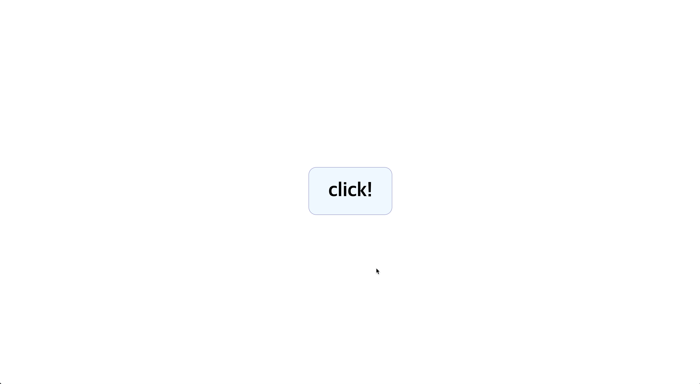

modal창을 만드는 것을 다시 한번 만들어보려고 한다

방향은 `hide`라는 클래스를 `display: none`으로 두고 js를 이용해서 클래스를 적용 해제 하려고 한다

## HTML
```html
<!DOCTYPE html>
<html lang="en">
<head>
    <meta charset="UTF-8">
    <meta name="viewport" content="width=device-width, initial-scale=1.0">
    <title>Modal</title>
    <link rel="stylesheet" href="./modal.css">
    <script defer src="./modal.js"></script>
</head>
<body>
    <div class="container">
        <div class="modal-btn">click!</div>
        <div class="modal hide">
            <div class="modal-bg"></div>
            <div class="modal-content">
                <p class="hide">modal page</p>
            </div>
        </div>
    </div>
</body>
</html>
```

버튼을 클릭했을때 모달창이 나오게 하기 위해서 버튼을 하나 만들고, modal이라는 클래스를 하나 만들어서 modal의 전체적 내용을 담도록했다. 

배경은 투명한 검은색으로 지정해 주기 위해서 `absolute`를 이용해서 배경(`modal-bg`)을 지정해주고, 검은색창인 내용을 표현하기 위해서 `modal-content`클래스를 지닌 `div`요소를 만들었다.

<br>

## CSS
```css
body {
    padding: 0;
    margin: 0;
}
.hide {
    display: none !important;
}
.show {
    animation: show 1s;
}
@keyframes show {
    0% {
        opacity: 0;
        transform: translateY(20px);
    }
    70% {
        transform: translateY(-5px);
    }
    100% {
        opacity: 1;
    }
}
.container {
    display: flex;
    justify-content: center;
    align-items: center;
    width: 100vw;
    height: 100vh;
}
.modal-btn {
    font-size: 50px;
    font-weight: 700;
    padding: 30px 50px;
    border-radius: 20px;
    background-color: aliceblue;
    border: 1px solid rgb(150, 150, 210);
    transition: all .2s;
    cursor: pointer;
}
.modal-btn:hover {
    background-color: rgb(180, 180, 230);
    color: #fff;
}
.modal {
    position: absolute;
    top: 0;
    left: 0;
    width: 100vw;
    height: 100vh;
    display: flex;
    justify-content: center;
    align-items: center;
}
.modal-bg {
    position: absolute;
    top: 0;
    left: 0;
    width: 100%;
    height: 100%;
    background-color: rgba(0, 0, 0, 0.3);
}
.modal-content {
    z-index: 10;
    width: 80%;
    height: 70%;
    background-color: #000;
    color: #fff;
    display: flex;
    justify-content: center;
    align-items: center;
    font-size: 30px;
    animation: width 1s;
}
@keyframes width {
    from {
        width: 0%;
    }
    to {
        width: 80%;
    }
}
```
`hide`라는 클래스를 생성해서 무조건 보이지 않도록 하기 위해서 `display:none !important`를 적용했다.

modal창이 생길때 옆으로 넓어지는 애니메이션을 추가해주기 위해서 `keyframes`를 이용해서 `width`를 조절했다.

`modal-content` 내에 텍스트 요소가 `modal-content`의 너비에 따라 깨지고 불안전한 모습을 보여서 `hide`를 적용했다가 생성될때 `show`라는 클래스에 애니메이션을 적용해서 위로 떠오르는(`translate`) 듯한 느낌을 추가했다

<br>

## JS
```javascript
const btn = document.querySelector(".modal-btn");
const modal = document.querySelector(".modal");
const content = document.querySelector(".modal-content").children[0];

btn.addEventListener("click", () => {
    if (modal.classList.contains("hide")){
        modal.classList.remove("hide");
    } 
    setTimeout(() => {
        content.classList.remove("hide");
        content.classList.add("show");
    }, 1000)
})

const bg = document.querySelector(".modal-bg");
bg.addEventListener("click", () => {
    if (!modal.classList.contains("hide")){
        modal.classList.add("hide");
    } 
})
```
js에서는 클래스 요소를 `classList.add / remove`를 이용해서 클래스를 적용하고 해제하고를 반복하고, 모달창의 배경을 클릭했을때 모달창이 없어지도록 했다.

`modal-content`의 내용이 바로 생기면 불안정한 모습을 보이는 것 같아 1초 뒤에 적용되도록 `setTimeout`을 이용해서 클래스를 추가시켰다

<br>

